# AutoBleem 2 Brugervejledning

AutoBleem 2 er en spillauncher til **PlayStation Classic** - og siden version 2 også til **Raspberry Pi**,
en **PC boot fra USB-stick** og **Windows**. Den viser dine PS1-spil som en hylde af omslag med deres
kasseart og detaljer, starter dem i den medfølgende PCSX-emulator, og med RetroArch installeret ved siden
af kan den også spille spil fra andre systemer. Denne vejledning dækker installation på hver platform,
daglig brug og de værktøjer, der kommer med det.

> Download til hver platform findes på **https://autobleem.retromenele.pl/**. Siden er organiseret efter
> platform: panelet *Install* på hver enkelt er det, du downloader; *Build inputs* under det er det, som
> installerne henter selv.

## 1. Hvad du får

- **Launcher** - karrusellen af omslag, sæt (PlayStation, RetroArch, Apps), detaljer om spil, Hurtigmenuen og
  systemmenuen, muligheder, memory card- og save-state-værktøjer og Butikken til download af apps og spil.
  Samme program på hver platform.
- **To PS1-emulatorer** - `pcsx-abnxt`, den aktuelle (standard), og `pcsx-ab`, den klassiske som AutoBleem
  altid har sendt. Du vælger den i muligheder; begge bruger de samme indstillinger og memory cards.
- **RetroArch** (valgfrit på hver platform) til andre systemer: NES, SNES, Mega Drive, Game Boy, arkade
  og meget mere. AutoBleem bygger dets RetroArch-lister fra ROM'erne, du kopierer ind, og starter hvert spil
  med den rigtige kerne.
- **Konsolværktøjerne**: *PSC-Bios* (vist i menuerne som *Netværk og controllere*) til WiFi, ur, Bluetooth og
  gamepad-kortlægning - på konsollen og også på en Raspberry Pi og PC-sticken - og *ABFlashKit* til
  installation af AutoBleem-kernelen (kun PlayStation Classic).
- **UpdateRoms** til Windows: genopfrisker RetroArch-listerne og kasseart på en konsolstick fra en PC, fordi
  konsollen selv ikke har netværk.

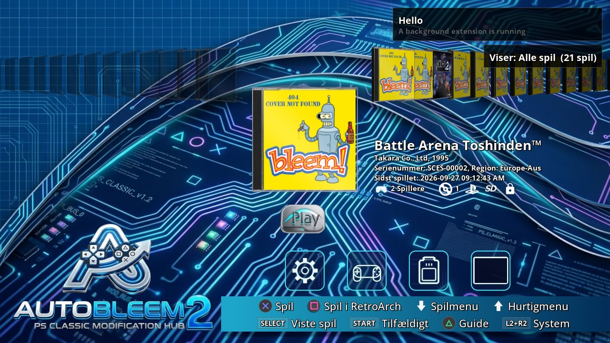

<!-- pagebreak -->

## 2. Installation

### 2.1 PlayStation Classic

Du har brug for en Windows-PC, en USB-stick (USB 2.0, 8 GB eller mere; installeren formaterer den hvis du
spørger) og stock-konsollen. AutoBleem køres fra stickjen uden ændring til konsollen. Stickjen skal være
**FAT32** til en stock-konsol - dens kernel kan ikke læse exFAT. Kun en konsol med AutoBleem-kernelen
installeret (ABFlashKit, kapitel 6) kan også starte fra exFAT-stick, hvilket fjerner FAT32's 4 GB-grænse.

1. Download **AutoBleemInstaller-<version>.zip** fra PlayStation Classic-panelet på siden og pak det ud
   overalt. Det indeholder `AutoBleemInstaller.exe` og AutoBleem-pakken, som det installerer.
2. Sæt stickjen i og start `AutoBleemInstaller.exe`. Vælg drevet øverst. Sæt flueben hvor du ønsker:
   - **Format stickjen** - kun til en frisk stick (alt på den slettes). Vælg FAT32 medmindre konsollen
     har AutoBleem-kernelen.
   - **Databaser med omslag** - kasseart og detaljer fra PS1-biblioteket (afkrydset som standard; cirka
     300 MB).
   - **RetroArch** - RetroArch med dets kerner, ekstra programmer (Doom, Quake, Amiga, ...) og libretro-assets
     til andre systemers spil. Slået fra som standard; kan tilføjes senere ved at køre installeren igen.
   - **BIOS-filer** - BIOS-filerne som RetroArch-kernerne har brug for (kræver RetroArch).
   - **Eksempelspil** - nogle få frie homebrew-spil så hylden ikke er tom.
3. Tryk **Install** og vent. Fremskridtslinjer og loggen viser hvert trin; stickjen hedder `SONY` til
   sidst, og `UpdateRoms` sættes på den (se kapitel 5).
4. Tag stickjen ud sikkert, sæt den i konsolens **anden USB-port** (den højre, spiller 2) og tænd for
   konsollen. AutoBleem starter i stedet for standard-menuen.

**Tænd og sluk.** Med stickjen i booter konsollen, blinker sit lys i nogle få sekunder (AutoBleem bliver
opfanget) og går så i standby før noget vises - det er konsolens egen måde at forberede en opdatering på,
som er hvordan AutoBleem får mulighed for at køre. Tryk **Power** en gang og launcher kommer op. *Power
Off* i systemmenuen eller konsolens power-knap sætter konsollen i **AutoBleem's standby**: stickjen
afkoblets først, derefter bliver lyset **rødt** - tegnet på at AutoBleem fungerer som det skal - og
næste tryk på Power bringer launcher direkte tilbage på få sekunder. **Mens lyset er rødt kan stickjen
trækkes ud** og sættes i en PC uden at Windows spørger efter at kontrollere den; sæt den tilbage før du
trykker Power. Hvis du tager konsolens strøm ud starter boot-standby'en igen næste gang.

For at **opdatere** en stick skal du køre en nyere installer over den: dine spil, gemmede data, indstillinger
og RetroArch-indhold bliver tilbage; kun AutoBleem's egne filer bliver erstattet. En stick lavet med AutoBleem
1.0 eller AutoBleem-NG bliver automatisk bragt til det nye layout.

> Stock-konsollen har ingen ur og ingen netværk: datoer vises kun efter AutoBleem-kernelen er installeret
> (kapitel 6), og kasseart til RetroArch-spil kommer fra UpdateRoms på PC'en (kapitel 5).

Spil går ind i `Games`-mappen på stickjen, en mappe pr. spil - se afsnit 3.9 for layoutet.

### 2.2 Raspberry Pi

AutoBleem gør en Pi til en lille konsol: den starter direkte i launcher uden skrivebord. To færdige images
er på siden - 32-bit og 64-bit - plus en tarball til en eksisterende Raspberry Pi OS Lite.

| Model | 32-bit image | 64-bit image | Noter |
|---|---|---|---|
| Raspberry Pi 5 | ja | ja | |
| Raspberry Pi 4 Model B, Pi 400 | ja | ja | |
| Raspberry Pi 3 Model B / B+ / A+ | ja | ja | fin til launcher og PS1 |
| Raspberry Pi Zero 2 W | ja | ja | 512 MB RAM: PS1 kører, tyngre RetroArch-kerner gør ikke |
| Raspberry Pi 2 Model B | ja | kun v1.2 | langsom for alt 3D |
| Raspberry Pi 1, Zero, Zero W | nej | nej | ARMv6 - ingen af imagerne køres |

**32-bit image er den anbefalede** til PS1-spil: `pcsx-ab`'s hurtige ARM-rekompiler er kun 32-bit, så
64-bit-bygningen kører PS1-spil langsommere. 64-bit-imagenen har det større sæt RetroArch-kerner.

**Med Raspberry Pi Imager:**

1. Installer Raspberry Pi Imager (raspberrypi.com/software). I *Choose OS* vælg *Use custom* og det
   `autobleem-<version>-rpi-armhf.img.xz` (32-bit) eller `-arm64.img.xz` (64-bit), du downloadede - eller
   tilføj repositorie-URL'en `https://autobleem.retromenele.pl/rpi-imager/os_list.json` i appens indstillinger
   og vælg AutoBleem fra listen.
2. Brug Imager's tilpasselseskærm (tandet hjul eller spørgsmål efter *Next*) til at indstille **brugernavn
   og adgangskode, WiFi-netværk og land og aktivere SSH**. AutoBleem har brug for et netværk ved første start.
3. Skriv kortet, sæt det i Pi'en med skærm og tastatur eller pad tilsluttet, og tænd.

**Første start** tager 5 til 25 minutter og viser hvad den gør på skærmen. Uden netværk spørger den efter
et (WiFi-liste, adgangskode), derefter spørger den om du vil installere RetroArch (et minut uden svar betyder
ja), ekspanderer systempartitionen, laver `AUTOBLEEM`-datapartitionen fra resten af kortet, installerer
RetroArch og dets kerner, BIOS-pakkerne og eksempelspilene og genstarter i launcher.

Svarene kan gives på forhånd i **`autobleem.txt`** på kortets boot-partition (redigerbar på enhver PC før
første start):

| Nøgle | Standard | Betydning |
|---|---|---|
| `root_gib` | 8 | Systempartitionens størrelse i GiB; resten bliver spillpartitionen. |
| `hdmi_mode` | 1920x1080@60 | Skærmtilstand for hele boot'en (`1280x720@60` til ældre tv). |
| `retroarch` | (spurgt) | `yes` / `no` - RetroArch og andre systemer eller kun PS1. |
| `thumbnails` | ingen | `boxarts` spejler hele kasseart-sættet offline (~9000 filer). |
| `bios`, `downloads`, `samples` | ja | Sæt til `no` for at springe BIOS-pakker, alle downloads eller eksempelspil over. |

**På en eksisterende Raspberry Pi OS Lite** (Bookworm eller Trixie): kopier `autobleem-rpi.tar.gz` (eller
arm64-versionen) til Pi'en, pak den ud og kør `sudo bash install.sh`. Den stiller de samme spørgsmål,
laver datapartitionen ved at krympe root ved næste start (`--shrink-root <GiB>`), og sætter launcher på
første konsol.

Efter installation er kortets **`AUTOBLEEM`-partition** (exFAT) hvad du udfylder: tag kortet ud og åbn det
på enhver PC eller kopier over netværk (SSH er på). `Games/` til PS1-spil, `RetroArch/roms/<system>/` til
andre systemer, `System/Bios/` til PS1 BIOS (afsnit 3.10), `Themes/` til temaer.

### 2.3 PC USB-stick

Den samme apparat til enhver PC, der starter fra USB - et 32-bit-system, så gamle maskiner fungerer også:

1. Download `autobleem-<version>-pcusb-i386.img.xz` fra PC-panelet og skriv det til en stick på 8 GB eller
   mere med Raspberry Pi Imager (*Use custom*), balenaEtcher eller Rufus (DD-tilstand).
2. Boot PC'en fra stickjen (boot-menu-tasten på din PC - F12, F8, Esc...). Både BIOS og UEFI boot fungerer;
   **Secure Boot skal være slået fra**.
3. Første start er Pi'ens: et netværksspørgsmål hvis der ikke er kabel, RetroArch-spørgsmål, derefter
   installation - cirka otte minutter med trådbundet netværk - og genbboot i launcher.

Stickjen har så en `AUTOBLEEM`-partition til dine spil, synlig på Windows 10 (1903 og nyere) som et
andet drev når du sætter stickjen i en kørende PC. `autobleem.txt` er på første partition med de samme
nøgler som på Pi'en (ingen `hdmi_mode` - PC'en bruger skærmens native tilstand).

### 2.4 Windows

AutoBleem som Windows-program: fuldskærm, emulatorer og RetroArch startet som programmer.

1. Download **AutoBleemSetup-<version>.exe** og kør den. Den installerer pr. bruger uden
   administrator-rettigheder: programmet under `%LOCALAPPDATA%\Programs\AutoBleem`, data (spil,
   indstillinger, temaer, RetroArch) i en mappe du vælger - `Documents\AutoBleem` som standard.
2. Sæt flueben ved komponenter - databaser med omslag, RetroArch (det officielle Windows-build og dets
   kerner), BIOS-filer, eksempelspil - og lad setup-hjælperen downloade dem.
3. Start AutoBleem fra Start-menuen eller Skrivebord. På en PC fungerer tastaturet som en pad (afsnit 3.2).

Kørsel af et nyere setup over det opdaterer programmet og holder datamappen. Launcher tjekker også siden
en gang dagligt og tilbyder en opdatering når der er en (afsnit 3.11).

<!-- pagebreak -->

## 3. Brug af AutoBleem

### 3.1 Launcher

Launcher åbner på hylden: omslaget fra det aktuelle sæt, det valgte i midten med en blød refleksion under sig,
dets detaljer ved siden af i et kompakt gitter - udgiver, år, serienummer, region, spillere, hvornår det sidst
blev spillet (en oplysning, et spil ikke har, udelades) - og en afspilningsknap. Standardudseendet er temaet
**ab2.0.0**; en ny installation og en opdatering, der bringer det, skifter til det én gang. Hintlinjen nederst
har to rækker med fire pladser. Den første viser, hvad knapperne gør for det valgte spil (spil, spil i
RetroArch, åbn ikorrækken, Hurtigmenuen); den anden viser altid Select (sættet), Start (et tilfældigt spil),
Triangle (vejledningen) og L2 + R2 (systemmenuen), nedtonet når en af dem ikke gør noget. En scanning af
spillemappen kører i baggrunden ved hver start; mens den kører viser en boble øverst til højre dens
fremskridt, og nye spil vises på hylden efterhånden som de findes.

**En ny installation** har ingen spil endnu: i stedet for en tom hylde viser launcher et velkomstkort - *Hej,
og velkommen til AutoBleem!* - der beder dig lægge spil i mappen `Games` og vælge *Genscan spil*, og som nævner
stedet for din platform: på dit stik (PlayStation Classic, PC-sticken), på dit SD-kort (Raspberry Pi) eller i din
AutoBleem-mappe (Windows). Kortet forsvinder, så snart en scanning finder det første spil.

**Notifikationer** vises som bobler øverst til højre: scanningens fremskridt, navnet på det sæt, du skiftede
til (*Viser: ...*, så længe Indstillinger → *Visningstid for besked* angiver), lavt batteri på en controller, en
note efter et nedbrud, en scanner-processor der arbejder, og Butikkens igangværende download. Downloadens boble
viser dens hastighed og den resterende tid, f.eks. `1.4 MB/s · 0:42`.

**Kanalmærket.** Et build, der ikke er en endelig udgivelse, viser et lille mærke under controllerens
batteriplade i øverste venstre hjørne: en chip med kanalen - `ALPHA`, `BETA` eller `RC` for en
førudgivelse, `TESTING` for enhver anden førudgivelse, `NIGHTLY` for et natligt build, `DEV` for et build lavet i
hånden - og den korte version ved siden af (for `DEV` den commit, det er bygget fra). En udgivelse viser intet
mærke.

En trådløs controller med et batteriniveau - på konsollen, en Pi eller PC-pinden, ikke på Windows - vises som et lille ikon med procenten, stablet fra øverste venstre hjørne på sin egen plade. En controller matchet til Spiller 1 eller Spiller 2 (efter indstillingen Byt spiller 1 / spiller 2) er mærket P1/P2; en umatchet eller en tredje controller får ingen mærkning. Når en controllers batteri bliver lavt, rapporterer en notifikationslinje det én gang, med navn og procent.

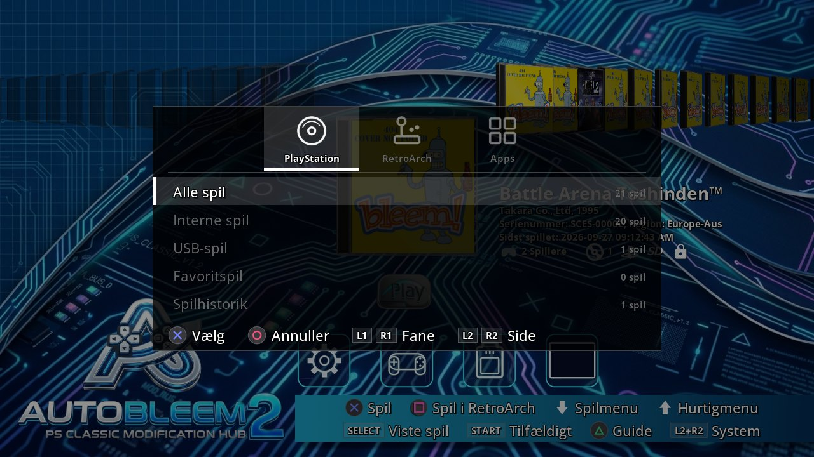

### 3.2 Kontroller

| Knap | På hylden |
|---|---|
| Venstre / Højre | Forrige / næste spil. Holdt scrolles videre. |
| L1 / R1 | Spring til forrige / næste første bogstav i titler. |
| Cross | Start det valgte spil (PS1-spil i PS1-emulator; RetroArch-spil i dets kerne; App efter læst mig). |
| Square | Start det valgte PS1-spil i RetroArch i stedet. |
| Triangle | Knap-vejledningen. |
| Start | Et tilfældigt spil fra det aktuelle sæt. |
| Select | Sæt-vælger: PlayStation / RetroArch / Apps faner (L1 / R1), grupperne fra fanen (Op / Ned, L2 / R2 en side), Cross vælger. |
| Op | Hurtigmenuen (afsnit 3.4). |
| Ned | Åbn ikorrækken under spillet (Indstillinger, Spil, Memory Card, Genoptag). Op lukker den. |
| L2 + R2 | Systemmenuen (afsnit 3.5). |

**Med tastatur** (en PC uden pad eller USB-tastatur på konsol, Pi eller PC-stick) indsætter tasterne sig selv:
**Piletaster** = d-pad, **Enter** = Cross, **Esc eller Backspace** = Circle, **Tab** = Triangle, **Mellemrum**
= Square, **F1 / F2** = Select / Start, **Page Up / Page Down** = L1 / R1, **Home / End** = L2 / R2, **F10**
= systemmenuen. På en udviklingmaskine lukker Esc programmet og Mellemrum er Start.

I hver liste og menu: Op / Ned bevæger, **L2 / R2 vendersider**, L1 / R1 hop til første / sidste række,
**Cross vælger, Circle går tilbage**. En skærm med indstillinger gemmer dem når du forlader den med Circle.

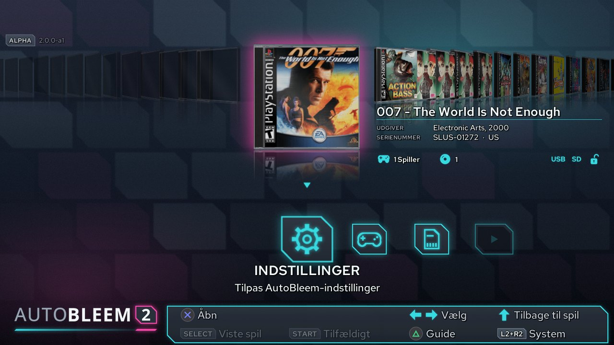

### 3.3 Sæt

**Select** åbner sæt-vælgeren. PlayStation-fanen viser på en PlayStation Classic *Alle spil* og *Interne spil*
(konsolens indbyggede tyve), derefter *USB-spil* (alt i `Games/`) og hver mappe du lavede under den (et spil i en
undermappe hører til den gruppe), derefter *Favoritspil*, *Spilhistorik* og når noget spil er markeret som sådan
*Lightgun-spil*. På en Raspberry Pi, en PC-stick og Windows er der ingen interne spil, så listen starter med
*USB-spil*, som er hele biblioteket. RetroArch-fanen (kun hvor RetroArch er installeret) viser en gruppe pr.
system der har spil plus RetroArch's egne Favoritter og Historie. Apps-fanen grupperer programmer efter type:
*All apps*, derefter *Games*, *Emulators*, *Tools*, *Media* og *Other* (kategorien indstilles i hver apps
`app.ini`-fil). Hver række viser hvor mange elementer den indeholder; en gruppe uden nogen åbner på en tom hylde
med ikorrækken der kun viser Indstillinger. Sidelinjen viser tasterne: L1 / R1 faner, L2 / R2 en side, Cross
vælger, Circle *Tilbage*.

### 3.4 Quick-menuen

**Op** i launcher eller **gear-ikonet** i ikorrækken (hvor Indstillinger / Spil / Memory Card / Genoptag er):
Hurtigmenuen til handlinger du når efter fra karrusellen. En kort liste: *Genscan spil* (starter en scanning
nu), *Butik* (gennemse og installer spil, apps og udvidelser), *Netværk og controllere* (kun hvor en installeret
udvidelse giver `network`-posten - PSC-Bios på konsol, Pi og PC-stick: WiFi, Bluetooth-parring,
gamepad-kortlægningsguide - se afsnit 6; nedtonet med "slå den til under Udvidelser" når den udvidelse er
deaktiveret - Cross åbner Udvidelser-listen), *Genstart launcher* (lukker AutoBleem og starter det igen; kun på
konsol, Pi og PC-stick) og *Systemmenu...* (alt andet: Indstillinger, Spilbibliotek, Sluk og mere - den fulde
menu nedenfor). Op / Ned bevæger (ombryder), Cross vælger, Circle tilbage. Hver række har en beskrivelse på én
linje. Bortset fra Butikken og *Genstart launcher* er hvert element også i systemmenuen.

### 3.5 Systemmenuen

**L2 + R2** (sammen, i enhver rækkefølge) åbner systemmenuen over hylden. Hver række har en beskrivelse på én
linje, og menuen er grupperet i afsnit:

| Afsnit | Element | Hvad det gør |
|---|---|---|
| (top) | Genscan spil | Leder efter nye, ændrede eller fjernede spil nu (scanning overvåger også mappen selv). |
| | Udvidelser | Udvidelserne på stickjen - AutoBleem Store og andre (afsnit 3.12). |
| **Bibliotek** | Spilbibliotek | PS1-spillene som en liste med deres mapper: slet et spil, tøm omslaget. Deaktiveret mens en scanning kører. |
| | Memory kort | Dit memory card-sæt (afsnit 3.7). |
| | Scanningsprocessorer | Programmer hver scanning kører først - deres rækkefølge, til eller fra (afsnit 3.13). Deaktiveret mens en scanning kører. |
| **System** | Indstillinger | AutoBleem's indstillinger (afsnit 3.6). |
| | Netværk og controllere | Kun hvor en installeret udvidelse giver `network`-posten (`Provides=network` i dens `extension.ini` - PSC-Bios på konsol, Pi og PC-stick) - WiFi, Bluetooth-controller-parring, DualShock 3-opsætning og gamepad-kortlægningsguide - se kapitel 6. Når den udvidelse er installeret men deaktiveret bliver dette element nedtonet med en note "slå den til under Udvidelser" - Cross åbner Udvidelser-listen på det. |
| | Hardwareinformation | Maskinens fakta: system, CPU, lagerplads, netværksgrænseflader, tidszone, display, pads og deres kortlægninger - samme side på hver platform (afsnit 4.2). |
| | Softwareopdatering | (Raspberry Pi og PC) Tjek siden for nyere AutoBleem eller RetroArch nu; rækken siger *Opdatering tilgængelig*, når launcher allerede kender en. |
| | Om | Kreditter og licens. |
| **Forlad** | RetroArch | (Kun hvor RetroArch er installeret.) Forlader launcher til RetroArch's egen menu. Lukning af RetroArch kommer tilbage. |
| | Sluk | Efter bekræftelse: på konsol AutoBleem's standby - stickjen afkoblet, lyset rødt, Power bringer launcher tilbage (afsnit 2.1); på Pi eller PC lukker maskinen ned. |

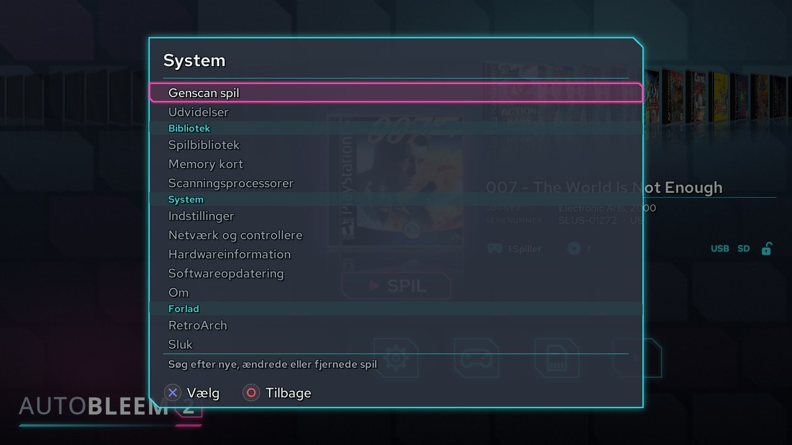

### 3.6 Muligheder

Indstillinger er i grupper, hver under en overskrift; Op / Ned bevæger mellem rækkerne, Venstre / Højre ændrer
værdi (et tryk er ét trin, hold ruller videre), L1 / R1 hopper til første / sidste række, L2 / R2 vender sider,
Circle forlader og gemmer. Hver ændring påføres øjeblikkeligt. Til/fra-værdier læses **TIL** / **FRA**.

| Gruppe / indstilling | Hvad det gør |
|---|---|
| **Grænseflade**: Skærm | Skærmens opløsning til launcher og PS1-emulatoren: *Auto* (skærmens egen tilstand, vist som *Auto (1920x1080)*) eller enhver tilstand skærmen oplister; konsollen tilbyder 720p og 1080p. En ny tilstand bliver der spurgt om: *Behold denne skærmtilstand?* - bekræfter du ikke, går den tilbage efter en nedtælling. Ikke i et udviklingsvindue. |
| Emulatorens skærmskalering | Hvordan PS1-emulatoren tilpasser et spils billede til skærmen: *1x1* (PlayStations egne pixels), *2x (heltal)*, *4:3*, *4:3 (heltal)* eller *Fuld skærm*. Heltalsskalering bruger kun hele multipla (det skarpeste). Den erstatter den gamle Widescreen-kontakt; den klassiske `pcsx-ab` og RetroArch kender kun fuld skærm og 4:3. |
| AutoBleem tema | Udseendet. Temaer bor i `Themes/`; et tema zip som sættes der bliver pakket ud ved næste besøg. AutoBleem's temaer som shipper opdateres med hver opdatering - for at tilpasse et skal du kopiere det under et nyt navn først. Standarden er **ab2.0.0**. |
| Cover-stil | Juvelerramdelen tegnet omkring PS1-omslag. |
| Glimt på coveret | Et glimt der krydser det valgte omslag, når hylden er kommet til ro. |
| Sprog | Launcher's sprog påført straks (17 sprog). |
| Visningstid for besked | Hvor længe informationsboblerne ("Viser: ...", scanningens opsummering) bliver stående, 0 til 20 sekunder; 0 viser *Fra*. Fejl har deres egen faste tid. |
| Startskærm | AutoBleem-billedet når launcher starter; fra går direkte til hylden. |
| Animationer | Bevægelsen mellem skærme; fra gør hvert skærmskift øjeblikkeligt. |
| **Skrifttyper**: Brug standardskrifttype | Launcher bruger sin standardskrifttype (Red Hat Text) eller - slået fra - den skrifttype der er valgt nedenfor. |
| Skrifttype | Enhver `.ttf`/`.otf` fra `resources/fonts`, `RetroArch/fonts` eller temats mappe; rækken navngiver den skrifttype der bruges. |
| **Lyd**: Musik, Baggrundsmusik | Hvilken nummer der spilles under launcher (temats eller en fil fra `resources/music`) og om en spilles overhovedet. |
| **Emulering**: PS1-emulator | `pcsx-abnxt` (standard: nuværende PCSX-ReARMed med AutoBleem's tilføjelser) eller `pcsx-ab` (klassisk). Et genoptag-punkt gemt af en fortsætter i den anden medmindre spillet kørte uden BIOS-fil. |
| Byt spiller 1 / spiller 2 (PS1-emulatorer) | Bytter om på hvilken af de to første controllere der er Spiller 1, og hvilken der er Spiller 2, i begge PS1-emulatorer (pcsx-abnxt og den klassiske pcsx-ab). Det virker kun med to eller flere controllere tilsluttet; med én controller er det altid Spiller 1. RetroArch påvirkes ikke. |
| Spil alle PSX-spil med RA, Opdater RA-konfiguration, Gem RetroArch-konfiguration | (Kun hvor RetroArch er installeret.) Hvert PS1-spil starter i RetroArch's PS1-kerne; AutoBleem skriver dets indstillinger ind i RetroArch's konfiguration når det starter et spil der; en ændring lavet i RetroArch's egen menu bevares, når RetroArch afsluttes. |
| **Bibliotek**: Vis interne spil | Konsolens indbyggede spil i PlayStation-listerne (kun PlayStation Classic). |
| Hent covers online | Scanning henter manglende omslag fra libretro's servere (Raspberry Pi, PC, Windows). |
| **Opdateringer** | Opdateringskanalen: `release` (den testede version), `testing` (den næste version, under test), `nightly` (det nyeste udviklingsbuild) eller `off`. Standarden følger den installerede version. Vises ikke på en udviklingsvært. |
| **Diagnostik**: Behold logfiler på USB-nøglen | Behold alle logfiler på sticken fra næste start, ikke kun efter et nedbrud (kapitel 7). |
| Vis ydeevne | Et overlay i nederste venstre hjørne: billedfrekvens, CPU-belastning, tråde og hukommelse; emulatoren viser også sin FPS og CPU i spillet. |

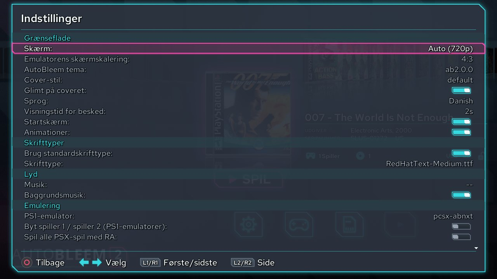

### 3.7 Et spils indstillinger

Med et spil valgt åbner **Ned** dets ikorrække: **Settings** (muligheder ovenfor), **Game** (spillets egne
indstillinger), **Memory Card** (dets memory card) og **Resume** (dets gemte tilstande). Cross åbner den
under markøren.

**Spil-editoren** viser spillets detaljer til højre (titel, udgiver, år, spillere, mappe, memory card) og dets indstillinger til venstre i fire grupper:

- **Spil**: *Favorit* (i Favoritspil-gruppen), *Lightgun-spil* og *Spil med RA* (kun hvor RetroArch er
  installeret: et light-gun-spil deltager i Lightgun-gruppen og kører altid i RetroArch hvis PS1-kerne har
  GunCon; *Spil med RA* kører dette spil i RetroArch), *Lås data* (scanner lader spillets titel, serienummer og
  disc-liste være som du sætter dem).
- **Skærm**: *Opløsning* (1x eller 2x, på den indbyggede GPU), *Fjern sømme* (kun med 2x), *Dithering* (Fra,
  Til, Altid), *Udjævning*, *Filter* - hvordan billedet skaleres: Nærmeste (rene pixels), Lineær (udjævnet), Skarp
  eller Skarp (enkel) (skarpe pixels uden flimmer), Quilez eller CRT-filtrene CRT (fast) og CRT-Pi (de tegner
  deres egne scanlines, så scanline-rækkerne nedtones) - og *Scanlines* med deres *Scanline-lysstyrke*.
  Opløsning, fjern sømme, dithering, udjævning og andre filtre end Lineær og Nærmeste er til `pcsx-abnxt`; den
  klassiske `pcsx-ab` og RetroArch viser resten som Nærmeste.
- **Gengivelse**: GPU-*Plugin* og *Frameskip* (Auto, Fra, 1 til 3).
- **Emulator**: SpeedHack, CPU-ur, SPU-interpolation, boot-logo (off springer BIOS-shell over - til homebrew
  disc hvis brugerdefinerede logo bryder boot), og med `pcsx-abnxt` *Sony-hacks*-toggle.

Billedets form og skærmens opløsning er globale (Indstillinger → *Emulatorens skærmskalering* og *Skærm*). Et
spil uden titel i sine data vises under sin mappes navn.

Triangle omdøber spillet, Square ændrer dets memory card, Start deler en nyt kort. Circle gemmer og forlader.

**Indstillinger gemt i emulatoren.** Emulatorens egen menu har *Gem indstillinger for dette spil*. Når et spil
har indstillinger gemt der bliver de som det spiller med og spil-editoren viser dets rækker Skærm, Gengivelse
og Emulator nedtonet med de værdier under overskrift *Gemt i emulatoren*. For at gå tilbage til spil-
editorens indstillinger vælg **Lås indstillingerne op** og bekræft: dette sletter indstillinger emulatoren
gemte og rækkerne kan ændres igen. Begge emulatorer `pcsx-ab` og `pcsx-abnxt` læser og skriver samme
gemte indstillinger.

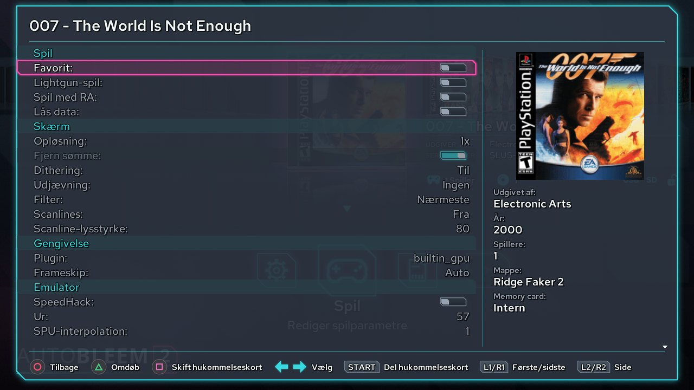

### 3.7 Memory cards og gemte tilstande

Hvert PS1-spil har dets eget memory card som standard (holdt med sine gemte tilstande i `Games/!SaveStates/
<spil-mappe>/`). **Memory Cards** i systemmenuen styrer **delte sæt** - et kort flere spil bruger holdt i
`Games/!MemCards/`: opret et (Square med på-skærm tastatur), omdøb (Cross), slet (Triangle). Et spil sættes
på et sæt med *Change memory card* i dets editor eller fra dets Memory Card-ikon.

**Memory card-editoren** (Memory Card-ikonet) viser spillets kort og et andet kort side ved siden med hvert
gems ikon og titel: kopier et gem mellem de to (Square), slet et (Triangle), defragmenter et kort (Select).
Start bytter kortet til højre til et andet sæt.

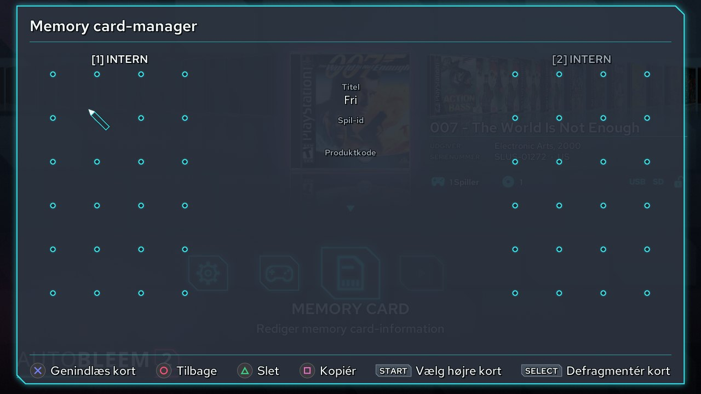

**Genoptag-punkter**: når du forlader PS1-spil med konsolens Reset-knap (eller emulatorens menu på Pi eller
PC) holder AutoBleem fast en gemt tilstand af hvor du var og tilbyder det under **Resume**-ikonet - fire
slots vist som indrammede kort, hver med billede af øjeblikket, slot-nummer og dato; det nyeste er mærket
**NYESTE**, og en ubrugt slot siger *Intet genoptagelsespunkt*. Cross fortsætter fra slot'en, Triangle sletter
det. Et spil med et genoptag-punkt viser et lille billede på dets Resume-ikon; et spil uden et har Resume-ikonet
nedtonet. Mens genoptag-punktet skrives på vej ud af et spil, viser emulatoren *Vent venligst...*.

### 3.8 Start af spil, RetroArch og Apps

**Cross** starter det valgte spil. PS1-spil kører i valgt PS1-emulator (afsnit 3.6) fuldskærm indtil du
forlader det - på konsol med front-**Reset**-knappen (tilbage til launcher med genoptag-punkt; det virker også
indefra in-game menuen) eller **Power** (konsol slukker); på Pi eller PC gennem emulatorens in-game menu
(nedenfor). **Square** starter PS1-spil i RetroArch i stedet.

**In-game menuen** (`pcsx-abnxt`). Tryk på menuknappen - padens Home, **Select + Start** på en pad uden, eller
**Esc** på et tastatur - og spillet stopper bag en menu med spillets sidste billede. **At holde menuknappen i 2
sekunder** er det samme som Reset: det forlader spillet. L1 / R1 skifter mellem dens tre faner, og menuen åbner
på den fane og række, den blev forladt på:

- **Spil**: *Fortsæt spillet*; under *Gemte spil*: *Hurtig gemning*, *Hurtig indlæsning* og *Indlæs autogem*
  (spillet som det var for op til 30 sekunder siden - emulatoren gemmer det i hukommelsen af sig selv, mens du
  spiller); under *Cd*: *Skift disk* og *Nulstil spillet* (starter det forfra); *Gem indstillinger for dette
  spil* (se afsnit 3.7), *PCSX-menu* (PCSX-ReARMed's egne sider: indstillinger, snydekoder, Om) og *Afslut*
  (tilbage til AutoBleem).
- **Billede**: *Skærm* (skærmens opløsning - på konsollen vælges den i Indstillinger og vises kun her),
  *Opløsning* (1x eller 2x), *Fjern sømme*, *Dithering*, *Skalering*, *Udjævning*, *Filter*, *Scanlines* og
  *Scanline-lysstyrke*. Hver række har en hjælpelinje til højre. CRT-Pi er for tung til konsollen ved 1080p. En
  række, der ikke gælder, er nedtonet, og dens hjælp siger hvorfor.
- **Controllere**: *Controller 1* og *Controller 2*: standard (digital), analog (DualShock), en pistol eller
  ingen; træder i kraft når spillet fortsætter.

Menuen er tegnet i launcherens ab2.0.0-udseende, med controllernes batterier og billedet fra den sidste hurtige
gemning.

Et **RetroArch**-spil starter i RetroArch med kernen launcher valgte for dets system; *Close Content* eller
*Quit RetroArch* i dens menu kommer tilbage til launcher. RetroArch-posten i systemmenuen åbner RetroArch's
egen menu (XMB) med intet lastet til for dets indstillinger og dens egne indholds-lister.

En **App** (Apps-sættet: konsolværktøjerne og på konsol de ekstra programmer RetroArch's pakke bringer -
Doom, Quake, Amiga, ...) viser dets læs-mig først; Cross starter det, Circle går tilbage.

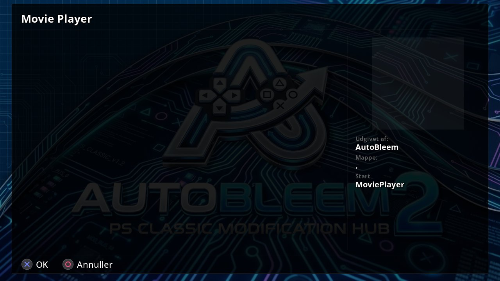

### 3.9 Tilføjelse af spil

**PS1-spil** går i `Games`-mappen **en mappe pr. spil** navngivet efter spillet:

```
Games/
  Crash Bandicoot/            Crash Bandicoot.cue + Crash Bandicoot.bin
  Final Fantasy VII/          Final Fantasy VII (Disc 1).chd, (Disc 2).chd, (Disc 3).chd
  Platformers/                en mappe med spil: en gruppe af dens egen i sæt-vælger
    Klonoa/                   Klonoa.pbp
```

- Formater: `.cue` + `.bin` (eller `.img`), `.pbp`, `.chd` (zstd også), `.ecm` (afkodet ved scanning), `.iso`.
  Et zippet spil fungerer også: **Unzip**-processoren pakker det ud før scanning (afsnit 3.13).
- Multi-disc-spil er en mappe med hver disc i det; mapper navngivet `Game (Disc 1)`, `Game (Disc 2)` ... bliver
  flettet til en `Game`-mappe ved scanning.
- Spil som sættes direkte i `Games/` (løse filer) bliver sorteret i mapper ved scanning.
- En **omslag** er PNG ved siden af spillets billede navngivet som det. Uden en kommer kasseart fra
  omslag-databaseerne eller - med RetroArch installeret - fra libretro's thumbnail-sæt; på Pi, PC eller
  Windows bliver en manglende hentet online (Muligheder → *Fetch box art online*).
- Scanning læser hver discs serienummer og tager titel, udgiver, år, spillere og region fra RetroArch's
  PlayStation-database eller omslag-databaseerne. Skift hvad som helst i spil-editoren og sæt *Lock data*
  for at holde det.

**Andre systemer** går under `RetroArch/roms/` **en mappe pr. system navngivet som RetroArch's databaser**
(mappen bliver lavet for dig): `Nintendo - Nintendo Entertainment System`, `Nintendo - Super Nintendo
Entertainment System`, `Sega - Mega Drive - Genesis`, `Nintendo - Game Boy Advance`, `FBNeo - Arcade Games`
(eller `Arcade`), ... ROM'er kan blive zippet. På Pi, PC eller Windows læser scanning dem af sig selv og
skriver RetroArch's afspilliste; på konsol-stick skal du køre **UpdateRoms** på PC'en (kapitel 5).

**Apps** går under `Apps/<name>/` med en `app.ini` (navn, ikon, hvad der skal køres) og en `run.sh`.

**Temaer** går under `Themes/<name>/` (`theme.json` og billeder) - eller drop temats zip i `Themes/`.

### 3.10 PS1 BIOS

På en **PlayStation Classic** bruger emulatoren konsolens eget BIOS. På en **Raspberry Pi, PC og Windows**
sæt din eget PS1 BIOS i `System/Bios/`: `romw.bin` (US/European SCPH-5501/5502) og `romJP.bin` (Japanese
SCPH-5500). Installerne udfylder dem fra RetroArch BIOS-pakkerne medmindre dine egne filer allerede er der.
Uden dem kører emulatoren på sin byggede HLE BIOS som mange spil tolererer og nogle ikke.

### 3.11 Opdateringer

- **Raspberry Pi, PC-stick, Windows**: launcher tjekker siden ved start og en gang dagligt (Muligheder →
  *Updates* er kanalen; *Software Update* i systemmenuen tjekker nu). Når der er nyere AutoBleem eller
  RetroArch spørger det: *Update now* downloader alt og kører installer igen med første-start fremskridts-
  skærm; *Remind me tomorrow* og *Skip this version* er de andre svar. Dine spil og indstillinger bliver
  tilbage; launcher genscannes en gang efter en opdatering.
- **PlayStation Classic**: kør nyere `AutoBleemInstaller.exe` over stickjen (afsnit 2.1).

### 3.12 Udvidelser og AutoBleem Store

**Udvidelser** tilføjer deres egne skærme til launcher. De bor i `Extensions/<name>/` på stickjen (på
Raspberry Pi dens data-partition, på Windows data-mappen); for at installere en skal du pak dens zip der.
**L2 + R2 → Extensions** lister dem: Cross kører en, Triangle slår den fra eller til igen. En udvidelse
der har brug for netværk starter ikke uden et og en der stoppede launcher bliver slået fra - listen siger det.

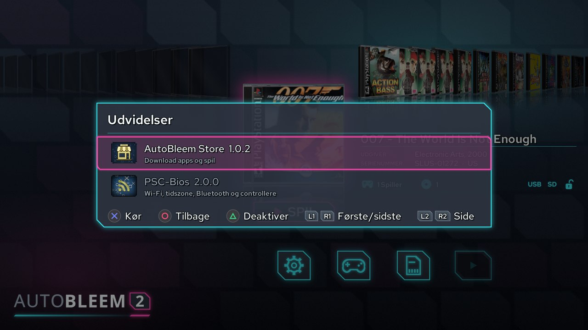

**AutoBleem Store** er første udvidelse: Apps og spil at installere med ét tryk på hvert system AutoBleem
kører på (en PlayStation Classic har brug for AutoBleem-kernels WiFi). Dets fire faner L1 / R1 mellem dem:

- **Apps** og **Games**: hvad kilder tilbyder hvert med billede, version, størrelse og kilde-favicon.
  Installerede elementer har et *Installeret*-mærke. Cross installerer (eller opdaterer, eller prøver igen efter
  fejl, eller annullerer en download i kø eller i gang), Triangle fjerner hvad Store installerede, Square
  opdaterer listerne. L2 / R2 hopper efter bogstav, **Select** viser en kilde ad gangen, **Start** søger
  titler. Sidelinjen viser tasterne for den valgte række. Element-billeder bliver cachelagret og kan blive
  genprøvet hvis de ikke indlæser.
- **Downloads**: hvad der downloades, venter, fejlslagne eller installerede. Fremskridtslinjen opdateres
  jævnt, og mens du er et andet sted i launcher, viser en boble den igangværende download med dens hastighed og
  resterende tid (`1.4 MB/s · 0:42`). Downloads går videre i baggrunden også efter du forlader Store; start af
  spil eller lukning af strøm stanser dem kun og et stoppet download genoptages hvor det stoppede. Hvis
  netværket falder ud, siger elementet *Venter på netværket* og fortsætter hvor det stoppede, når netværket er
  tilbage (det giver op efter 30 minutter). Et installeret spil dukker op på hylden efter næste scanning med
  Store's billede som omslag. Downloads over 2 GB fungerer på alle platforme, inklusiv 32-bit builds.
- **Sources**: hvor lister kommer fra - AutoBleem's egen katalog en TSV-liste som sættes i
  `System/Extensions/store/sources/` og adresser du tilføjer med **Add a source URL**. Hver kilde viser
  sit favicon i listen. Cross på en du tilføjede omdøber det, ændrer dets adresse eller fjerner det.

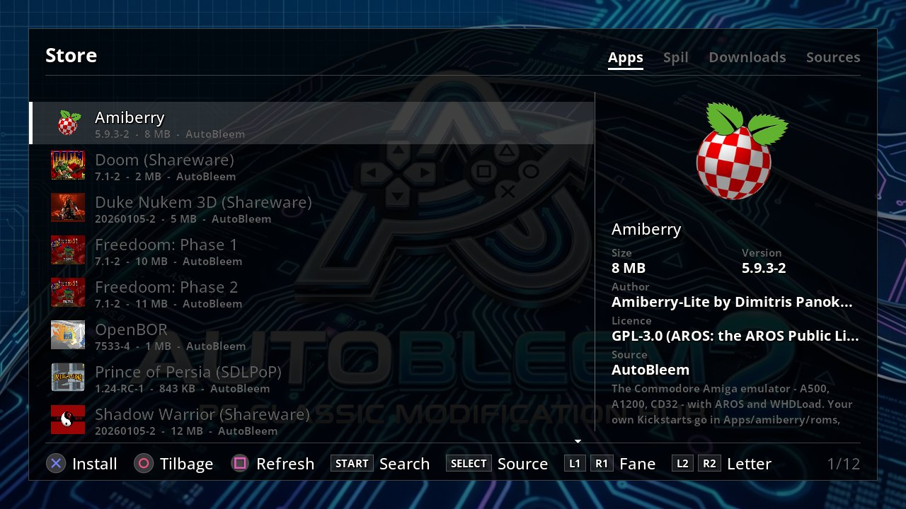


Hvad AutoBleem's katalog tilbyder er også listet på download-siden `https://autobleem.retromenele.pl/store/`.
**Du er ansvarlig for hvad kilder du tilføjer indeholder.**

**Dine egne spil på dit netværk**: `abstored` Store's LAN-server betjener en mappe PS1-spil til Store på
samme netværk. Det kører på enhver Linux-maskine - en Raspberry Pi, en hjemmeserver - og læser kun mappen.
Start det med `abstored <spil-mappe>` åbn `http://<den maskine>:8124/` i browser for at se hvad det
betjener og problemer det fandt og tilføj `http://<den maskine>:8124/store.tsv` som kilde. Klare programmer
for Linux og Windows er på Store-siden i dens **LAN server**-fane; at sætte det op som service er
`INSTALL-linux.md` (`ext_store/server/` i kilden). **LAN Share** (afsnit 5.2) sætter spil og disc fra
PC på sådan server.

### 3.13 Scanning-processorer

**Scanning-processorer** er små programmer som hver scanning kører før den læser dine spil. En kan gøre et
format AutoBleem ikke læser til et det gør - et zippet spil for eksempel - eller ændre et spils data sådan
som en oversættelses-patch. De bor i `System/Processors/<name>/` på stickjen (på Raspberry Pi dens data-
partition på Windows data-mappen); for at installere en skal du pak mappen der. Næste scanning kører den.

- **Unzip kommer med AutoBleem**: det pakker zippede PS1-spil i `Games/` ud før scanning læser dem og
  zippede ROM'er en ad gangen (arkade-sæt bliver zippet). Opdatering af AutoBleem opdaterer det også og
  lader det blive slået fra hvis du slog det fra.
- En processor som allerede havde håndteret et spil køres ikke på det igen indtil spillet ændres.
- Mens en processor arbejder viser boblen øverst til højre hvad den gør; en advarsel eller fejl vises på
  linjen under det. `processors.log` i log-mappen har detaljer.
- Start af spil eller RetroArch stopper en processor som ændrer filer; næste scanning afslutter dens arbejde.

**L2 + R2 → Scanner processors** viser dem i rækkefølge de kører en fane til PS1-spil og en til ROM'erne
(L1 / R1). **Square** plukker en processor op og Op / Ned flytter den - rækkefølge betyder: en processor
som pakker ud skal komme før en som patcher hvad blev pakket ud. **Cross** slår en fra eller til **Triangle**
har den se på hvert spil igen ved næste scanning, **Circle** går tilbage og starter en scanning hvis du
ændrede noget. En processor bygget til anden maskine bliver på listen nedtonet.

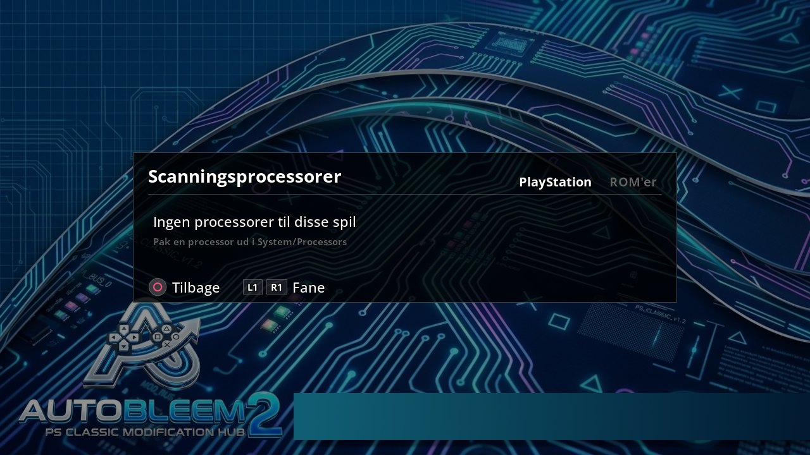

Skriv din egen: Unzip-siden `https://github.com/autobleem2/proc_unzip` forklarer alt en processor skal gøre
og `tools/proc_check.py` i AutoBleem's kilde tjekker en før du deler det.

<!-- pagebreak -->

## 4. Skærme

### 4.1 Game Manager

PS1-spillene som liste med kun titler (spillets mappe er i detaljerne) og det valgte omslag. Cross åbner spil-editoren **Square
sletter spillet** (dets mappe og efter et andet spørgsmål dets gemte tilstande) Triangle sletter hvert
omslag PNG ved siden af spillene (scanning tager dem fra databaseren igen) L2 / R2 side. Fri plads på
drevet er øverst til højre. Game Manager venter mens en scanning kører.

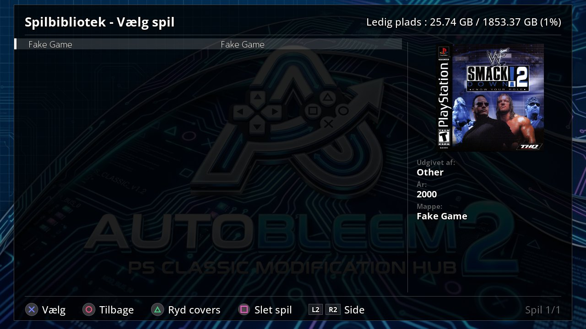

### 4.2 Hardware Information

Maskinens fakta - system, hardware, lagerplads med dens frie plads netværk-adresser display og audio-drivere
tilsluttede pads - genleser hvert sekund. Det er den samme side på hver platform, også på konsollen;
skærmene til opsætning af netværk og controllere er **Netværk og controllere** (PSC-Bios, kapitel 6).

De to første controllers vises som Spiller 1 og Spiller 2 – portene som PS1-emulatoren giver dem. Enhver
yderligere controller vises som ikke brugt af PS1-emulatoren. RetroArch tildeler controllers efter egne
indstillinger og kan ordne dem anderledes. Når en controller tilsluttes eller fjernes, viser launcher'en
kort, hvilken pad der er Spiller 1 og Spiller 2.

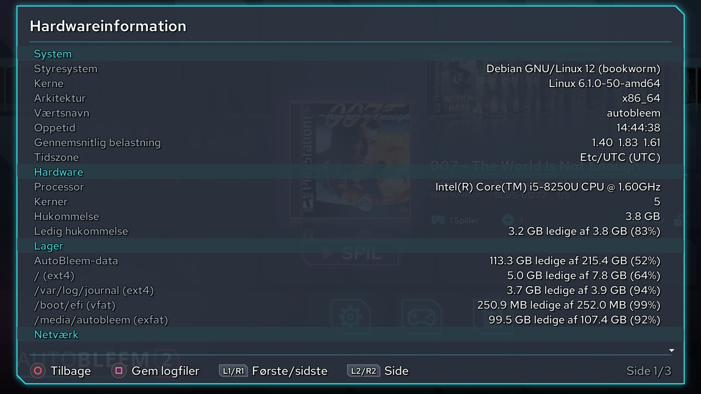

### 4.3 Knap-vejledningen

Triangle på hylden: hver knap på hver skærm på en side. Når USB-tastatur er tilsluttet eller er blevet brugt
viser en Keyboard-kolonne tasterne ved siden af pad-knapperne.

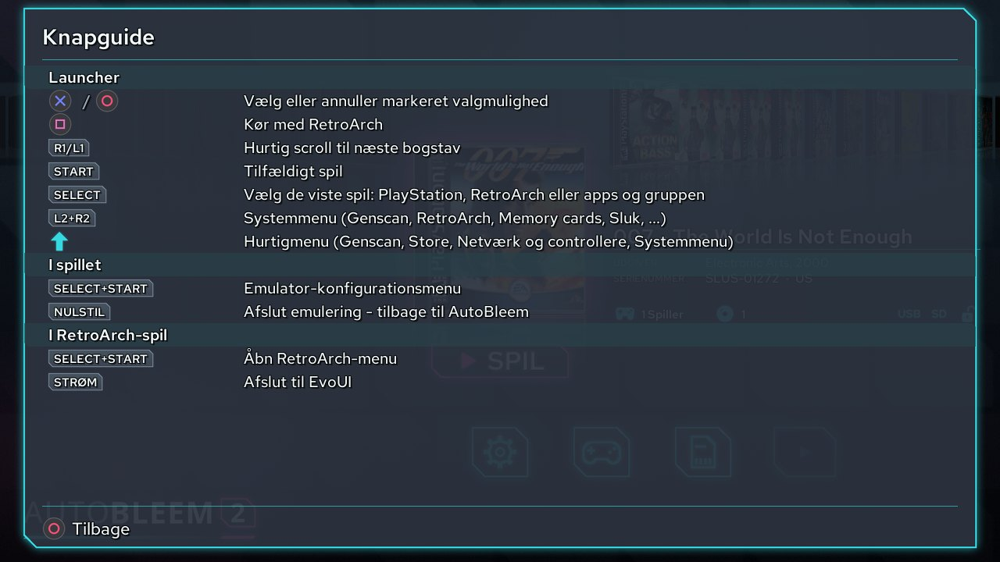

### 4.4 Tastaturet på skærmen

Overalt hvor tekst bliver tastet - memory card-sæt et spils titel WiFi-adgangskode en sources adresse -
samme tastatur lagt ud som telefonens: bogstaver en side med symboler (`/ \ : ? & = % @ #` og resten en
adresse eller adgangskode har brug for) og to sider med accenterede bogstaver med Shift side-key Mellemrum
Backspace og Bekræft på den nederste række. Retninger bevæger Cross taster Triangle sletter Square er
mellemrum **L1** er Shift (to gange for caps lock) **R1** næste side **L2 / R2** bevæger markøren Start
bekræfter Circle annullerer. USB-tastatur taster til enhver tid: Enter bekræfter Esc annullerer.

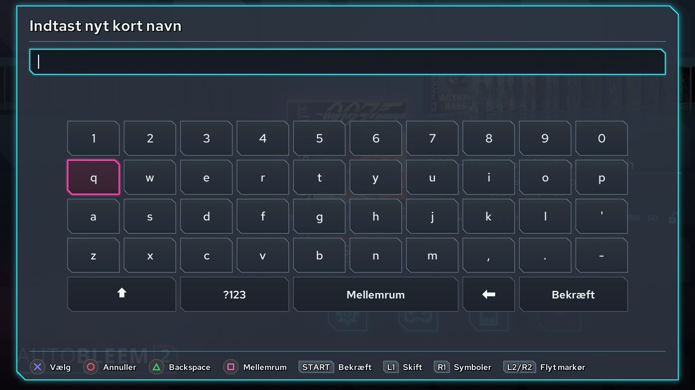

<!-- pagebreak -->

## 5. På PC'en

### 5.1 UpdateRoms - genopfrisking af konsol-stick

PlayStation Classic har ingen netværk så RetroArch-listerne og kasseart på dens stick bliver lavet på PC'en:
**UpdateRoms** gør på PC'en hvad launcher's scanning gør på Pi med PC'ens netværk og konsolens veje så
konsollen starter og finder alt på plads.

1. Kopier dine ROM'er på stickjen under `RetroArch/roms/<system>/` (afsnit 3.9). Mappe-navne skal være
   RetroArch's database-navne; installer laver de almindelige.
2. Start **`UpdateRoms\UpdateRoms.exe` fra stickjen** (installer sætter den der). Den finder stickjen fra
   hvor den sidder viser en fase-linje en fremskridt-linje og en log og:
   - downloader RetroArch's database-bundle når stickjen ikke har et og identificerer hvert ROM efter det -
     et spil databasen kender får dets rigtige navn;
   - skriver en afspilnings-liste pr. system ind i `RetroArch/bin/playlists/` med konsolens veje og holder
     hvad RetroArch selv tilføjede der;
   - henter kasseart fra hvert ROM som ikke har nogen fra libretro's thumbnail-servere ind i
     `RetroArch/bin/thumbnails/`.
3. Tag stickjen sikkert ud og sæt den tilbage i konsollen. RetroArch-fanen af sæt-vælgeren lister hvert
   system som har spil.

Kør det igen efter hver ændring til ROM-mapper; en mappe som ingenting ændrede i bliver sprunget over så
en genstart er hurtig. Loggen er `System/Logs/updateroms.log`. Et Raspberry Pi-kort i kortlæser kan blive
genopfrisket samme vej (`UpdateRoms.exe <drev> --target rpi`) selvom Pi gør det af sig selv når det har netværk.

### 5.2 LAN Share - dine spil og disc på serveren på dit netværk

**LAN Share** (`LanShare.exe` på Store-siden i dens **LAN server**-fane) sætter dine PS1-spil på Store's
server på dit hjemmenetværk - en `abstored` på en Raspberry Pi NAS eller anden PC - og læser PS1-disc i PC'ens
CD/DVD-drev til det. Store på konsol Pi eller PC installerer dem da fra der. Intet at installere; indstillinger
bliver holdt i `%LOCALAPPDATA%\AutoBleem LAN Share\`.


1. **Serveren**: indtast dens adresse (`http://<dens adresse>:<port>` som Store har det) og tryk **Connect**.
   Dets spil og problemer dets scanning fandt bliver listet til venstre. For at sætte spil på det giv en af:
   - **Share** - serverens spil-mappe som den er delt på netværk (Samba) f.eks. `\\raspberrypi\games`:
     LAN Share kopierer spillene der og beder serveren skanningen. Serveren selv bliver læse-kun.
   - **Token** - når serveren blev startet med `--allow-uploads`: dens token (serveren udskriver det ved
     start og holder det i `<state>/upload-token`). LAN Share uploader over HTTP og en stoppet upload går
     videre hvor den stoppede.
2. **Spil på denne PC**: vælg mappe af spil (en mappe pr. spil) sæt flueben på spil og tryk **Publish the
   ticked games**. **On the server** siger om serveren allerede har et spil (efter dets serienummer eller efter
   titel); sådan spil sendes aldrig to gange. **Tick those not on the server** sætter flueben på resten.
3. **En disc**: put PS1-disc i drev og tryk **Read a disc and publish it**. Discs bliver læst helt ind i
   `.bin` + `.cue` (og `.sbi` til LibCrypt-spil når drev giver subkanalerne) navngivet efter dets titel
   tjekket mod kendt godt dump (når databaseerne bliver valgt) og publiceret. Til spil på flere disc sæt
   flueben på **The game has more than one disc**: LAN Share spørger for hver næste disc og publicerer dem
   sammen som et spil.
4. **Remove from the server...** tager de valgte spil fra serveren. Intet bliver slettet: hvert blir flyttet
   i `.removed`-mappe ved siden af serverens spil og at flytte det tilbage sætter det tilbage.

**Databaseerne** - AutoBleem's omslag-mappe (`coversU/P/J.db`) og RetroArch's `Sony - PlayStation.rdb` -
giver titler og tjek af læst disc; begge valgfrit. **Also share the games on this PC with the Store**
(som standard fra) betjener mappen på denne PC til Store direkte. Første gang spørger Windows om dets
firewall: tillad kun private netværk.

<!-- pagebreak -->

## 6. Konsolværktøjerne (PlayStation Classic)

To værktøjer til PlayStation Classic-stick. Begge tegner i launcher's tema og sprog og begge bliver kørt af
pad - og i gamepad-guiden af konsolens front-knapper. **PSC-Bios** er udvidelse der kommer med konsol-pakken:
posten *Netværk og controllere* i Hurtigmenuen og systemmenuen åbner det og det er i Udvidelser-listen. **ABFlashKit** er App i
Apps-sættet.

### 6.1 PSC-Bios

En udvidelse der kommer med konsol-pakken også tilgængelig på Raspberry Pi og PC-stick. Det bliver åbnet fra
Systemmenuen's *Network & Controllers*-element (eller fra Udvidelser-listen). Når den udvidelse er
installeret men deaktiveret er *Network & Controllers*-elementet i Quick-menu og Systemmenuen nedtonet med
note "enable it in Extensions" - Cross der åbner Udvidelser-listen på det.

Åbnings-skærmen viser maskine-fakta: tid tidszone WiFi/Ethernet/Bluetooth-netværksadaptere med deres adresser
og hver tilsluttet controller med om det har knap-kortlægning. Netværk og Bluetooth-dele har brug for
AutoBleem-kernelen på konsol (afsnit 6.2) eller systemværktøjer på Raspberry Pi / PC-stick; gamepad-guiden
fungerer på ethvert system.

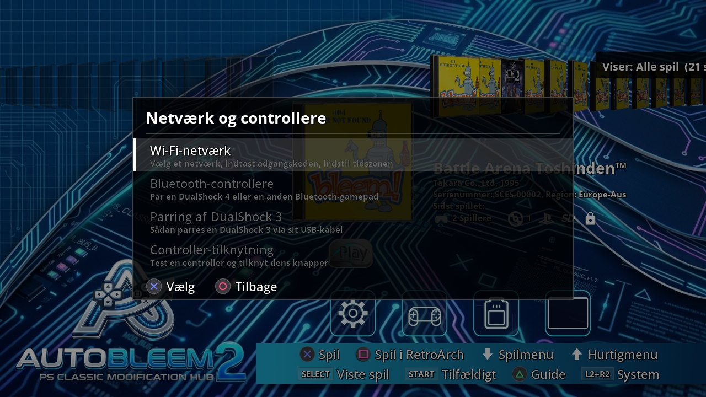

- **Select - Wi-Fi Network** (kernel eller NetworkManager): netværks-navn (tastet eller plukket fra scan)
  adgangskode driver-mode og *Apply / Restart Network*. Tidszone indstilles her også. Konsolens IP-adresse
  vises når forbundet.
- **Square - Bluetooth Controllers**: scan for Bluetooth-gamepads (DualShock 4 osv.) at parre eller fjerne.
- **L1 - DualShock 3 Pairing**: USB-kun forbindelse til første DualShock 3 gennem kernels sixaxis-plugin.
- **R1 - Controller Mapping**: kortlægnings-guiden (nedenfor).
- **Triangle - About**, **Circle - tilbage** til launcher.

**Gamepad-guiden** viser tilsluttede pad rå - hver akse knap og hat som tal og DualShock-billede som
lyser op når du trykker. Fordi pad'et under test ikke kan stoles på bliver guiden kørt af konsolens **front-
knapper**: **RESET** skifter til næste pad **OPEN** starter kortlægning (derefter svar hver spørgsmål - tryk
knap tændt på billede eller OPEN når pad ikke har sådan knap) **POWER** annullerer eller forlader. Hold Circle
på pad i 2 sekunder forlader guide (en bar fyldes og footer-hint siger "Hold 2 s: Exit"). Mens pad ikke har
kortlægning endnu holder nogen knap i 2 sekunder gør det ("Hold any button 2 s: Exit"). Et kort tryk
kortlægges som normalt. På tastatur står Esc / Mellemrum / Enter ind for POWER / RESET / OPEN. Til slut
bliver nye kortlægning tilføjet til test og OPEN gemmer det under navn du vælger; launcher indlæser det
derefter.

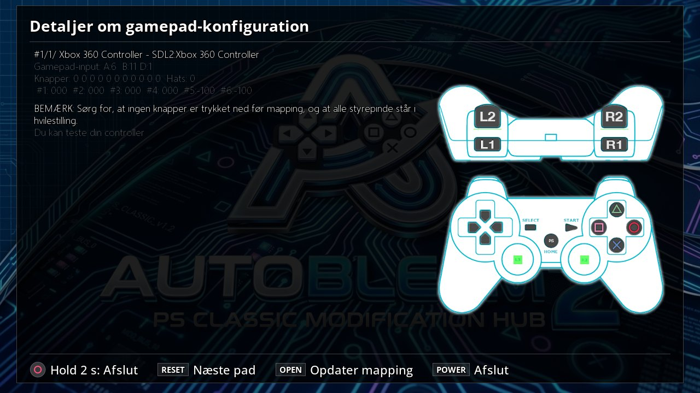

### 6.2 ABFlashKit - AutoBleem-kernelen

AutoBleem-kernelen er valgfrit erstatning af konsolens Linux-kernel: det bringer arbejdende ur USB-WiFi og
Bluetooth-dongel (til PSC-Bios og Bluetooth-pads) og front-knap-support emulatoren bruger til genoptag-
punkter. ABFlashKit installerer det, backer konsollen først og kan sætte konsollen tilbage til stock gennem
Sony's egen recovery.

> **Dette værktøj skriver til konsolens flash-hukommelse.** En flash der bliver afbrudt - strøm afbrydt stick
> trukket ud - kan efterlade konsollen ustand til start og installation af brugerdefineret kernel ophæver
> dens garanti. Hold konsollen strøm og stick i indtil den genstarter af sig selv. ABFlashKit åbner på denne
> advarsel; *I understand* går videre *Quit* forlader.

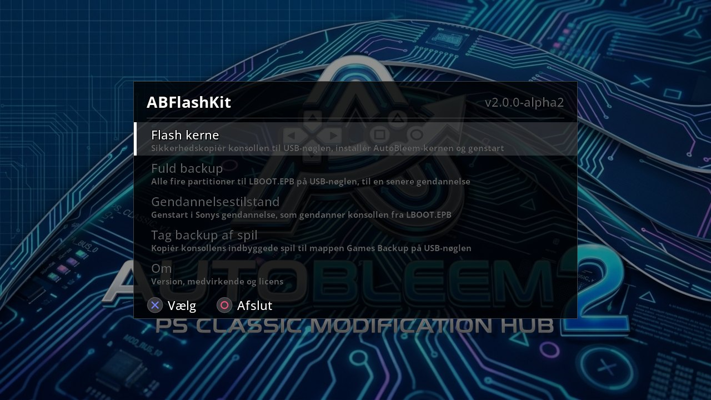

- **Flash Kernel**: laver recovery backup af konsolens partitioner på stick (`LBOOT.EPB`) hvis der ikke er
  en endnu, tjekker den og kernel-image skriver kernel og AutoBleem's system-filer og genstarter. *All done
  - when the screen goes black replace power cord*: tag konsolens strøm ud og stik den tilbage i.
- **Full backup**: alle fire partitioner til `LBOOT.EPB` til restore senere (tidligere backup bliver
  overskrevet efter spørgsmål).
- **Restore Mode**: tjekker backupen er en stock-en sætter recovery-flag og genstarter ind i Sony's recovery
  som restorer konsollen fra `LBOOT.EPB` på stickjen - vejen tilbage til stock firmware.

En fremskridts-linje under hvert trin viser hvor langt handlingen er. Værktøjet nægtede at flashe konsol der
kører anden brugerdefineret firmware (BleemSync Project Eris): restore den til stock først.

<!-- pagebreak -->

## 7. Hvis noget går galt

- **Logs**: AutoBleem holder sine logs i hukommelse så stickjen ikke bliver skrevet til hele tiden - de når
  `System/Logs/` på stick kort eller data-mappe kun når noget går galt: krasch af launcher PS1-spil eller
  RetroArch gemmer dem til `System/Logs/crash-<n>/` (de sidste tre bliver holdt) og launcher siger det en
  gang når det kommer tilbage. For at holde hvert log skal du skifte til *Options -> Diagnostics -> Keep
  logs on the stick* (fra næste start) eller opret tom fil `System/Logs/keep` på PC. På Pi eller PC viser
  *Hardware Information* hvor logs er og Square gemmer dem til `System/Logs/saved-<n>/`. Filerne:
  `autobleem.log` (launcher) `launch.log` og `pcsx.log` (PS1-spils start og emulators output)
  `retroarch.log` og - altid på stick - `update.log` (online opdatering) og `updateroms.log` (UpdateRoms).
- **Et spil er ikke på hylden**: tjek mappen layout (en mappe pr. spil billede-formater fra afsnit 3.9).
  *Game Manager* lister mapper scanning nægtede efter spillene markeret *Not added* med grund; Square sletter
  sådan mappe. *Genscan spil* i systemmenuen kører scanning igen.
- **Ingen omslag**: omslag-databaseerne blev ikke installerede (kør installer igen med dem afkrydset) eller
  til RetroArch-spil på konsol UpdateRoms er ikke blevet kørt på PC'en.
- **En pad gør intet eller har sine knapper blandet**: PSC-Bios's gamepad-guide (en konsol) kortlægger det;
  på Pi eller PC viser Hardware Information-siden hvad SDL ser.
- **Konsol viser sort skærm efter spil**: AutoBleem genbygger sit vindue af sig selv (op til tre gange); hvis
  det bliver sort hold power-knap og tænd konsol igen.
- **Raspberry Pi**: `Alt+F2` giver login-prompt på anden konsol; SSH er aktiveret fra første start. `sudo
  journalctl -u autobleem` viser launcher's service; `sudo systemctl restart autobleem` genstartet det. En
  første start som ikke kunne afsluttet (intet netværk) forsøger igen ved næste start.
- **Windows**: `Esc` forlader launcher; data-mappen er den valgte i setup (`Documents\AutoBleem` som
  standard) logs er i dens `System\Logs`.

AutoBleem er frit software (GNU GPL v3 eller senere) uden garanti. Support og nyheder: Discord-serveren
linket på About-skærmen og https://autobleem.retromenele.pl/.
