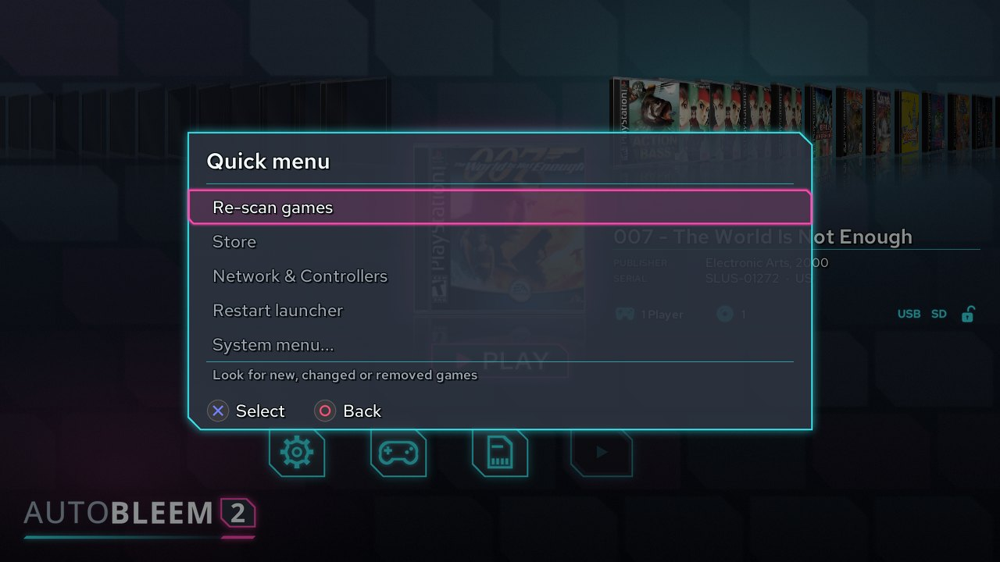

# Manual de usuario de AutoBleem 2

AutoBleem 2 es un lanzador de juegos para **PlayStation Classic** - y, desde la versión 2, para **Raspberry Pi**,
un **PC que arranca desde una unidad USB** y **Windows**. Muestra sus juegos PS1 como una estantería de carátulas
con sus empaques y detalles, los inicia en el emulador PCSX incluido y, con RetroArch instalado junto a él, puede
reproducir juegos de otros sistemas. Este manual cubre la instalación en cada plataforma, el uso diario y las
herramientas incluidas.

> Las descargas para cada plataforma están en **https://autobleem.retromenele.pl/**. La página se organiza por
> plataforma: el panel *Install* de cada una es lo que descarga; los *Build inputs* debajo son lo que los
> instaladores descargan por sí solos.

## 1. Lo que obtiene

- **El lanzador** - la estantería de carátulas, los conjuntos (PlayStation, RetroArch, Aplicaciones), los detalles
  del juego, el menú rápido y el menú del sistema, las opciones, las herramientas de tarjeta de memoria y puntos de
  reinicio, y la Tienda para descargar aplicaciones y juegos. El mismo programa en todas las plataformas.
- **Dos emuladores PS1** - `pcsx-abnxt`, el actual (predeterminado), y `pcsx-ab`, el clásico que AutoBleem
  siempre ha incluido. Elige uno en las opciones; ambos usan la misma configuración y tarjetas de memoria.
- **RetroArch** (opcional en todas las plataformas) para otros sistemas: NES, SNES, Mega Drive, Game Boy, arcade
  y muchos más. AutoBleem construye sus listas de RetroArch desde las ROM que copia e inicia cada juego con el
  núcleo correcto.
- **Las herramientas de consola**: *PSC-Bios* (que los menús muestran como *Red y mandos*) para WiFi, reloj,
  Bluetooth y mapeo de controles - en la consola, y también en una Raspberry Pi y la unidad PC - y *ABFlashKit*
  para instalar el núcleo AutoBleem (solo PlayStation Classic).
- **UpdateRoms** para Windows: actualiza las listas de RetroArch y las carátulas de una unidad de consola en una
  PC, porque la consola misma no tiene red.


<!-- pagebreak -->

## 2. Instalación

### 2.1 PlayStation Classic

Necesita una PC Windows, una unidad USB (USB 2.0, 8 GB o más) y la consola original. La unidad no tiene que
estar vacía y **no se formatea** a menos que usted lo pida: AutoBleem se instala junto a lo que ya contiene, y
una unidad que ya usa con AutoBleem 1.0 se actualiza en su sitio (ver más abajo). AutoBleem se ejecuta desde la
unidad sin cambios en la consola. La unidad debe ser **FAT32**
para una consola original - su núcleo no puede leer exFAT. Solo una consola con el núcleo AutoBleem instalado
(ABFlashKit, capítulo 6) también arranca desde una unidad exFAT, lo que levanta el límite de 4 GB de FAT32.

1. Descargue **AutoBleemInstaller-<version>.zip** del panel PlayStation Classic del sitio y descomprímalo en
   cualquier lugar. Contiene `AutoBleemInstaller.exe` y el paquete de AutoBleem que instala.
2. Conecte la unidad e inicie `AutoBleemInstaller.exe`. Seleccione la unidad en la parte superior. La línea de
   debajo dice qué hay ahora en la unidad: *una instalación nueva* (los demás archivos de la unidad no se tocan)
   o *AutoBleem <versión> está en esta unidad: se actualizará* (juegos, partidas guardadas, tarjetas de memoria y
   configuración se conservan). **Formatear es opcional**: el botón **Format** junto a la unidad es solo para
   una unidad nueva sin sistema de archivos, una que la consola no puede leer (NTFS, por ejemplo) o una que
   quiera vaciar - primero pregunta y luego borra todo lo que hay en la unidad. Elija allí FAT32 a menos que la
   consola tenga el núcleo de AutoBleem. Marque lo que desee:
   - **Bases de datos de carátulas** - los empaques y detalles de la biblioteca PS1 (marcado de forma predeterminada;
     aproximadamente 300 MB).
   - **RetroArch** - RetroArch con sus núcleos, aplicaciones adicionales (Doom, Quake, Amiga, ...) y recursos
     de libretro para juegos de otros sistemas. Desactivado de forma predeterminada; se puede añadir más tarde
     ejecutando el instalador nuevamente.
   - **Archivos BIOS** - los archivos BIOS que necesitan los núcleos de RetroArch (requiere RetroArch).
   - **Juegos de muestra** - algunos juegos homebrew gratuitos para que la estantería no esté vacía.
3. Pulse **Instalar** y espere. Las barras de progreso y el registro muestran cada paso; la unidad se llama `SONY`
   al final y `UpdateRoms` se coloca en ella (ver capítulo 5).
4. Extraiga la unidad de forma segura, conéctela al **segundo puerto USB** de la consola (el derecho, jugador 2)
   e encienda la consola. AutoBleem inicia en lugar del menú original.

**Encendido y apagado.** Con la unidad dentro, la consola arranca, su luz parpadea durante unos segundos (AutoBleem
se está configurando) y luego va a espera antes de que se muestre nada - así es como la consola organiza una
actualización, así es como AutoBleem se ejecuta. Presione **Power** una vez y aparece el lanzador. *Apagar* en el
menú del sistema, o el botón Power de la consola, pone la consola en **espera de AutoBleem**: la unidad se
desconecta primero, luego la luz se pone **roja** - la señal de que AutoBleem funciona correctamente - y el
siguiente Press Power trae el lanzador directamente, en unos segundos. **Mientras la luz es roja, la unidad se
puede extraer** y poner en una PC sin que Windows pida verificarla; vuelva a ponerla antes de presionar Power.
Desconectar la consola pasa por la espera de arranque nuevamente la próxima vez.

Para **actualizar** una unidad, ejecute un instalador más nuevo en ella: sus juegos, guardados, configuración y
contenido de RetroArch permanecen; solo se reemplazan los archivos propios de AutoBleem.

**Actualizar desde AutoBleem 1.0 (o AutoBleem-NG).** El mismo instalador, la misma unidad - sin formatear:

1. Primero copie toda la unidad a la PC como copia de seguridad.
2. Conéctela, inicie `AutoBleemInstaller.exe`, elija el canal y la unidad. **No** pulse Format.
3. Pulse **Install**. El instalador pone al día la disposición antigua: RetroArch, las ROM y los temas pasan a
   donde AutoBleem 2 los busca, y las carpetas de ROM antiguas (`nes`, `snes`, ...) reciben los nombres de
   sistema de RetroArch. Juegos, estados guardados, tarjetas de memoria, ROM y partidas de RetroArch se
   conservan; `config.ini` también, con el emulador de PS1 puesto en pcsx-abnxt.
4. Vuelva a poner la unidad en la consola. El primer escaneo reconstruye la lista de juegos y las listas de
   reproducción (UpdateRoms en la PC descarga las carátulas de los juegos de RetroArch, capítulo 5).

> La consola original no tiene reloj ni red: las fechas solo se muestran después de instalar el núcleo AutoBleem
> (capítulo 6), y las carátulas para juegos de RetroArch vienen de UpdateRoms en la PC (capítulo 5).

Los juegos van en la carpeta `Games` de la unidad, una carpeta por juego - ver sección 3.9 para la disposición.

### 2.2 Raspberry Pi

AutoBleem convierte un Pi en una pequeña consola: arranca directamente en el lanzador, sin escritorio. Dos imágenes
listas están en el sitio - 32 bits y 64 bits - más un tarball para un Raspberry Pi OS Lite existente.

| Modelo | Imagen de 32 bits | Imagen de 64 bits | Notas |
|---|---|---|---|
| Raspberry Pi 5 | sí | sí | |
| Raspberry Pi 4 Modelo B, Pi 400 | sí | sí | |
| Raspberry Pi 3 Modelo B / B+ / A+ | sí | sí | bien para el lanzador y PS1 |
| Raspberry Pi Zero 2 W | sí | sí | 512 MB de RAM: PS1 funciona, núcleos de RetroArch más pesados no |
| Raspberry Pi 2 Modelo B | sí | solo v1.2 | lento para cualquier cosa en 3D |
| Raspberry Pi 1, Zero, Zero W | no | no | ARMv6 - ninguna imagen funciona |

La **imagen de 32 bits es la recomendada** para juegos PS1: el recompilador ARM rápido de `pcsx-ab` es solo 32 bits,
por lo que la compilación de 64 bits ejecuta juegos PS1 más lentamente. La imagen de 64 bits tiene un conjunto más
grande de núcleos de RetroArch.

**Con Raspberry Pi Imager:**

1. Instale Raspberry Pi Imager (raspberrypi.com/software). En *Choose OS* seleccione *Use custom* y el
   `autobleem-<version>-rpi-armhf.img.xz` (32 bits) o `-arm64.img.xz` (64 bits) que descargó - o agregue la
   URL del repositorio `https://autobleem.retromenele.pl/rpi-imager/os_list.json` en la configuración de la
   aplicación y seleccione AutoBleem de la lista.
2. Use la pantalla de personalización de Imager (el engranaje, o la pregunta después de *Siguiente*) para
   establecer **el nombre de usuario y contraseña, la red WiFi y el país, y habilitar SSH**. AutoBleem necesita
   una red en el primer arranque.
3. Escriba la tarjeta, insértela en el Pi con una pantalla y un teclado o control, e enciéndalo.

**El primer arranque** tarda de 5 a 25 minutos y muestra lo que hace en la pantalla. Sin red, le pide una (una lista
WiFi, la contraseña), luego pregunta si instalar RetroArch (un minuto sin respuesta significa sí), agranda la
partición del sistema, crea la partición de datos `AUTOBLEEM` del resto de la tarjeta, instala RetroArch y sus
núcleos, los paquetes BIOS y los juegos de muestra, y reinicia en el lanzador.

Las respuestas se pueden proporcionar con anticipación en **`autobleem.txt`** en la partición de arranque de la
tarjeta (editable en cualquier PC antes del primer arranque):

| Clave | Predeterminado | Significado |
|---|---|---|
| `root_gib` | 8 | El tamaño de la partición del sistema en GiB; el resto se convierte en la partición de juegos. |
| `hdmi_mode` | 1920x1080@60 | El modo de pantalla para todo el arranque (`1280x720@60` para un televisor más antiguo). |
| `retroarch` | (solicitado) | `yes` / `no` - RetroArch y otros sistemas, o solo PS1. |
| `thumbnails` | none | `boxarts` refleja el conjunto completo de carátulas para cubiertas sin conexión (~9000 archivos). |
| `bios`, `downloads`, `samples` | yes | Establezca en `no` para omitir paquetes BIOS, todas las descargas o juegos de muestra. |

**En un Raspberry Pi OS Lite existente** (Bookworm o Trixie): copie `autobleem-rpi.tar.gz` (o la versión arm64)
en el Pi, descomprima y ejecute `sudo bash install.sh`. Hace las mismas preguntas, crea la partición de datos al
encoger la raíz en el próximo arranque (`--shrink-root <GiB>`), y coloca el lanzador en la primera consola.

Después de la instalación, la partición **`AUTOBLEEM`** de la tarjeta (exFAT) es lo que usted completa: extraiga
la tarjeta y ábra la en cualquier PC, o copie a través de la red (SSH está activado). `Games/` para juegos PS1,
`RetroArch/roms/<sistema>/` para otros sistemas, `System/Bios/` para BIOS PS1 (sección 3.10), `Themes/` para temas.

### 2.3 Unidad USB de PC

El mismo aparato para cualquier PC que arranque desde USB - un sistema de 32 bits, por lo que las máquinas antiguas
también funcionan:

1. Descargue `autobleem-<version>-pcusb-i386.img.xz` del panel de PC y escríbalo en una unidad de 8 GB o más
   con Raspberry Pi Imager (*Use custom*), balenaEtcher o Rufus (modo DD).
2. Inicie la PC desde la unidad (la tecla del menú de arranque de su PC - F12, F8, Esc...). Tanto BIOS como
   UEFI funcionan; **Secure Boot debe estar desactivado**.
3. El primer arranque es el del Pi: una pregunta de red si no hay cable, la pregunta de RetroArch, luego la
   instalación - aproximadamente ocho minutos con una red por cable - y un reinicio en el lanzador.

La unidad luego tiene una partición `AUTOBLEEM` para sus juegos, visible en Windows 10 (1903 y más reciente)
como una segunda unidad cuando conecta la unidad a una PC en ejecución. `autobleem.txt` está en la primera
partición, con las mismas claves que en el Pi (sin `hdmi_mode` - la PC usa el modo nativo de la pantalla).

### 2.4 Windows

AutoBleem como programa de Windows: pantalla completa, emuladores y RetroArch iniciados como programas.

1. Descargue **AutoBleemSetup-<version>.exe** y ejecútelo. Se instala por usuario, sin derechos de administrador:
   el programa bajo `%LOCALAPPDATA%\Programs\AutoBleem`, los datos (juegos, configuración, temas, RetroArch) en
   una carpeta que elija - `Documents\AutoBleem` de forma predeterminada.
2. Marque los componentes - las bases de datos de carátulas, RetroArch (la compilación de Windows oficial y sus
   núcleos), los archivos BIOS, los juegos de muestra - y deje que el asistente de configuración los descargue.
3. Inicie AutoBleem desde el menú Inicio o el Escritorio. En una PC, el teclado funciona como un control (sección 3.2).

Ejecutar una versión más nueva del programa sobre ella lo actualiza y mantiene la carpeta de datos. El lanzador
también verifica el sitio una vez al día y ofrece una actualización si hay una (sección 3.11).

<!-- pagebreak -->

## 3. Usar AutoBleem

### 3.1 El lanzador

El lanzador se abre en la estantería: las carátulas del conjunto actual, la seleccionada en el medio con un suave
reflejo debajo, sus detalles al lado en una cuadrícula compacta - editorial, año, número de serie, región,
jugadores, cuándo se jugó por última vez (un dato que el juego no tiene se omite) - y un botón de reproducción. El
aspecto predeterminado es el tema **ab2.0.0**; una instalación nueva y una actualización que lo trae cambian a él una
vez. La barra de ayuda en la parte inferior tiene dos líneas de cuatro espacios. La primera dice lo que hacen los
botones para el juego seleccionado (jugar, jugar en RetroArch, abrir la fila de iconos, el menú rápido); la segunda
muestra siempre Select (el conjunto), Start (un juego aleatorio), Triangle (la guía) y L2 + R2 (el menú del sistema),
atenuados cuando alguno no hace nada. Un escaneo de la carpeta de juegos se ejecuta en segundo plano en cada inicio;
mientras se ejecuta, una burbuja en la parte superior derecha muestra su progreso, y los nuevos juegos aparecen en la
estantería a medida que se descubren.

**Una instalación nueva** aún no tiene juegos: en lugar de una estantería vacía, el lanzador muestra una tarjeta de
bienvenida - *¡Hola y bienvenido a AutoBleem!* - que indica copiar juegos en la carpeta `Games` y elegir *Reescanear
juegos*, y que nombra el lugar según la plataforma: en tu memoria USB (PlayStation Classic, unidad PC), en tu tarjeta
SD (Raspberry Pi) o en la carpeta AutoBleem (Windows). La tarjeta desaparece en cuanto un escaneo encuentra el primer
juego.

**Las notificaciones** aparecen como burbujas en la parte superior derecha: el progreso del escaneo, el nombre del
conjunto al que cambió (*Mostrando: ...*, mientras lo indique Opciones → *Duración del aviso*), una batería baja del
mando, una nota tras un fallo, un procesador de escáner trabajando y la descarga en curso de la Tienda. La burbuja de la
descarga muestra su velocidad y el tiempo restante, p. ej. `1.4 MB/s · 0:42`.

**La etiqueta del canal.** Una compilación que no es una versión final muestra una pequeña etiqueta bajo la placa de
batería del mando en la esquina superior izquierda: un indicador con el canal - `ALPHA`, `BETA` o `RC` para un
prelanzamiento, `TESTING` para cualquier otro prelanzamiento, `NIGHTLY` para una compilación nocturna, `DEV` para una
hecha a mano - y la versión corta al lado (para `DEV`, el commit del que se compiló). Una versión final no muestra
etiqueta.

Un mando inalámbrico con lectura de batería disponible - en la consola, una Pi o el USB para PC, no en Windows - se muestra como un pequeño icono con su porcentaje, apilado desde la esquina superior izquierda sobre su propia placa. Un mando emparejado con el Jugador 1 o el Jugador 2 (según la opción Intercambiar Jugador 1 / Jugador 2) lleva la etiqueta P1/P2; un mando no emparejado, o un tercero, no lleva etiqueta. Cuando la batería de un mando se agota, una línea de notificación lo indica una vez, con su nombre y porcentaje.


### 3.2 Controles

| Botón | En la estantería |
|---|---|
| Izquierda / Derecha | Juego anterior / siguiente. Mantener desplaza. |
| L1 / R1 | Salta a la primera letra anterior / siguiente de los títulos. |
| Cross | Inicia el juego seleccionado (un juego PS1 en el emulador PS1; un juego de RetroArch en su núcleo; una aplicación después de su manual). |
| Square | Inicia el juego PS1 seleccionado en RetroArch en su lugar. |
| Triangle | La guía de botones. |
| Start | Un juego aleatorio del conjunto actual. |
| Select | El selector de conjuntos: pestañas PlayStation / RetroArch / Aplicaciones (L1 / R1), los grupos de la pestaña (Arriba / Abajo, L2 / R2 una página), Cross selecciona. |
| Arriba | El menú rápido (sección 3.4). |
| Abajo | Abre la fila de iconos bajo el juego (Configuración, Juego, Tarjeta de memoria, Reanudar). Arriba la cierra. |
| L2 + R2 | El menú del sistema (sección 3.5). |

**Con un teclado** (una PC sin control o un teclado USB en la consola, un Pi o la unidad PC) las teclas
reemplazan: **Flechas** = d-pad, **Intro** = Cross, **Esc o Retroceso** = Circle, **Tabulación** = Triangle,
**Espacio** = Square, **F1 / F2** = Select / Start, **Página Anterior / Página Siguiente** = L1 / R1,
**Inicio / Fin** = L2 / R2, **F10** = el menú del sistema. En una máquina de desarrollo, Esc cierra el programa
y Espacio es Start.

En cada lista y menú: Arriba / Abajo se mueven, **L2 / R2 cambian de página**, L1 / R1 saltan a la primera /
última fila, **Cross selecciona, Circle regresa**. Una pantalla con configuración la guarda cuando la sale con Circle.


### 3.3 Los conjuntos

**Select** abre el selector de conjuntos. La pestaña PlayStation enumera, en una PlayStation Classic, *Todos los
juegos* y *Juegos internos* (los veinte incorporados de la consola), luego *Juegos USB* (todo lo que hay en `Games/`) y
cada carpeta que creó bajo ella (un juego en una subcarpeta pertenece a ese grupo), luego *Juegos favoritos*,
*Historial de juego* y, si es el caso, *Juegos de pistola*. En una Raspberry Pi, una unidad PC y Windows no hay juegos
internos, así que la lista empieza con *Juegos USB*, que es toda la biblioteca. La pestaña RetroArch (solo donde
RetroArch está instalado) enumera un grupo por sistema que tiene juegos, más Favoritos e Historial propios de
RetroArch. La pestaña Aplicaciones agrupa aplicaciones por tipo: *Todas las aplicaciones*, luego *Juegos*,
*Emuladores*, *Herramientas*, *Medios* y *Otros* (la categoría se establece en el archivo `app.ini` de cada
aplicación). Cada fila muestra cuántos elementos contiene; un grupo vacío se abre en una estantería vacía con la fila
de iconos mostrando solo Configuración. El pie de página nombra las teclas: L1 / R1 pestañas, L2 / R2 una página, Cross
elige, Circle *Atrás*.

### 3.4 El menú rápido

**Arriba** en el lanzador, o el **icono de engranaje** en la fila de iconos (donde están Configuración / Juego /
Tarjeta de memoria / Reanudar): el menú rápido para acciones que alcanza desde el carrusel. Una lista breve:
*Reescanear juegos* (inicia un escaneo ahora), *Tienda* (explorar e instalar juegos, aplicaciones y extensiones),
*Red y mandos* (solo donde una extensión instalada proporciona la entrada `network` - PSC-Bios en la consola, un Pi
y la unidad PC: WiFi, emparejamiento Bluetooth, el asistente de mapeo de controladores - ver sección 6; atenuado con
"actívala en Extensiones" cuando esa extensión está deshabilitada - Cross abre la lista de Extensiones), *Reiniciar
el launcher* (cierra AutoBleem y lo inicia de nuevo; solo en la consola, un Pi y la unidad PC) y *Menú del sistema...*
(todo lo demás: Opciones, Administrador de juegos, Apagar y más - el menú completo abajo). Arriba / Abajo se mueven
(envolvente), Cross selecciona, Circle regresa. Cada elemento tiene una descripción de una línea en su fila. Aparte de
la Tienda y *Reiniciar el launcher*, cada elemento también está en el menú del sistema.



### 3.5 El menú del sistema

**L2 + R2** (juntos, en cualquier orden) abre el menú del sistema sobre la estantería. Cada fila tiene una descripción
de una línea, y el menú está agrupado en secciones:

| Sección | Elemento | Lo que hace |
|---|---|---|
| (arriba) | Reescanear juegos | Busca juegos nuevos, modificados o eliminados ahora (el escaneo también observa la carpeta en sí). |
| | Extensiones | Las extensiones en la unidad - la Tienda de AutoBleem y otras (sección 3.12). |
| **Biblioteca** | Administrador de Juegos | Los juegos PS1 como una lista con sus carpetas: elimine un juego, vacíe las carátulas. Deshabilitado durante un escaneo. |
| | Memory cards | Sus conjuntos de tarjetas de memoria (sección 3.7). |
| | Procesadores de escaneo | Los programas que cada escaneo ejecuta primero - su orden, activado o desactivado (sección 3.13). Deshabilitado durante un escaneo. |
| **Sistema** | Opciones | La configuración de AutoBleem (sección 3.6). |
| | Red y mandos | Solo donde una extensión instalada proporciona la entrada `network` (`Provides=network` en su `extension.ini` - PSC-Bios en la consola, un Pi y la unidad PC) - WiFi, emparejamiento de controladores Bluetooth, configuración DualShock 3 y el asistente de mapeo de controladores - ver capítulo 6. Cuando esta extensión está instalada pero deshabilitada, este elemento permanece atenuado con una nota "actívala en Extensiones" - Cross abre la lista de Extensiones. |
| | Informacion de hardware | Los hechos de la máquina: sistema, CPU, almacenamiento, interfaces de red, zona horaria, pantalla, los controles y sus asignaciones - la misma página en todas las plataformas (sección 4.2). |
| | Actualización de software | (Raspberry Pi y PC) Verifique el sitio para una versión más nueva de AutoBleem o RetroArch ahora; la fila dice *Actualización disponible* cuando el lanzador ya conoce una. |
| | Sobre | Créditos y licencia. |
| **Salir** | RetroArch | (Solo donde RetroArch está instalado.) Sale del lanzador al menú propio de RetroArch. Cerrar RetroArch regresa. |
| | Apagar | Después de una confirmación: en la consola la espera de AutoBleem - la unidad desconectada, la luz roja, Power trae el lanzador (sección 2.1); en un Pi o una PC la máquina se apaga. |


### 3.6 Opciones

La configuración está en grupos, cada uno bajo un encabezado; Arriba / Abajo se mueve entre las filas, Izquierda /
Derecha cambia un valor (un toque es un paso, mantener desplaza), L1 / R1 saltan a la primera / última fila, L2 / R2
pasan de página, Circle sale y guarda. Cada cambio se aplica inmediatamente. Los valores de activado/desactivado se
leen **ACTIVADO** / **DESACTIVADO**.

| Grupo / Configuración | Lo que hace |
|---|---|
| **Interfaz**: Pantalla | La resolución de la pantalla, para el lanzador y el emulador PS1: *Auto* (el modo propio de la pantalla, mostrado como *Auto (1920x1080)*) o cualquier modo que la pantalla enumere; la consola ofrece 720p y 1080p. Un modo nuevo se confirma: *¿Mantener este modo de pantalla?* - si no lo confirma, vuelve atrás tras una cuenta regresiva. No en una ventana de desarrollo. |
| Escalado de pantalla del emulador | Cómo el emulador PS1 ajusta la imagen de un juego a la pantalla: *1x1* (los píxeles propios de la PlayStation), *2x (entero)*, *4:3*, *4:3 (entero)* o *Pantalla completa*. El escalado entero usa solo múltiplos enteros (el más nítido). Sustituye al antiguo interruptor de pantalla panorámica; el clásico `pcsx-ab` y RetroArch solo conocen pantalla completa y 4:3. |
| Tema AutoBleem | La apariencia. Los temas viven en `Themes/`; un archivo zip de tema depositado allí se descomprime en la próxima visita. Los temas que AutoBleem envía se actualizan con cada actualización - para personalizar uno, cópielo primero bajo un nuevo nombre. El predeterminado es **ab2.0.0**. |
| Estilo de caratulas | El marco de caja de joyas dibujado alrededor de las carátulas de PS1. |
| Destello de la carátula | Un destello que cruza la carátula seleccionada cuando la estantería se detiene. |
| Idioma | El idioma del lanzador, aplicado inmediatamente (17 idiomas). |
| Duración del aviso | Cuánto tiempo permanecen las burbujas informativas ("Mostrando: ...", el resumen del escaneo), de 0 a 20 segundos; 0 muestra *Desactivado*. Los errores tienen su propio tiempo fijo. |
| Pantalla de inicio | La imagen de AutoBleem cuando arranca el lanzador; desactivado va directo a la estantería. |
| Animaciones | El movimiento entre pantallas; desactivado hace instantáneo cada cambio de pantalla. |
| **Fuentes**: Usar la fuente predeterminada | El lanzador usa su fuente predeterminada (Red Hat Text) o - desactivado - la fuente elegida abajo. |
| Fuente | Cualquier `.ttf`/`.otf` de `resources/fonts`, `RetroArch/fonts` o la carpeta del tema; la fila nombra la fuente en uso. |
| **Sonido**: Música, Música de fondo | Qué pista suena bajo el lanzador (la del tema, o un archivo de `resources/music`), y si suena una. |
| **Emulación**: Emulador PS1 | `pcsx-abnxt` (predeterminado: PCSX-ReARMed actual con adiciones de AutoBleem) o `pcsx-ab` (el clásico). Un punto de reinicio guardado por uno continúa en el otro, a menos que el juego se haya ejecutado sin un archivo BIOS. |
| Intercambiar Jugador 1 / Jugador 2 (emuladores PS1) | Intercambia cuál de los dos primeros controles es el Jugador 1 y cuál el Jugador 2, en ambos emuladores PS1 (pcsx-abnxt y el pcsx-ab clásico). Solo tiene efecto con dos o más controles conectados; con un solo control, siempre es el Jugador 1. RetroArch no se ve afectado. |
| Jugar todos los juegos PSX con RA, Transferir configuracion RA, Conservar config. de RetroArch | (Solo donde RetroArch está instalado.) Cada juego de PS1 inicia en el núcleo PS1 de RetroArch; AutoBleem escribe su configuración en la configuración de RetroArch cuando inicia un juego allí; un cambio hecho en el menú propio de RetroArch se conserva cuando RetroArch se cierra. |
| **Biblioteca**: Mostrar juegos internos | Los juegos incorporados de la consola en las listas de PlayStation (solo PlayStation Classic). |
| Descargar carátulas en línea | El escaneo descarga carátulas faltantes de los servidores de libretro (Raspberry Pi, PC, Windows). |
| **Actualizaciones** | El canal de actualización: `release` (la versión probada), `testing` (la próxima versión, en pruebas), `nightly` (la compilación de desarrollo más reciente) o `off`. El predeterminado sigue la versión instalada. No se muestra en un equipo de desarrollo. |
| **Diagnóstico**: Conservar los registros en el USB | Conserva todos los registros en la unidad desde el próximo inicio, no solo tras un fallo (capítulo 7). |
| Mostrar rendimiento | Una superposición en la esquina inferior izquierda: fotogramas por segundo, carga de CPU, hilos y memoria; el emulador también muestra sus FPS y CPU en el juego. |


### 3.7 Configuración de un juego

Con un juego seleccionado, **Abajo** abre su fila de iconos: **Configuración** (las opciones anteriores), **Juego**
(la configuración propia del juego), **Tarjeta de memoria** (su tarjeta de memoria) y **Reanudar** (sus puntos de
reinicio). Cross abre el que está bajo el cursor.

El **editor de juegos** muestra los detalles del juego a la derecha (título, editorial, año, jugadores, carpeta, tarjeta de memoria) y su configuración a la izquierda, en cuatro grupos:

- **Juego**: *Favorito* (en el grupo Juegos favoritos), *Juego de pistola* y *Jugar usando RA* (solo donde RetroArch
  está instalado: un juego de pistola se une al grupo de pistola y siempre se ejecuta en RetroArch, cuyo núcleo PS1
  tiene el GunCon; *Jugar usando RA* ejecuta este juego en RetroArch), *Bloquear datos* (el escáner deja el título del
  juego, el número de serie y la lista de discos como los estableció).
- **Pantalla**: *Resolución* (1x o 2x, en la GPU integrada), *Eliminar costuras* (solo con 2x), *Tramado*
  (Desactivado, Activado, Siempre), *Suavizado*, el *Filtro* - cómo se escala la imagen: Más cercano (píxeles sin
  procesar), Lineal (suavizado), Nítido o Nítido (simple) (píxeles nítidos sin parpadeo), Quilez, o los filtros CRT
  CRT (fast) y CRT-Pi (dibujan sus propias scanlines, así que las filas de scanlines se atenúan) - y *Scanlines* con su
  *Brillo de las scanlines*. Resolución, eliminar costuras, tramado, suavizado y los filtros distintos de Lineal y
  Más cercano son para `pcsx-abnxt`; el clásico `pcsx-ab` y RetroArch muestran el resto como Más cercano.
- **Renderizado**: el *Plugin* de GPU y el *Frameskip* (Auto, Desactivado, 1 a 3).
- **Emulador**: SpeedHack, la frecuencia del CPU, interpolación de SPU, el logo de arranque (desactivado omite el
  shell de BIOS - para un disco casero cuyo logo personalizado rompe el arranque), y con `pcsx-abnxt` el alternar
  *Parches de Sony*.

La forma de la imagen y la resolución de la pantalla son globales (Opciones → *Escalado de pantalla del emulador* y
*Pantalla*). Un juego sin título en sus datos se muestra bajo el nombre de su carpeta.

Triangle renombra el juego, Square cambia su tarjeta de memoria, Start comparte una nueva tarjeta. Circle guarda
y sale.

**Configuración guardada en el emulador.** El menú propio del emulador tiene *Guardar ajustes para este juego*.
Una vez que un juego tiene la configuración guardada allí, esa es con la que juega, y el editor de juegos muestra
sus filas Pantalla, Renderizado y Emulador atenuadas, con esos valores, bajo el título *Guardado en el emulador*. Para volver a
la configuración del editor de juegos, seleccione **Desbloquear los ajustes** y confirme: esto elimina la
configuración que el emulador guardó, y las filas se pueden cambiar nuevamente. Ambos emuladores, `pcsx-ab` y
`pcsx-abnxt`, leen y escriben la misma configuración guardada.


### 3.7 Tarjetas de memoria y puntos de reinicio

Cada juego de PS1 tiene su propia tarjeta de memoria de forma predeterminada (guardada con sus puntos de reinicio
en `Games/!SaveStates/<carpeta de juego>/`). **Tarjetas de memoria** en el menú del sistema administra **conjuntos
compartidos** - una tarjeta que varios juegos usan, guardada en `Games/!MemCards/`: cree una (Square, con el
teclado en pantalla), renombre (Cross), elimine (Triangle). Un juego se coloca en un conjunto con *Cambiar tarjeta
de memoria* en su editor, o desde su icono de Tarjeta de memoria.

El **editor de tarjeta de memoria** (el icono Tarjeta de memoria) muestra la tarjeta del juego y una segunda
tarjeta una al lado de la otra, con el icono y título de cada guardado: copie un guardado entre los dos (Square),
elimine uno (Triangle), defragmente una tarjeta (Select). Start intercambia la tarjeta de la derecha por otro
conjunto.


**Puntos de reinicio**: cuando sale de un juego de PS1 con el botón Reset de la consola (o el menú del emulador
en un Pi o PC), AutoBleem mantiene un punto de reinicio de dónde estaba y lo ofrece bajo el icono **Reanudar** -
cuatro espacios, mostrados como tarjetas enmarcadas, cada una con una imagen del momento, su número de espacio y la
fecha; el más reciente está marcado **MÁS RECIENTE** y un espacio sin usar dice *Sin punto de reanudación*. Cross
continúa desde el espacio, Triangle lo elimina. Un juego con un punto de reinicio muestra una pequeña imagen en su
icono Reanudar; un juego sin ninguno tiene el icono Reanudar atenuado. Mientras se escribe el punto de reinicio al
salir de un juego, el emulador muestra *Espera, por favor...*.

### 3.8 Iniciar juegos, RetroArch y aplicaciones

**Cross** inicia el juego seleccionado. Un juego de PS1 se ejecuta en el emulador PS1 elegido (sección 3.6),
pantalla completa, hasta que lo sale - en la consola con el botón **Reset** anterior (volver al lanzador con un
punto de reinicio; funciona también desde dentro del menú del juego) o **Power** (la consola se apaga); en un Pi o una
PC a través del menú del emulador en el juego (abajo). **Square** inicia un juego de PS1 en RetroArch en su lugar.

**El menú del juego** (`pcsx-abnxt`). Pulse el botón de menú - el Home del control, **Select + Start** en un control
que no lo tiene, o **Esc** en un teclado - y el juego se detiene tras un menú con la última imagen del juego.
**Mantener el botón de menú 2 segundos** es lo mismo que Reset: sale del juego. L1 / R1 cambian entre sus tres
pestañas, y el menú se abre en la pestaña y la fila en que se dejó:

- **Juego**: *Continuar el juego*; bajo *Partidas guardadas*: *Guardado rápido*, *Carga rápida* y *Cargar autoguardado*
  (el juego como estaba hasta 30 segundos antes - el emulador lo guarda en memoria por sí solo mientras juega); bajo
  *Disco CD*: *Cambiar de disco* y *Reiniciar el juego* (lo empieza de nuevo); *Guardar ajustes para este juego* (ver
  sección 3.7), *Menú PCSX* (las páginas propias de PCSX-ReARMed: opciones, trucos, Acerca de) y *Salir* (de vuelta a
  AutoBleem).
- **Imagen**: *Pantalla* (la resolución de la pantalla - en la consola se elige en Opciones y aquí solo se muestra),
  *Resolución* (1x o 2x), *Eliminar costuras*, *Tramado*, *Escalado*, *Suavizado*, *Filtro*, *Scanlines* y *Brillo de las
  scanlines*. Cada fila tiene una línea de ayuda a la derecha. CRT-Pi es demasiado pesado para la consola a 1080p. Una
  fila que no se aplica está atenuada, y su ayuda dice por qué.
- **Mandos**: *Mando 1* y *Mando 2*: estándar (digital), analógico (DualShock), una pistola o ninguno; surte efecto
  cuando el juego continúa.

El menú se dibuja con el aspecto ab2.0.0 del lanzador, con las baterías de los mandos y la imagen del último guardado
rápido.

Un juego de **RetroArch** se inicia en RetroArch con el núcleo que el lanzador eligió para su sistema; *Cerrar
contenido* o *Salir de RetroArch* en su menú regresa al lanzador. El elemento de RetroArch en el menú del sistema
abre el menú propio de RetroArch (XMB) sin nada cargado, para su configuración y sus listas de contenido propias.

Una **aplicación** (el conjunto de Aplicaciones: las herramientas de consola, y en una consola las aplicaciones
adicionales que trae el paquete de RetroArch - Doom, Quake, Amiga, ...) muestra primero su manual; Cross la
inicia, Circle regresa.


### 3.9 Agregar juegos

Los **juegos de PS1** van en la carpeta `Games`, **una carpeta por juego**, llamada después del juego:

```
Games/
  Crash Bandicoot/            Crash Bandicoot.cue + Crash Bandicoot.bin
  Final Fantasy VII/          Final Fantasy VII (Disc 1).chd, (Disc 2).chd, (Disc 3).chd
  Platformers/                una carpeta de juegos: su propio grupo en el selector de conjuntos
    Klonoa/                   Klonoa.pbp
```

- Formatos: `.cue` + `.bin` (o `.img`), `.pbp`, `.chd` (también zstd), `.ecm` (decodificado por el escaneo),
  `.iso`. Un juego comprimido también funciona: el procesador **Unzip** lo descomprime antes del escaneo (sección 3.13).
- Un juego de múltiples discos es una carpeta con cada disco adentro; las carpetas nombradas `Game (Disc 1)`,
  `Game (Disc 2)` ... se fusionan en una carpeta `Game` por el escaneo.
- Los juegos directamente en `Games/` (archivos sueltos) se clasifican en carpetas por el escaneo.
- Una **carátula** es un PNG al lado de la imagen del juego, llamado como ella. Sin una, el empaque viene de las
  bases de datos de carátulas, o - con RetroArch instalado - del conjunto de miniaturas de libretro; en un Pi,
  una PC o Windows se descarga una carátula faltante en línea (Opciones → *Descargar carátulas en línea*).
- El escaneo lee el número de serie de cada disco y toma el título, editorial, año, jugadores y región de la base
  de datos de PlayStation de RetroArch o de las bases de datos de carátulas. Cambie lo que sea en el editor de
  juegos y marque *Bloquear datos* para conservarlo.

Los **otros sistemas** van bajo `RetroArch/roms/`, **una carpeta por sistema, nombrada como lo son las bases de
datos de RetroArch** (la carpeta se crea para usted): `Nintendo - Nintendo Entertainment System`, `Nintendo -
Super Nintendo Entertainment System`, `Sega - Mega Drive - Genesis`, `Nintendo - Game Boy Advance`, `FBNeo -
Arcade Games` (o `Arcade`), ... Las ROM pueden permanecer comprimidas. En un Pi, una PC o Windows el escaneo las
lee por sí solo y escribe las listas de juegos de RetroArch; en una unidad de consola, ejecute **UpdateRoms** en
la PC (capítulo 5).

Las **aplicaciones** van bajo `Apps/<nombre>/` con un `app.ini` (el nombre, el icono, lo que ejecutar) y una
`run.sh`.

Los **temas** van bajo `Themes/<nombre>/` (`theme.json` y las imágenes) - o suelte el archivo zip del tema en
`Themes/`.

### 3.10 El BIOS de PS1

En una **PlayStation Classic** el emulador utiliza el BIOS propio de la consola. En un **Raspberry Pi, una PC y
Windows** coloque su propio BIOS de PS1 en `System/Bios/`: `romw.bin` (el US/Europeo SCPH-5501/5502) y
`romJP.bin` (el Japonés SCPH-5500). Los instaladores los completan desde los paquetes BIOS de RetroArch a menos
que sus propios archivos ya estén allí. Sin ellos el emulador se ejecuta en su BIOS HLE integrado, que muchos
juegos toleran y algunos no.

### 3.11 Actualizaciones

- **Raspberry Pi, unidad PC, Windows**: el lanzador verifica el sitio en el inicio y una vez al día (Opciones →
  *Actualizaciones* es el canal; *Actualización de software* en el menú del sistema verifica ahora). Cuando hay
  un AutoBleem o RetroArch más nuevo, pregunta: *Actualizar ahora* descarga todo y vuelve a ejecutar el
  instalador con la pantalla de progreso del primer arranque; *Recordarme mañana* y *Omitir esta versión* son
  las otras respuestas. Sus juegos y configuración permanecen; el lanzador rescancela una vez después de una
  actualización.
- **PlayStation Classic**: ejecute un `AutoBleemInstaller.exe` más nuevo en la unidad (sección 2.1).

### 3.12 Extensiones y la Tienda de AutoBleem

Las **extensiones** agregan sus propias pantallas al lanzador. Viven en `Extensions/<nombre>/` en la unidad (en
un Raspberry Pi su partición de datos, en Windows la carpeta de datos); para instalar una, descomprima su archivo
zip allí. **L2 + R2 → Extensiones** las enumera: Cross ejecuta una, Triangle la desactiva o la reactiva. Una
extensión que necesita la red no se inicia sin ella, y una que detuvo el lanzador se desactiva - la lista lo dice.


La **Tienda de AutoBleem** es la primera extensión: aplicaciones y juegos para instalar en un pase, en cada
sistema en el que AutoBleem se ejecuta (una PlayStation Classic necesita el WiFi del núcleo AutoBleem). Sus cuatro
pestañas, L1 / R1 entre ellas:

- **Aplicaciones** y **Juegos**: lo que ofrecen las fuentes, cada una con su imagen, versión, tamaño e icono de
  fuente. Los elementos instalados llevan una insignia *Instalado*. Cross instala (o actualiza, o reintenta después de
  un fallo, o cancela una descarga en cola o en curso), Triangle elimina lo que la Tienda instaló, Square actualiza las
  listas. L2 / R2 saltan por letra, **Select** muestra una fuente a la vez, **Start** busca en los títulos. El pie de
  página muestra las teclas de la fila seleccionada. Las imágenes de elementos se almacenan en caché y se pueden
  reintentar si no se cargan.
- **Descargas**: lo que se está descargando, esperando, falló o está instalado. La barra de progreso se actualiza
  constantemente, y mientras está en otra parte del lanzador una burbuja muestra la descarga en curso con su velocidad
  y el tiempo restante (`1.4 MB/s · 0:42`). Las descargas continúan en segundo plano incluso después de salir de la
  Tienda; iniciar un juego o apagar solo las pausa, y una descarga detenida continúa donde se detuvo. Si la red se cae,
  el elemento dice *Esperando la red* y sigue donde se detuvo cuando la red vuelve (se rinde a los 30 minutos). Un
  juego instalado aparece en la estantería después del próximo escaneo, con la imagen de la Tienda como carátula. Las
  descargas de más de 2 GB funcionan en todas las plataformas, incluidas las compilaciones de 32 bits.
- **Fuentes**: de dónde vienen las listas - el catálogo propio de AutoBleem, una lista TSV depositada en
  `System/Extensions/store/sources/` y las direcciones que agrega con **Agregar una URL de fuente**. Cada fuente
  muestra su icono en la lista. Cross en uno que agregó lo renombra, cambia su dirección, alterna entre `http://`
  e `https://`, o lo elimina.


Lo que ofrece el catálogo de AutoBleem también se enumera en el sitio de descarga, `https://autobleem.retromenele.pl/store/`.
**Usted es responsable de lo que contienen las fuentes que agrega.**

**Sus propios juegos en su red**: `abstored`, el servidor LAN de la Tienda, sirve una carpeta de juegos de PS1
a la Tienda en la misma red. Se ejecuta en cualquier máquina Linux - un Raspberry Pi, un servidor doméstico - y
solo lee la carpeta. Inicie con `abstored <carpeta de juegos>`, abra `http://<esa máquina>:8124/` en un navegador
para ver lo que sirve y cualquier problema que encontró, y agregue `http://<esa máquina>:8124/store.tsv` como
fuente. Los programas listos para Linux y Windows están en la página de la Tienda, en su pestaña **Servidor LAN**;
configurarlo como servicio es `INSTALL-linux.md` (`ext_store/server/` en la fuente). **LAN Share** (sección 5.2)
coloca juegos y discos de una PC en tal servidor.

### 3.13 Procesadores de escáner

Los **procesadores de escáner** son pequeños programas que cada escaneo ejecuta antes de leer sus juegos. Uno puede
transformar un formato que AutoBleem no lee en uno que lee - un juego comprimido, por ejemplo - o cambiar los datos
de un juego, como un parche de traducción. Viven en `System/Processors/<nombre>/` en la unidad (en un Raspberry Pi
su partición de datos, en Windows la carpeta de datos); para instalar uno, descomprima su carpeta allí. El próximo
escaneo lo ejecuta.

- **Unzip viene con AutoBleem**: descomprime los juegos de PS1 comprimidos en `Games/` antes de que el escaneo los
  lea y los ROM comprimidos uno por uno (los juegos arcade permanecen comprimidos). Actualizar AutoBleem también lo
  actualiza y lo deja deshabilitado si lo deshabilitó.
- Un procesador que ya ha tratado un juego no se reejecuta en él hasta que el juego cambia.
- Mientras un procesador funciona, la burbuja en la parte superior derecha muestra lo que hace; una advertencia o
  error aparece en la línea debajo. `processors.log` en la carpeta de registros tiene los detalles.
- Iniciar un juego o RetroArch detiene un procesador que modifica archivos; el próximo escaneo termina su trabajo.

**L2 + R2 → Procesadores de escáner** los muestra en el orden en que se ejecutan, una pestaña para juegos de PS1
y una para ROM (L1 / R1). **Square** toma uno y Arriba / Abajo lo mueve - el orden importa: un procesador que
descomprime debe venir antes de uno que parchea lo que fue descomprimido. **Cross** lo alterna o lo activa,
**Triangle** lo reexamina en cada próximo escaneo, **Circle** regresa e inicia un escaneo si cambió algo. Un
procesador construido para otra máquina permanece en la lista, atenuado.


Escribir el suyo: la página de Unzip, `https://github.com/autobleem2/proc_unzip`, explica todo lo que un
procesador debe hacer, y `tools/proc_check.py` en la fuente de AutoBleem verifica uno antes de compartirlo.

<!-- pagebreak -->

## 4. Pantallas

### 4.1 Administrador de juegos

Los juegos de PS1 como una lista de solo sus títulos (la carpeta del juego seleccionado está en sus detalles) y la carátula del seleccionado. Cross abre
el editor de juegos, **Square elimina el juego** (su carpeta y, después de una segunda pregunta, sus puntos de
reinicio), Triangle elimina cada PNG de carátula al lado de los juegos (el escaneo los recupera de las bases de
datos), L2 / R2 pagina. El espacio libre de la unidad está en la parte superior derecha. El administrador de juegos
espera mientras se ejecuta un escaneo.


### 4.2 Información de hardware

Los hechos de la máquina - sistema, hardware, almacenamiento con su espacio libre, direcciones de red, los
controladores de pantalla y audio, los controles conectados - reléidos cada segundo. Es la misma página en todas las
plataformas, la consola incluida; las pantallas de configuración de red y mandos son **Red y mandos** (PSC-Bios, capítulo 6).

Los dos primeros controles se muestran como Jugador 1 y Jugador 2 – los puertos que el emulador PS1 les asigna.
Cualquier control adicional se muestra como no utilizado por el emulador PS1. RetroArch asigna controles según
su propia configuración y puede ordenarlos de manera diferente. Cuando se conecta o desconecta un control, el
lanzador muestra brevemente cuál es el pad Jugador 1 y Jugador 2.


### 4.3 La guía de botones

Triangle en la estantería: cada botón de cada pantalla en una página. Cuando un teclado USB está conectado o ha
sido usado, una columna de Teclado muestra las teclas junto a los botones del control.


### 4.4 El teclado en pantalla

Dondequiera que se escriba texto - un conjunto de tarjeta de memoria, un título de juego, una contraseña WiFi, la
dirección de una fuente - el mismo teclado, dispuesto como el de un teléfono: letras, una página de símbolos
(`/ \ : ? & = % @ #` y el resto que una dirección o contraseña necesita) y dos páginas de letras acentuadas, con
Mayús, la tecla de página, Espacio, Retroceso y Confirmar en la fila inferior. Las direcciones se mueven, Cross
escribe, Triangle elimina, Square es un espacio, **L1** es Mayús (dos veces para bloqueo de mayús), **R1** la
página siguiente, **L2 / R2** mueven el cursor, Start confirma, Circle cancela. Un teclado USB escribe en cualquier
momento: Intro confirma, Esc cancela.


<!-- pagebreak -->

## 5. En la PC

### 5.1 UpdateRoms - actualizar una unidad de consola

La PlayStation Classic no tiene red, por lo que las listas de RetroArch y las carátulas de su unidad se crean en
la PC: **UpdateRoms** hace en la PC lo que el escaneo del lanzador hace en un Pi, con la red de la PC y las rutas
de la consola, por lo que la consola arranca y encuentra todo en su lugar.

1. Copie sus ROM en la unidad bajo `RetroArch/roms/<sistema>/` (sección 3.9). Los nombres de carpeta deben ser los
   nombres de base de datos de RetroArch; el instalador crea los comunes.
2. Inicie **`UpdateRoms\UpdateRoms.exe` desde la unidad** (el instalador lo puso allí). Encuentra la unidad de
   dónde está, muestra una línea de etapa, una barra de progreso y un registro, y:
   - descarga el paquete de base de datos de RetroArch cuando la unidad no tiene uno, e identifica cada ROM a partir
     de él - un juego que la base de datos conoce obtiene su nombre correcto;
   - escribe una lista de juegos por sistema en `RetroArch/bin/playlists/` con las rutas de la consola, guardando
     todo lo que RetroArch agregó allí;
   - obtiene las carátulas de cada ROM que no tiene uno de los servidores de miniaturas de libretro en
     `RetroArch/bin/thumbnails/`.
3. Extraiga la unidad de forma segura y vuelva a colocarla en la consola. La pestaña de RetroArch del selector de
   conjuntos enumera cada sistema que tiene juegos.

Vuelva a ejecutar después de cada cambio en las carpetas de ROM; una carpeta a la que nada cambió se salta, por lo
que una reejec

ución es rápida. El registro es `System/Logs/updateroms.log`. Una tarjeta de Raspberry Pi en un lector de tarjetas
se puede actualizar de la misma manera (`UpdateRoms.exe <unidad> --target rpi`), aunque un Pi lo haga por sí solo
si tiene una red.

### 5.2 LAN Share - sus juegos y discos en el servidor en su red

**LAN Share** (`LanShare.exe`, en la página de la Tienda en su pestaña **Servidor LAN**) coloca sus juegos de PS1
en el servidor de la Tienda en su red doméstica - un `abstored` en un Raspberry Pi, un NAS u otra PC - y lee un
disco de PS1 en la unidad de CD/DVD de la PC. La Tienda en la consola, el Pi o la PC luego lo instala desde allí.
Nada que instalar; la configuración se mantiene en `%LOCALAPPDATA%\AutoBleem LAN Share\`.


1. **El servidor**: ingrese su dirección (`http://<su dirección>:<puerto>`, como la tiene la Tienda) y presione
   **Conectar**. Sus juegos y los problemas que su escaneo encontró se enumeran a la izquierda. Para poner juegos
   en él, dé uno de ellos:
   - **Compartir** - la carpeta de juegos del servidor como se comparte en la red (Samba), por ejemplo
     `\\raspberrypi\games`: LAN Share copia los juegos allí y pide al servidor que escanee. El servidor en sí
     permanece de solo lectura.
   - **Token** - cuando el servidor fue iniciado con `--allow-uploads`: su token (el servidor lo imprime al iniciar
     y lo mantiene en `<state>/upload-token`). LAN Share carga sobre HTTP, y una descarga detenida continúa donde se
     detuvo.
2. **Juegos en esta PC**: elija una carpeta de juegos (una carpeta por juego), marque juegos y presione **Publique
   los juegos marcados**. **En el servidor** dice si el servidor ya tiene un juego (por su número de serie, de lo
   contrario por su título); tal juego nunca se envía dos veces. **Marque los que no estén en el servidor** marca el
   resto.
3. **Un disco**: coloque un disco de PS1 en la unidad y presione **Lea un disco y publíquelo**. El disco se lee
   completamente en un `.bin` + `.cue` (y un `.sbi` para un juego de LibCrypt, cuando la unidad da el subcanal),
   llamado después de su título, verificado contra el vaciado conocido bueno (cuando se eligen las bases de datos)
   y publicado. Para un juego en varios discos, marque **El juego tiene más de un disco**: LAN Share pide cada
   disco siguiente y los publica juntos como un juego.
4. **Elimine del servidor...** quita los juegos seleccionados del servidor. Nada se elimina: cada uno se mueve a una
   carpeta `.removed` junto a los juegos del servidor, y devolverlo lo recupera.

Las **bases de datos** - la carpeta de carátulas de AutoBleem (`coversU/P/J.db`) y `Sony - PlayStation.rdb` de
RetroArch - dan los títulos y la verificación de un disco leído; ambas son opcionales. **También comparta los juegos
en esta PC con la Tienda** (desactivado de forma predeterminada) sirve la carpeta en esta PC a la Tienda directamente.
La primera vez, Windows pregunta sobre su firewall: permitir solo redes privadas.

<!-- pagebreak -->

## 6. Las herramientas de consola (PlayStation Classic)

Dos herramientas para una unidad de PlayStation Classic. Ambas dibujan en el tema e idioma del lanzador y ambas son
manejadas por el control - y, en el asistente de control, por los botones anteriores de la consola. **PSC-Bios** es
una extensión que viene con el paquete de consola: el elemento *Red y mandos* del menú rápido y del menú del sistema la abre, y está
en la lista de extensiones. **ABFlashKit** es una aplicación en el conjunto de Aplicaciones.

### 6.1 PSC-Bios

Una extensión que viene con el paquete de consola, también disponible en un Raspberry Pi y la unidad PC. Se abre
desde el elemento *Red y controladores* del menú del sistema (o de la lista de extensiones). Cuando esta extensión
está instalada pero deshabilitada, el elemento *Red y controladores* en el menú rápido y el menú del sistema
permanece atenuado con una nota "habilítalo en Extensiones" - Cross allí abre la lista de Extensiones.

La pantalla de apertura muestra hechos de la máquina: hora, zona horaria, adaptadores de red WiFi/Ethernet/Bluetooth
con sus direcciones, y cada control conectado con si tiene una asignación. Las partes de red y Bluetooth necesitan
el núcleo de AutoBleem en la consola (sección 6.2) o herramientas del sistema en un Raspberry Pi / unidad PC; el
asistente de control funciona en cualquier sistema.


- **Select - Red WiFi** (núcleo o NetworkManager): el nombre de la red (escrito o elegido de un escaneo), la
  contraseña, el modo del controlador, y *Aplicar / Reiniciar red*. La zona horaria también se establece aquí.
  La dirección IP de la consola se muestra una vez conectada.
- **Square - Controladores Bluetooth**: un escaneo de mandos Bluetooth (DualShock 4, etc.), para emparejar o
  eliminar.
- **L1 - Emparejamiento DualShock 3**: conexión solo USB para el primer DualShock 3, a través del complemento
  sixaxis del núcleo.
- **R1 - Mapeo de control**: el asistente de mapeo (abajo).
- **Triangle - Acerca de**, **Circle - regresará** al lanzador.

**El asistente de control** muestra el control conectado sin procesar - cada eje, botón y sombrero como números, y
una imagen de DualShock que se ilumina cuando presiona. Debido a que el control probado no se puede confiar, el
asistente es manejado por los **botones anteriores de la consola**: **RESET** cambia al siguiente control,
**OPEN** inicia el mapeo (luego responde cada pregunta - presione el botón iluminado en la imagen, u OPEN si el
control no tiene ese botón), **POWER** cancela o se va. Mantener Circle en el control durante 2 segundos sale del
asistente (una barra se llena y la pista del pie dice "Mantener 2 s: Salir"). Mientras el control no tiene una
asignación, mantener cualquier botón 2 segundos lo hace ("Mantener cualquier botón 2 s: Salir"). Una pulsación
corta se asigna como de costumbre. En un teclado, Esc / Espacio / Intro remplazan POWER / RESET / OPEN. Al final,
la nueva asignación se agrega para una prueba y OPEN la guarda bajo un nombre de su elección; el lanzador la carga
desde entonces.


### 6.2 ABFlashKit - el núcleo AutoBleem

El núcleo de AutoBleem es un reemplazo opcional del núcleo Linux de la consola: trae un reloj que funciona, dongles
USB WiFi y Bluetooth (para PSC-Bios y controles de Bluetooth) y el soporte de botones anteriores que el emulador usa
para puntos de reinicio. ABFlashKit lo instala, hace una copia de seguridad de la consola primero, y puede poner la
consola de vuelta al stock a través de la recuperación propia de Sony.

> **Esta herramienta escribe en la memoria flash de la consola.** Un flash que se interrumpe - la potencia se corta,
> la unidad se extrae - puede dejar la consola incapaz de iniciar, e instalar un núcleo personalizado anula su
> garantía. Mantenga la consola encendida y la unidad dentro hasta que se reinicie por sí sola. ABFlashKit se abre
> en esta advertencia; *Entiendo* continúa, *Salir* se va.


- **Flash Kernel**: hace una copia de seguridad de recuperación de las particiones de la consola en la unidad
  (`LBOOT.EPB`) si aún no existe una, la verifica y verifica la imagen del núcleo, escribe el núcleo y los archivos
  del sistema de AutoBleem, y reinicia. *Todo listo - cuando la pantalla se pone negra reemplace el cable de
  alimentación*: tire del cable de alimentación de la consola y vuelva a enchufarlo.
- **Copia de seguridad completa**: las cuatro particiones a `LBOOT.EPB`, para una restauración posterior (la copia
  de seguridad anterior se reemplaza después de una pregunta).
- **Modo de restauración**: verifica que la copia de seguridad sea del stock, establece la bandera de recuperación
  y reinicia en la recuperación de Sony, que restaura la consola desde `LBOOT.EPB` en la unidad - el camino de
  regreso al firmware original.

Una barra de progreso bajo cada paso muestra cuánto ha progresado la acción. La herramienta se niega a actualizar una
consola que ejecuta otro firmware personalizado (BleemSync, Project Eris): restaure la al stock primero.

<!-- pagebreak -->

## 7. Si algo sale mal

- **Registros**: AutoBleem mantiene sus registros en memoria, por lo que la unidad no se escribe todo el tiempo - llegan
  a `System/Logs/` en la unidad, tarjeta o carpeta de datos solo cuando algo sale mal: un bloqueo del lanzador, de
  un juego de PS1 o de RetroArch los guarda en `System/Logs/crash-<n>/` (se guardan los últimos tres), y el lanzador
  lo dice una vez cuando regresa. Para mantener cada registro, active *Opciones -> Diagnóstico -> Mantener registros en
  la unidad* (a partir del siguiente inicio), o cree un archivo vacío `System/Logs/keep` en una PC. En un Pi o una PC,
  *Información de hardware* muestra dónde están los registros y Square los guarda en `System/Logs/saved-<n>/`. Los
  archivos: `autobleem.log` (el lanzador), `launch.log` y `pcsx.log` (el inicio de un juego de PS1 y la salida del
  emulador), `retroarch.log`, y - siempre en la unidad - `update.log` (una actualización en línea) y `updateroms.log`
  (UpdateRoms).
- **Un juego no está en la estantería**: verifique la disposición de la carpeta (una carpeta por juego, los formatos de
  imagen de la sección 3.9). El *Administrador de juegos* enumera las carpetas que el escaneo rechazó después de los
  juegos, marcadas *No agregado*, con la razón; Square elimina tal carpeta. *Reescanear juegos* en el menú del sistema
  reejecutar el escaneo.
- **No hay carátulas**: las bases de datos de carátulas no fueron instaladas (reejecutor el instalador con ellas marcadas),
  o, para juegos de RetroArch en una consola, UpdateRoms no se ejecutó en la PC.
- **Un control no hace nada o tiene sus botones mezclados**: el asistente de control de PSC-Bios (una consola) lo asigna;
  en un Pi o una PC la página Información de hardware enumera lo que SDL ve.
- **La consola muestra una pantalla negra después de un juego**: AutoBleem reconstruye su ventana por sí solo (hasta tres
  veces); si permanece negra, mantenga presionado el botón Power e encienda nuevamente la consola.
- **Raspberry Pi**: `Alt+F2` da un símbolo del sistema en la segunda consola; SSH está habilitado desde el primer inicio.
  `sudo journalctl -u autobleem` muestra el servicio del lanzador; `sudo systemctl restart autobleem` lo reinicia. Un
  primer inicio que no pudo terminar (sin red) reintenta en el próximo inicio.
- **Windows**: `Esc` sale del lanzador; la carpeta de datos es la elegida en la instalación
  (`Documents\AutoBleem` de forma predeterminada), los registros están en su `System\Logs`.

AutoBleem es software libre (GNU GPL v3 o posterior), sin garantía. Soporte y noticias: el servidor Discord vinculado
en la pantalla Acerca de, y https://autobleem.retromenele.pl/.
