# Manuale dell'utente di AutoBleem 2

AutoBleem 2 è un launcher di giochi per **PlayStation Classic** - e, dalla versione 2, per **Raspberry Pi**,
un **PC avviato da una unità USB** e **Windows**. Visualizza i tuoi giochi PS1 come uno scaffale di copertine con
i loro box art e dettagli, li avvia nell'emulatore PCSX in dotazione, e, con RetroArch installato accanto, può
riprodurre giochi di altri sistemi. Questo manuale copre l'installazione su ogni piattaforma, l'uso quotidiano e
gli strumenti in dotazione.

> I download per ogni piattaforma sono su **https://autobleem.retromenele.pl/**. La pagina è organizzata per
> piattaforma: il pannello *Install* di ognuna è quello che scarichi; i *Build inputs* sotto sono quello che gli
> installatori scaricano da soli.

## 1. Cosa ottieni

- **Il launcher** - lo scaffale di copertine, i set (PlayStation, RetroArch, App), i dettagli del gioco, il menu
  rapido e il menu di sistema, le opzioni, gli strumenti di memory card e di punti di salvataggio, e lo Store per
  scaricare app e giochi. Lo stesso programma su tutte le piattaforme.
- **Due emulatori PS1** - `pcsx-abnxt`, l'attuale (predefinito), e `pcsx-ab`, il classico che AutoBleem ha sempre
  fornito. Scegli uno nelle opzioni; entrambi usano le stesse impostazioni e memory card.
- **RetroArch** (opzionale su tutte le piattaforme) per altri sistemi: NES, SNES, Mega Drive, Game Boy, arcade e
  molti altri. AutoBleem costruisce i suoi elenchi di RetroArch dalle ROM che copi e avvia ogni gioco con il nucleo
  corretto.
- **Gli strumenti della console**: *PSC-Bios* (mostrato nei menu come *Rete e controller*) per WiFi, orologio,
  Bluetooth e mappatura del controller - sulla console, e anche su un Raspberry Pi e sulla chiavetta PC - e
  *ABFlashKit* per installare il kernel AutoBleem (solo PlayStation Classic).
- **UpdateRoms** per Windows: aggiorna gli elenchi di RetroArch e le copertine di un'unità console su un PC, poiché
  la console stessa non ha rete.

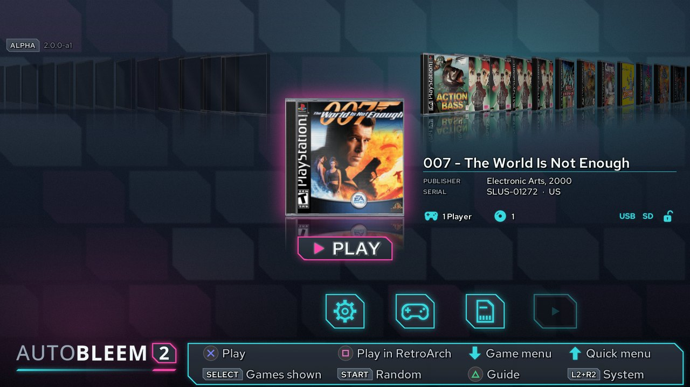

<!-- pagebreak -->

## 2. Installazione

### 2.1 PlayStation Classic

Hai bisogno di un PC Windows, un'unità USB (USB 2.0, 8 GB o più; l'installatore la formatta se richiesto) e la
console originale. AutoBleem gira dall'unità senza modifiche alla console. L'unità deve essere **FAT32** per una
console originale - il suo kernel non può leggere exFAT. Solo una console con il kernel AutoBleem installato
(ABFlashKit, capitolo 6) avvia anche da un'unità exFAT, che solleva il limite di 4 GB di FAT32.

1. Scarica **AutoBleemInstaller-<version>.zip** dal pannello PlayStation Classic del sito e estrailo ovunque.
   Contiene `AutoBleemInstaller.exe` e il pacchetto AutoBleem che installa.
2. Collega l'unità e avvia `AutoBleemInstaller.exe`. Seleziona l'unità in alto. Spunta quello che vuoi:
   - **Formatta l'unità** - solo per un'unità nuova (tutto su di essa viene cancellato). Seleziona FAT32 a meno che
     la console non abbia il kernel AutoBleem.
   - **Database di copertine** - i box art e i dettagli della biblioteca PS1 (spuntato per impostazione predefinita;
     circa 300 MB).
   - **RetroArch** - RetroArch con i suoi nuclei, applicazioni aggiuntive (Doom, Quake, Amiga, ...) e risorse
     libretro per i giochi di altri sistemi. Disabilitato per impostazione predefinita; può essere aggiunto in
     seguito eseguendo di nuovo l'installatore.
   - **File BIOS** - i file BIOS di cui hanno bisogno i nuclei di RetroArch (richiede RetroArch).
   - **Giochi di esempio** - alcuni giochi homebrew gratuiti per non lasciare lo scaffale vuoto.
3. Premi **Installa** e aspetta. Le barre di progresso e il registro mostrano ogni passaggio; l'unità è denominata
   `SONY` alla fine e `UpdateRoms` viene messo su di essa (vedi capitolo 5).
4. Estrai l'unità in modo sicuro, collegala alla **seconda porta USB** della console (quella di destra, giocatore 2)
   e accendi la console. AutoBleem si avvia al posto del menu originale.

**Accensione e spegnimento.** Con l'unità dentro, la console si avvia, la sua luce lampeggia per alcuni secondi
(AutoBleem viene configurato) e poi va in standby prima che venga visualizzato nulla - è così che la console mette
in scena un aggiornamento, è così che AutoBleem gira. Premi **Power** una volta e il launcher appare. *Spegni*
nel menu di sistema, o il pulsante Power della console, mette la console in **standby di AutoBleem**: l'unità viene
disconnessa per prima, poi la luce diventa **rossa** - il segno che AutoBleem sta funzionando correttamente - e la
successiva pressione di Power riporta il launcher direttamente, in pochi secondi. **Mentre la luce è rossa, l'unità
può essere estratta** e messa su un PC senza che Windows chieda di controllarla; rimettila prima di premere Power.
Scollegare l'alimentazione della console passa di nuovo per lo standby di avvio la prossima volta.

Per **aggiornare** un'unità, esegui un installatore più recente su di essa: i tuoi giochi, salvataggi, impostazioni
e contenuto di RetroArch rimangono; vengono sostituiti solo i file propri di AutoBleem. Un'unità creata con
AutoBleem 1.0 o AutoBleem-NG viene aggiornata automaticamente al nuovo layout.

> La console originale non ha un orologio e nessuna rete: le date vengono visualizzate solo dopo l'installazione
> del kernel AutoBleem (capitolo 6), e le copertine per i giochi di RetroArch provengono da UpdateRoms su PC
> (capitolo 5).

I giochi vanno nella cartella `Games` dell'unità, una cartella per gioco - vedi sezione 3.9 per il layout.

### 2.2 Raspberry Pi

AutoBleem trasforma un Pi in una piccola console: si avvia direttamente nel launcher, senza desktop. Due immagini
pronte sono sul sito - 32 bit e 64 bit - più un tarball per un Raspberry Pi OS Lite esistente.

| Modello | Immagine a 32 bit | Immagine a 64 bit | Note |
|---|---|---|---|
| Raspberry Pi 5 | sì | sì | |
| Raspberry Pi 4 Modello B, Pi 400 | sì | sì | |
| Raspberry Pi 3 Modello B / B+ / A+ | sì | sì | buono per il launcher e PS1 |
| Raspberry Pi Zero 2 W | sì | sì | 512 MB di RAM: PS1 funziona, i nuclei RetroArch più pesanti no |
| Raspberry Pi 2 Modello B | sì | solo v1.2 | lento per qualsiasi cosa in 3D |
| Raspberry Pi 1, Zero, Zero W | no | no | ARMv6 - nessuna immagine funziona |

L'**immagine a 32 bit è quella consigliata** per i giochi PS1: il ricompilatore ARM veloce di `pcsx-ab` è solo 32
bit, quindi la build a 64 bit esegue i giochi PS1 più lentamente. L'immagine a 64 bit ha un set più ampio di nuclei
RetroArch.

**Con Raspberry Pi Imager:**

1. Installa Raspberry Pi Imager (raspberrypi.com/software). In *Choose OS* seleziona *Use custom* e il
   `autobleem-<version>-rpi-armhf.img.xz` (32 bit) o `-arm64.img.xz` (64 bit) che hai scaricato - o aggiungi
   l'URL del repository `https://autobleem.retromenele.pl/rpi-imager/os_list.json` nelle impostazioni dell'app
   e seleziona AutoBleem dall'elenco.
2. Usa la schermata di personalizzazione di Imager (l'ingranaggio, o la domanda dopo *Avanti*) per impostare
   **nome utente e password, rete WiFi e paese, e abilita SSH**. AutoBleem ha bisogno di una rete al primo avvio.
3. Scrivi la scheda, inseriscila nel Pi con uno schermo e una tastiera o un controller, e accendilo.

**Il primo avvio** richiede da 5 a 25 minuti e mostra quello che sta facendo sullo schermo. Senza rete, ti chiede
uno (un elenco WiFi, la password), poi chiede se installare RetroArch (un minuto senza risposta significa sì),
ingrandisce la partizione di sistema, crea la partizione di dati `AUTOBLEEM` dal resto della scheda, installa
RetroArch e i suoi nuclei, i pacchetti BIOS e i giochi di esempio, e si riavvia nel launcher.

Le risposte possono essere fornite in anticipo in **`autobleem.txt`** sulla partizione di avvio della scheda
(modificabile su qualsiasi PC prima del primo avvio):

| Chiave | Predefinito | Significato |
|---|---|---|
| `root_gib` | 8 | La dimensione della partizione di sistema in GiB; il resto diventa la partizione di giochi. |
| `hdmi_mode` | 1920x1080@60 | La modalità di schermo per tutto l'avvio (`1280x720@60` per una TV più vecchia). |
| `retroarch` | (chiesto) | `yes` / `no` - RetroArch e altri sistemi, o solo PS1. |
| `thumbnails` | none | `boxarts` rispecchia l'intero set di copertine per copertine offline (~9000 file). |
| `bios`, `downloads`, `samples` | yes | Imposta su `no` per saltare i pacchetti BIOS, tutti i download o i giochi di esempio. |

**Su un Raspberry Pi OS Lite esistente** (Bookworm o Trixie): copia `autobleem-rpi.tar.gz` (o la versione arm64)
sul Pi, estrailo e esegui `sudo bash install.sh`. Pone le stesse domande, crea la partizione di dati restringendo
la root al prossimo avvio (`--shrink-root <GiB>`), e mette il launcher sulla prima console.

Dopo l'installazione, la partizione **`AUTOBLEEM`** della scheda (exFAT) è quello che riempi: estrai la scheda e
aprila su qualsiasi PC, o copia via rete (SSH è abilitato). `Games/` per giochi PS1, `RetroArch/roms/<sistema>/`
per altri sistemi, `System/Bios/` per BIOS PS1 (sezione 3.10), `Themes/` per temi.

### 2.3 Unità USB per PC

Lo stesso dispositivo per qualsiasi PC che si avvia da USB - un sistema a 32 bit, quindi anche le vecchie macchine
funzionano:

1. Scarica `autobleem-<version>-pcusb-i386.img.xz` dal pannello PC e scrivilo su un'unità da 8 GB o più con
   Raspberry Pi Imager (*Use custom*), balenaEtcher o Rufus (modalità DD).
2. Avvia il PC dall'unità (il tasto del menu di avvio del tuo PC - F12, F8, Esc...). Sia l'avvio BIOS che UEFI
   funzionano; **Secure Boot deve essere disabilitato**.
3. Il primo avvio è quello del Pi: una domanda sulla rete se non c'è cavo, la domanda su RetroArch, poi
   l'installazione - circa otto minuti con una rete cablata - e un riavvio nel launcher.

L'unità ha quindi una partizione `AUTOBLEEM` per i tuoi giochi, visibile su Windows 10 (1903 e più recente) come
seconda unità quando colleghi l'unità a un PC in esecuzione. `autobleem.txt` è sulla prima partizione, con le
stesse chiavi che su Pi (senza `hdmi_mode` - il PC utilizza la modalità nativa dello schermo).

### 2.4 Windows

AutoBleem come programma Windows: schermo intero, emulatori e RetroArch avviati come programmi.

1. Scarica **AutoBleemSetup-<version>.exe** ed eseguilo. Si installa per utente, senza diritti di amministratore:
   il programma in `%LOCALAPPDATA%\Programs\AutoBleem`, i dati (giochi, impostazioni, temi, RetroArch) in una
   cartella che scegli - `Documents\AutoBleem` per impostazione predefinita.
2. Spunta i componenti - i database di copertine, RetroArch (la build Windows ufficiale e i suoi nuclei), i file
   BIOS, i giochi di esempio - e lascia che l'assistente di setup li scarichi.
3. Avvia AutoBleem dal menu Start o dal Desktop. Su un PC, la tastiera funziona come un controller (sezione 3.2).

L'esecuzione di una versione più recente del programma su di essa la aggiorna e mantiene la cartella di dati.
Il launcher verifica anche il sito una volta al giorno e offre un aggiornamento se ce n'è uno (sezione 3.11).

<!-- pagebreak -->

## 3. Usare AutoBleem

### 3.1 Il launcher

Il launcher si apre sullo scaffale: le copertine del set attuale, quella selezionata nel mezzo con un morbido
riflesso sotto di sé, i suoi dettagli accanto in una griglia compatta - editore, anno, numero di serie, regione,
giocatori, quando è stato riprodotto per l'ultima volta (un dato che il gioco non ha viene omesso) - e un pulsante
di riproduzione. L'aspetto predefinito è il tema **ab2.0.0**; una nuova installazione e un aggiornamento che lo
porta passano a esso una volta sola. La barra dei suggerimenti in basso ha due righe di quattro posti. La prima dice
cosa fanno i pulsanti per il gioco selezionato (gioca, gioca in RetroArch, apri la riga di icone, il menu rapido);
la seconda mostra sempre Select (il set), Start (un gioco casuale), Triangle (la guida) e L2 + R2 (il menu di
sistema), attenuati quando uno non fa nulla. Una scansione della cartella di giochi viene eseguita in background ad
ogni avvio; mentre viene eseguita, una bolla in alto a destra mostra il suo progresso, e i nuovi giochi appaiono
sullo scaffale mentre vengono trovati.

**Una nuova installazione** non ha ancora giochi: al posto di uno scaffale vuoto il launcher mostra una scheda di
benvenuto - *Ciao e benvenuto in AutoBleem!* - che invita a copiare i giochi nella cartella `Games` e a scegliere
*Riscansiona i giochi*, e che indica il posto per la tua piattaforma: sulla tua chiavetta (PlayStation Classic,
chiavetta PC), sulla tua scheda SD (Raspberry Pi) o nella cartella AutoBleem (Windows). La scheda sparisce non
appena una scansione trova il primo gioco.

**Le notifiche** appaiono come bolle in alto a destra: il progresso della scansione, il nome del set a cui sei
passato (*Sto mostrando: ...*, per tutto il tempo indicato da Opzioni → *Durata avviso*), una batteria del controller
scarica, una nota dopo un arresto anomalo, un processore di scansione al lavoro e il download in corso dello Store.
La bolla del download mostra la sua velocità e il tempo rimanente, ad es. `1.4 MB/s · 0:42`.

**L'etichetta del canale.** Una build che non è una release finale mostra una piccola etichetta sotto la targhetta
della batteria del controller nell'angolo in alto a sinistra: un chip con il canale - `ALPHA`, `BETA` o `RC` per un
pre-rilascio, `TESTING` per qualsiasi altro pre-rilascio, `NIGHTLY` per una build notturna, `DEV` per una build fatta a
mano - e la versione breve accanto (per `DEV`, il commit da cui è stata costruita). Una release non mostra alcuna
etichetta.

Un controller wireless con una lettura della batteria disponibile - sulla console, un Pi o la chiavetta PC, non su Windows - viene mostrato come una piccola icona con la sua percentuale, impilata dall'angolo in alto a sinistra sulla propria targhetta. Un controller associato al Giocatore 1 o al Giocatore 2 (secondo l'opzione Scambia Giocatore 1 / Giocatore 2) porta l'etichetta P1/P2; un controller non associato, o un terzo, non ha etichetta. Quando la batteria di un controller è scarica, una riga di notifica lo segnala una volta, con nome e percentuale.

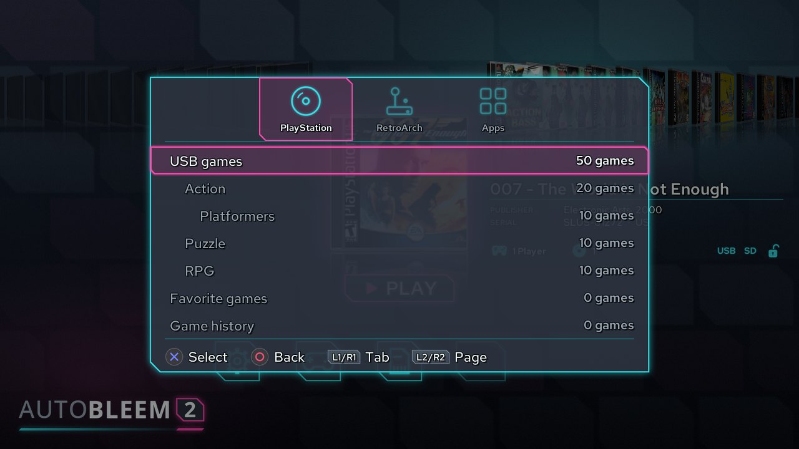

### 3.2 Controlli

| Pulsante | Sullo scaffale |
|---|---|
| Sinistra / Destra | Gioco precedente / successivo. Mantieni per scorrere. |
| L1 / R1 | Salta alla prima lettera precedente / successiva dei titoli. |
| Cross | Avvia il gioco selezionato (un gioco PS1 nell'emulatore PS1; un gioco RetroArch nel suo nucleo; un'app dopo il suo manuale). |
| Square | Avvia il gioco PS1 selezionato in RetroArch invece. |
| Triangle | La guida dei pulsanti. |
| Start | Un gioco casuale dal set attuale. |
| Select | Il selettore di set: schede PlayStation / RetroArch / App (L1 / R1), i gruppi della scheda (Su / Giù, L2 / R2 una pagina), Cross seleziona. |
| Su | Il menu rapido (sezione 3.4). |
| Giù | Apre la riga di icone sotto il gioco (Impostazioni, Gioco, Memory Card, Riprendi). Su la chiude. |
| L2 + R2 | Il menu di sistema (sezione 3.5). |

**Con una tastiera** (un PC senza controller o una tastiera USB sulla console, un Pi o l'unità PC) i tasti
rimpiazzano: **Frecce** = d-pad, **Invio** = Cross, **Esc o Backspace** = Circle, **Tab** = Triangle,
**Spazio** = Square, **F1 / F2** = Select / Start, **Pagina Su / Pagina Giù** = L1 / R1, **Home / Fine** =
L2 / R2, **F10** = il menu di sistema. Su una macchina di sviluppo, Esc chiude il programma e Spazio è Start.

In ogni elenco e menu: Su / Giù si muovono, **L2 / R2 cambiano pagina**, L1 / R1 saltano alla prima / ultima riga,
**Cross seleziona, Circle torna indietro**. Una schermata con impostazioni le salva quando la esci con Circle.

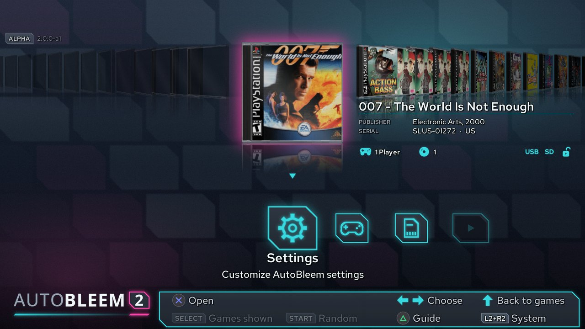

### 3.3 I set

**Select** apre il selettore di set. La scheda PlayStation elenca, su una PlayStation Classic, *Tutti i giochi* e
*Giochi interni* (i venti incorporati della console), poi *Giochi su USB* (tutto ciò che è in `Games/`) e ogni cartella
che hai creato al suo interno (un gioco in una sottocartella appartiene a quel gruppo), poi *Giochi preferiti*,
*Cronologia giochi* e, se del caso, *Giochi con pistola*. Su un Raspberry Pi, una chiavetta PC e Windows non ci sono
giochi interni, quindi l'elenco comincia con *Giochi su USB*, che è l'intera libreria. La scheda RetroArch (solo dove
RetroArch è installato) elenca un gruppo per sistema che ha giochi, più Preferiti e Cronologia propri di RetroArch. La
scheda App raggruppa le applicazioni per tipo: *Tutte le app*, poi *Giochi*, *Emulatori*, *Strumenti*, *Media* e
*Altro* (la categoria è impostata nel file `app.ini` di ogni app). Ogni riga mostra quanti elementi contiene; un
gruppo vuoto si apre su uno scaffale vuoto con la riga di icone che mostra solo Impostazioni. Il piè di pagina indica
i tasti: L1 / R1 le schede, L2 / R2 una pagina, Cross sceglie, Circle *Indietro*.

### 3.4 Il menu rapido

**Su** nel launcher, o l'**icona dell'ingranaggio** nella riga di icone (dove sono Impostazioni / Gioco / Memory Card
/ Riprendi): il menu rapido per le azioni che raggiungibili dal carosello. Un breve elenco: *Riscansiona i giochi*
(avvia una scansione ora), *Store* (sfoglia e installa giochi, app ed estensioni), *Rete e controller* (solo dove
un'estensione installata fornisce la voce `network` - PSC-Bios sulla console, un Pi e l'unità PC: WiFi, pairing
Bluetooth, la procedura guidata di mappatura del controller - vedi sezione 6; disattivato con "attivala in
Estensioni" quando quell'estensione è disabilitata - Cross apre l'elenco Estensioni), *Riavvia il launcher* (chiude
AutoBleem e lo avvia di nuovo; solo su console, Pi e chiavetta PC) e *Menu di sistema...* (tutto il resto: Opzioni,
Gestore del gioco, Spegni e altro - il menu completo sotto). Su / Giù si muovono (avvolgente), Cross seleziona,
Circle torna indietro. Ogni elemento ha una descrizione di una riga nella sua riga. A parte lo Store e *Riavvia il
launcher*, ogni elemento è anche nel menu di sistema.

### 3.5 Il menu di sistema

**L2 + R2** (insieme, in qualsiasi ordine) apre il menu di sistema sopra lo scaffale. Ogni riga ha una descrizione di
una riga, e il menu è raggruppato in sezioni:

| Sezione | Elemento | Cosa fa |
|---|---|---|
| (in alto) | Riscansiona i giochi | Cerca giochi nuovi, modificati o rimossi ora (la scansione controlla anche la cartella stessa). |
| | Estensioni | Le estensioni sull'unità - il Negozio AutoBleem e altri (sezione 3.12). |
| **Libreria** | Gestore del gioco | I giochi PS1 come un elenco con le loro cartelle: elimina un gioco, svuota le copertine. Disabilitato durante una scansione. |
| | Memory cards | I tuoi set di memory card (sezione 3.7). |
| | Processori di scansione | I programmi che ogni scansione esegue per primo - il loro ordine, attivati o disattivati (sezione 3.13). Disabilitato durante una scansione. |
| **Sistema** | Opzioni | Le impostazioni di AutoBleem (sezione 3.6). |
| | Rete e controller | Solo dove un'estensione installata fornisce la voce `network` (`Provides=network` nel suo `extension.ini` - PSC-Bios sulla console, un Pi e l'unità PC) - WiFi, pairing di controller Bluetooth, configurazione DualShock 3 e la procedura guidata di mappatura del controller - vedi capitolo 6. Quando questa estensione è installata ma disabilitata, questo elemento rimane disattivato con una nota "attivala in Estensioni" - Cross apre l'elenco Estensioni. |
| | Informazioni hardware | I fatti della macchina: sistema, CPU, archiviazione, interfacce di rete, fuso orario, display, i controller e le loro mappature - la stessa pagina su ogni piattaforma (sezione 4.2). |
| | Aggiornamento software | (Raspberry Pi e PC) Verifica il sito per una versione più recente di AutoBleem o RetroArch adesso; la riga dice *Aggiornamento disponibile* quando il launcher ne conosce già una. |
| | Informazioni su | Crediti e licenza. |
| **Esci** | RetroArch | (Solo dove RetroArch è installato.) Esce dal launcher nel menu proprio di RetroArch. Chiudere RetroArch torna indietro. |
| | Spegni | Dopo una conferma: sulla console lo standby di AutoBleem - l'unità scollegata, la luce rossa, Power riporta il launcher (sezione 2.1); su un Pi o un PC la macchina si spegne. |

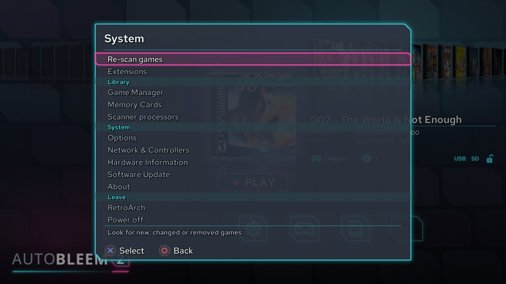

### 3.6 Opzioni

Le impostazioni sono in gruppi, ognuno sotto un'intestazione; Su / Giù si muovono tra le righe, Sinistra / Destra
cambia un valore (un tocco è un passo, tenere premuto scorre), L1 / R1 saltano alla prima / ultima riga, L2 / R2
cambiano pagina, Circle esce e salva. Ogni modifica viene applicata immediatamente. I valori acceso/spento si leggono
**ON** / **OFF**.

| Gruppo / Impostazione | Cosa fa |
|---|---|
| **Interfaccia**: Schermo | La risoluzione dello schermo, per il launcher e l'emulatore PS1: *Auto* (la modalità propria dello schermo, mostrata come *Auto (1920x1080)*) o qualsiasi modalità che lo schermo elenca; la console offre 720p e 1080p. Una nuova modalità viene confermata: *Mantenere questa modalità video?* - se non confermi, torna indietro dopo un conto alla rovescia. Non in una finestra di sviluppo. |
| Scala schermo emulatore | Come l'emulatore PS1 adatta l'immagine di un gioco allo schermo: *1x1* (i pixel propri della PlayStation), *2x (intera)*, *4:3*, *4:3 (intera)* o *Schermo intero*. La scalatura intera usa solo multipli interi (la più nitida). Sostituisce il vecchio interruttore Widescreen; il classico `pcsx-ab` e RetroArch conoscono solo lo schermo intero e il 4:3. |
| Tema di AutoBleem | L'aspetto. I temi vivono in `Themes/`; un file zip di tema depositato lì viene estratto alla prossima visita. I temi che AutoBleem fornisce vengono aggiornati ad ogni aggiornamento - per personalizzarne uno, copialo prima con un nuovo nome. Il predefinito è **ab2.0.0**. |
| Stile delle cover | Il telaio del custodia gioiello disegnato attorno alle copertine PS1. |
| Riflesso della copertina | Un riflesso che attraversa la copertina selezionata quando lo scaffale si ferma. |
| Lingua | La lingua del launcher, applicata immediatamente (17 lingue). |
| Durata avviso | Per quanto tempo restano le bolle informative ("Sto mostrando: ...", il riepilogo della scansione), da 0 a 20 secondi; 0 mostra *Disattivato*. Gli errori hanno un proprio tempo fisso. |
| Schermata iniziale | L'immagine AutoBleem all'avvio del launcher; disattivata va direttamente allo scaffale. |
| Animazioni | Il movimento tra le schermate; disattivate rendono istantaneo ogni cambio di schermata. |
| **Caratteri**: Usa il carattere predefinito | Il launcher usa il suo carattere predefinito (Red Hat Text) o - disattivato - il carattere scelto sotto. |
| Carattere | Qualsiasi `.ttf`/`.otf` da `resources/fonts`, `RetroArch/fonts` o la cartella del tema; la riga nomina il carattere in uso. |
| **Suono**: Musica, Musica di sottofondo | Quale traccia suona sotto il launcher (quella del tema, o un file da `resources/music`), e se ne suona una. |
| **Emulazione**: Emulatore PS1 | `pcsx-abnxt` (predefinito: PCSX-ReARMed attuale con aggiunte di AutoBleem) o `pcsx-ab` (il classico). Un punto di salvataggio salvato da uno continua nell'altro, a meno che il gioco non si sia eseguito senza un file BIOS. |
| Scambia giocatore 1 / giocatore 2 (emulatori PS1) | Scambia quale dei primi due controller è il Giocatore 1 e quale il Giocatore 2, in entrambi gli emulatori PS1 (pcsx-abnxt e il pcsx-ab classico). Ha effetto solo con due o più controller collegati; con un solo controller si gioca sempre come Giocatore 1. RetroArch non è interessato. |
| Gioca a tutti i giochi PSX con RA, Aggiorna configurazione RA, Mantieni la config di RetroArch | (Solo dove RetroArch è installato.) Ogni gioco PS1 si avvia nel nucleo PS1 di RetroArch; AutoBleem scrive le sue impostazioni nella configurazione di RetroArch quando avvia un gioco lì; una modifica fatta nel menu proprio di RetroArch viene mantenuta quando RetroArch si chiude. |
| **Libreria**: Mostra giochi interni | I giochi incorporati della console negli elenchi PlayStation (solo PlayStation Classic). |
| Scarica copertine online | La scansione scarica le copertine mancanti dai server di libretro (Raspberry Pi, PC, Windows). |
| **Aggiornamenti** | Il canale di aggiornamento: `release` (la versione testata), `testing` (la prossima versione, in prova), `nightly` (la build di sviluppo più recente) o `off`. Il predefinito segue la versione installata. Non mostrato su un host di sviluppo. |
| **Diagnostica**: Conserva i log sulla chiavetta | Conserva tutti i log sull'unità dal prossimo avvio, non solo dopo un arresto anomalo (capitolo 7). |
| Mostra prestazioni | Una sovrapposizione nell'angolo in basso a sinistra: frequenza dei fotogrammi, carico della CPU, thread e memoria; l'emulatore mostra anche i suoi FPS e la CPU nel gioco. |

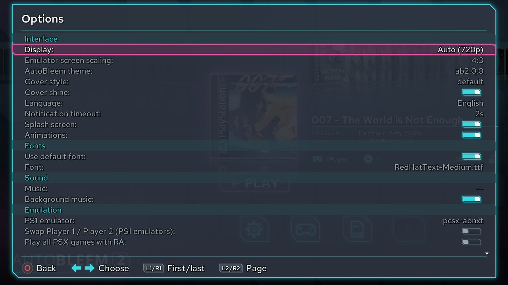

### 3.7 Impostazioni di un gioco

Con un gioco selezionato, **Giù** apre la sua riga di icone: **Impostazioni** (le opzioni sopra), **Gioco**
(le impostazioni proprie del gioco), **Memory Card** (la sua memory card) e **Riprendi** (i suoi punti di salvataggio).
Cross apre quello sotto il cursore.

L'**editor di giochi** mostra i dettagli del gioco a destra (titolo, editore, anno, giocatori, cartella, memory card) e le sue impostazioni a sinistra, in quattro gruppi:

- **Gioco**: *Preferiti* (nel gruppo Giochi preferiti), *Gioco Lightgun* e *Gioca con RA* (solo dove RetroArch è
  installato: un gioco a pistola si unisce al gruppo Lightgun e si esegue sempre in RetroArch, il cui nucleo PS1 ha il
  GunCon; *Gioca con RA* esegue questo gioco in RetroArch), *Blocca dati* (lo scanner lascia il titolo del gioco, il
  numero di serie e l'elenco dei dischi come li hai impostati).
- **Schermo**: *Risoluzione* (1x o 2x, sulla GPU integrata), *Rimuovi le giunture* (solo con 2x), *Dithering*
  (Disattivato, Attivato, Sempre), *Smussatura*, il *Filtro* - come viene scalata l'immagine: Più vicino (pixel
  grezzi), Lineare (smussato), Nitido o Nitido (semplice) (pixel netti senza sfarfallio), Quilez, o i filtri CRT: CRT
  (fast) e CRT-Pi (disegnano le proprie scanline, quindi le righe delle scanline si disattivano) - e *Scanline* con la
  loro *Luminosità scanline*. Risoluzione, rimozione delle giunture, dithering, smussatura e i filtri diversi da
  Lineare e Più vicino sono per `pcsx-abnxt`; il classico `pcsx-ab` e RetroArch mostrano il resto come Più vicino.
- **Rendering**: il *Plugin* GPU e il *Frameskip* (Auto, Disattivato, da 1 a 3).
- **Emulatore**: SpeedHack, la frequenza della CPU, interpolazione SPU, il logo di avvio (disabilitato salta il
  shell BIOS - per un disco homebrew il cui logo personalizzato interrompe l'avvio), e con `pcsx-abnxt` l'interruttore
  *Patch Sony*.

La forma dell'immagine e la risoluzione dello schermo sono globali (Opzioni → *Scala schermo emulatore* e *Schermo*).
Un gioco senza titolo nei suoi dati viene mostrato con il nome della sua cartella.

Triangle rinomina il gioco, Square cambia la sua memory card, Start condivide una nuova card. Circle salva ed esce.

**Impostazioni salvate nell'emulatore.** Il menu proprio dell'emulatore ha *Salva le impostazioni per questo gioco*.
Una volta che un gioco ha le impostazioni salvate lì, sono quelle con cui gioca, e l'editor di giochi mostra le sue
righe Schermo, Rendering ed Emulatore disattivate, con quei valori, sotto il titolo *Salvate nell'emulatore*. Per tornare alle
impostazioni dell'editor di giochi, seleziona **Sblocca le impostazioni** e conferma: questo elimina le impostazioni
che l'emulatore ha salvato, e le righe possono essere cambiate di nuovo. Entrambi gli emulatori, `pcsx-ab` e
`pcsx-abnxt`, leggono e scrivono le stesse impostazioni salvate.

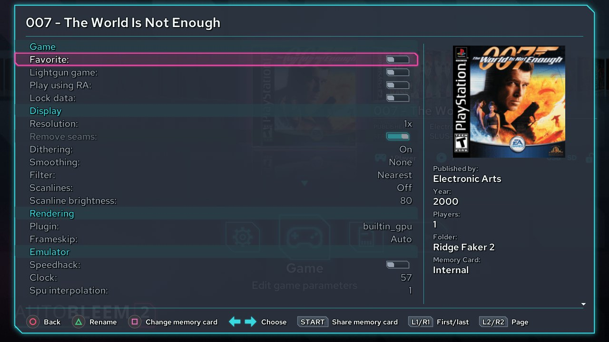

### 3.7 Memory Card e punti di salvataggio

Ogni gioco PS1 ha la sua memory card per impostazione predefinita (conservata con i suoi punti di salvataggio in
`Games/!SaveStates/<cartella di gioco>/`). **Memory Card** nel menu di sistema gestisce **set condivisi** - una
card che più giochi usano, conservata in `Games/!MemCards/`: crearne una (Square, con la tastiera su schermo),
rinominare (Cross), eliminare (Triangle). Un gioco viene messo su un set con *Cambia memory card* nel suo editor,
o dalla sua icona Memory Card.

L'**editor di memory card** (l'icona Memory Card) mostra la card del gioco e una seconda card affiancate, con l'icona
e il titolo di ogni salvataggio: copia un salvataggio tra i due (Square), elimina uno (Triangle), deframmenta una
card (Select). Start scambia la card a destra con un altro set.

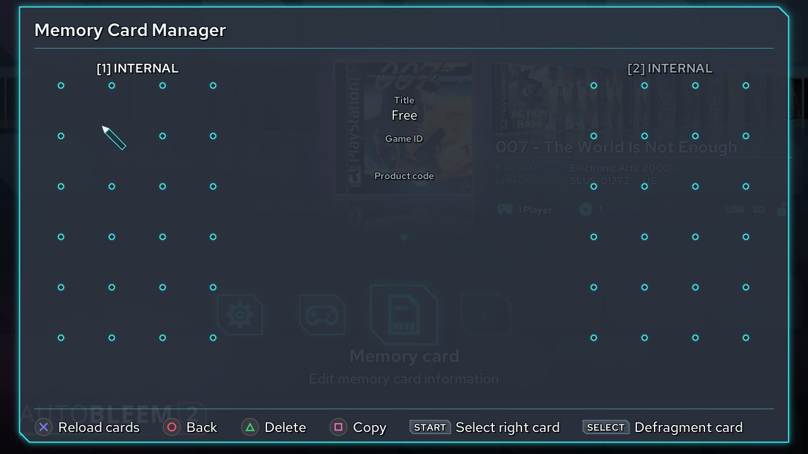

**Punti di salvataggio**: quando esci da un gioco PS1 con il pulsante Reset della console (o il menu dell'emulatore
su un Pi o PC), AutoBleem mantiene un punto di salvataggio di dove eri e lo offre sotto l'icona **Riprendi** -
quattro slot, mostrati come schede incorniciate, ognuna con un'immagine del momento, il suo numero di slot e la data;
il più recente è contrassegnato **RECENTE** e uno slot non usato dice *Nessun punto di ripresa*. Cross continua dallo
slot, Triangle lo elimina. Un gioco con un punto di salvataggio mostra una piccola immagine sulla sua icona Riprendi;
un gioco senza ha l'icona Riprendi attenuata. Mentre il punto di salvataggio viene scritto all'uscita da un gioco,
l'emulatore mostra *Attendere...*.

### 3.8 Avviare giochi, RetroArch e app

**Cross** avvia il gioco selezionato. Un gioco PS1 si esegue nell'emulatore PS1 scelto (sezione 3.6), schermo
intero, finché non lo esci - sulla console con il pulsante **Reset** anteriore (torna al launcher con un punto di
salvataggio; funziona anche dall'interno del menu di gioco) o **Power** (la console si spegne); su un Pi o un PC
tramite il menu di gioco dell'emulatore (sotto). **Square** avvia un gioco PS1 in RetroArch invece.

**Il menu di gioco** (`pcsx-abnxt`). Premi il pulsante menu - il Home del controller, **Select + Start** su un
controller che non lo ha, o **Esc** su una tastiera - e il gioco si ferma dietro un menu con l'ultima immagine del
gioco. **Tenere premuto il pulsante menu per 2 secondi** equivale a Reset: esce dal gioco. L1 / R1 passano tra le sue
tre schede, e il menu si apre sulla scheda e sulla riga in cui è stato lasciato:

- **Gioco**: *Riprendi il gioco*; sotto *Salvataggi*: *Salvataggio rapido*, *Caricamento rapido* e *Carica il
  salvataggio automatico* (il gioco com'era fino a 30 secondi fa - l'emulatore lo salva da solo in memoria mentre
  giochi); sotto *Disco CD*: *Cambia disco* e *Riavvia il gioco* (lo ricomincia da capo); *Salva le impostazioni per
  questo gioco* (vedi sezione 3.7), *Menu PCSX* (le pagine proprie di PCSX-ReARMed: opzioni, trucchi, Informazioni) e
  *Esci* (di nuovo in AutoBleem).
- **Immagine**: *Schermo* (la risoluzione dello schermo - sulla console si sceglie in Opzioni e qui è solo mostrata),
  *Risoluzione* (1x o 2x), *Rimuovi le giunture*, *Dithering*, *Scalatura*, *Smussatura*, *Filtro*, *Scanline* e
  *Luminosità delle scanline*. Ogni riga ha una riga di aiuto a destra. CRT-Pi è troppo pesante per la console a 1080p.
  Una riga che non si applica è attenuata, e il suo aiuto dice perché.
- **Controller**: *Controller 1* e *Controller 2*: standard (digitale), analogico (DualShock), una pistola o nessuno;
  ha effetto quando il gioco prosegue.

Il menu è disegnato nell'aspetto ab2.0.0 del launcher, con le batterie dei controller e l'immagine dell'ultimo
salvataggio rapido.

Un gioco **RetroArch** si avvia in RetroArch con il nucleo che il launcher ha scelto per il suo sistema; *Chiudi
contenuto* o *Esci da RetroArch* nel suo menu torna al launcher. L'elemento RetroArch nel menu di sistema apre il
menu proprio di RetroArch (XMB) senza nulla caricato, per le sue impostazioni e i suoi elenchi di contenuto propri.

Un'**app** (il set di App: gli strumenti della console, e su una console le applicazioni aggiuntive che il pacchetto
RetroArch porta - Doom, Quake, Amiga, ...) mostra prima il suo manuale; Cross la avvia, Circle torna indietro.

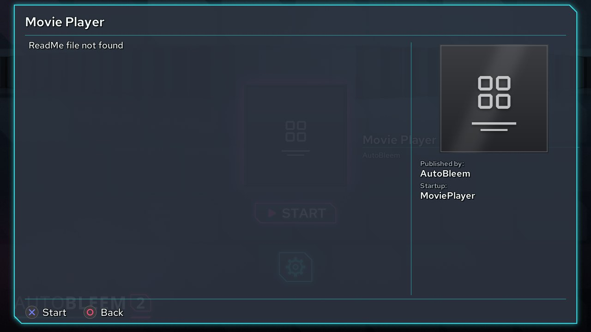

### 3.9 Aggiungere giochi

I **giochi PS1** vanno nella cartella `Games`, **una cartella per gioco**, nominata dopo il gioco:

```
Games/
  Crash Bandicoot/            Crash Bandicoot.cue + Crash Bandicoot.bin
  Final Fantasy VII/          Final Fantasy VII (Disc 1).chd, (Disc 2).chd, (Disc 3).chd
  Platformers/                una cartella di giochi: il suo gruppo nel selettore di set
    Klonoa/                   Klonoa.pbp
```

- Formati: `.cue` + `.bin` (o `.img`), `.pbp`, `.chd` (anche zstd), `.ecm` (decodificato dalla scansione),
  `.iso`. Un gioco zippato funziona anche: il processore **Unzip** lo estrae prima della scansione (sezione 3.13).
- Un gioco multi-disco è una cartella con ogni disco dentro; le cartelle nominate `Game (Disc 1)`, `Game (Disc 2)`
  ... vengono unite in una cartella `Game` dalla scansione.
- I giochi direttamente in `Games/` (file sciolti) vengono ordinati in cartelle dalla scansione.
- Una **copertina** è un PNG accanto all'immagine del gioco, nominato come essa. Senza una, il box art viene dai
  database di copertine, o - con RetroArch installato - dal set di miniature di libretro; su un Pi, un PC o
  Windows una copertina mancante viene scaricata online (Opzioni → *Scarica copertine online*).
- La scansione legge il numero di serie di ogni disco e prende il titolo, editore, anno, giocatori e regione dal
  database di PlayStation di RetroArch o dai database di copertine. Cambia tutto nell'editor di giochi e spunta
  *Blocca dati* per mantenerlo.

Gli **altri sistemi** vanno sotto `RetroArch/roms/`, **una cartella per sistema, nominata come sono i database di
RetroArch** (la cartella viene creata per te): `Nintendo - Nintendo Entertainment System`, `Nintendo - Super
Nintendo Entertainment System`, `Sega - Mega Drive - Genesis`, `Nintendo - Game Boy Advance`, `FBNeo - Arcade Games`
(o `Arcade`), ... Le ROM possono rimanere zippate. Su un Pi, un PC o Windows la scansione le legge da sola e scrive
gli elenchi di giochi di RetroArch; su un'unità di console, esegui **UpdateRoms** su PC (capitolo 5).

Le **app** vanno sotto `Apps/<nome>/` con un `app.ini` (il nome, l'icona, cosa eseguire) e una `run.sh`.

I **temi** vanno sotto `Themes/<nome>/` (`theme.json` e le immagini) - o rilascia il file zip del tema in `Themes/`.

### 3.10 Il BIOS PS1

Su una **PlayStation Classic** l'emulatore usa il BIOS proprio della console. Su un **Raspberry Pi, un PC e
Windows** metti il tuo BIOS PS1 in `System/Bios/`: `romw.bin` (il US/Europeo SCPH-5501/5502) e
`romJP.bin` (il Giapponese SCPH-5500). Gli installatori li riempiono dai pacchetti BIOS di RetroArch a meno che
i tuoi file non siano già lì. Senza di essi l'emulatore gira sul suo BIOS HLE incorporato, che molti giochi
tollerano e alcuni no.

### 3.11 Aggiornamenti

- **Raspberry Pi, unità PC, Windows**: il launcher controlla il sito all'avvio e una volta al giorno (Opzioni →
  *Aggiornamenti* è il canale; *Aggiornamento software* nel menu di sistema verifica adesso). Quando c'è un
  AutoBleem o RetroArch più recente, chiede: *Aggiorna adesso* scarica tutto e riesegue l'installatore con la
  schermata di progresso del primo avvio; *Ricordamelo domani* e *Salta questa versione* sono le altre risposte.
  I tuoi giochi e impostazioni rimangono; il launcher riscansiona una volta dopo un aggiornamento.
- **PlayStation Classic**: esegui un `AutoBleemInstaller.exe` più recente sull'unità (sezione 2.1).

### 3.12 Estensioni e il Negozio AutoBleem

Le **estensioni** aggiungono i loro schermi al launcher. Vivono in `Extensions/<nome>/` sull'unità (su un
Raspberry Pi la sua partizione di dati, su Windows la cartella di dati); per installarne una, estraila il suo zip
lì. **L2 + R2 → Estensioni** le elenca: Cross ne esegue una, Triangle la disattiva o la riattiva. Un'estensione
che ha bisogno della rete non si avvia senza di essa, e una che ha fermato il launcher viene disattivata - l'elenco
lo dice.

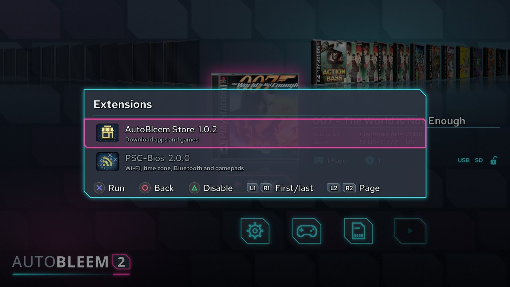

Il **Negozio AutoBleem** è la prima estensione: app e giochi da installare in una pressione, su ogni sistema su cui
AutoBleem gira (una PlayStation Classic ha bisogno del WiFi del kernel AutoBleem). Le sue quattro schede, L1 / R1
tra loro:

- **App** e **Giochi**: quello che le fonti offrono, ognuno con la sua immagine, versione, dimensione e icona della
  fonte. Gli elementi installati portano un badge *Installato*. Cross installa (o aggiorna, o riprova dopo un errore, o
  annulla un download in coda o in corso), Triangle rimuove quello che il Negozio ha installato, Square aggiorna gli
  elenchi. L2 / R2 saltano per lettera, **Select** mostra una fonte alla volta, **Start** ricerca nei titoli. Il piè di
  pagina mostra i tasti della riga selezionata. Le immagini degli elementi sono memorizzate nella cache e possono
  essere ritentate se non si caricano.
- **Download**: quello che viene scaricato, in attesa, non riuscito o installato. La barra di progresso si aggiorna
  costantemente, e mentre sei altrove nel launcher una bolla mostra il download in corso con la sua velocità e il
  tempo rimanente (`1.4 MB/s · 0:42`). I download continuano in background anche dopo aver chiuso il Negozio; avviare
  un gioco o spegnere li mette solo in pausa, e un download interrotto continua da dove si è fermato. Se la rete cade,
  l'elemento dice *In attesa della rete* e prosegue da dove si era fermato quando la rete torna (rinuncia dopo 30
  minuti). Un gioco installato appare sullo scaffale dopo la prossima scansione, con l'immagine del Negozio come
  copertina. I download superiori a 2 GB funzionano su tutte le piattaforme, incluse le build a 32 bit.
- **Fonti**: da dove vengono gli elenchi - il catalogo proprio di AutoBleem, un elenco TSV depositato in
  `System/Extensions/store/sources/` e gli indirizzi che aggiungi con **Aggiungi un URL di fonte**. Ogni fonte
  mostra la sua icona nell'elenco. Cross su uno che hai aggiunto lo rinomina, cambia il suo indirizzo, alterna tra
  `http://` e `https://`, o lo rimuove.

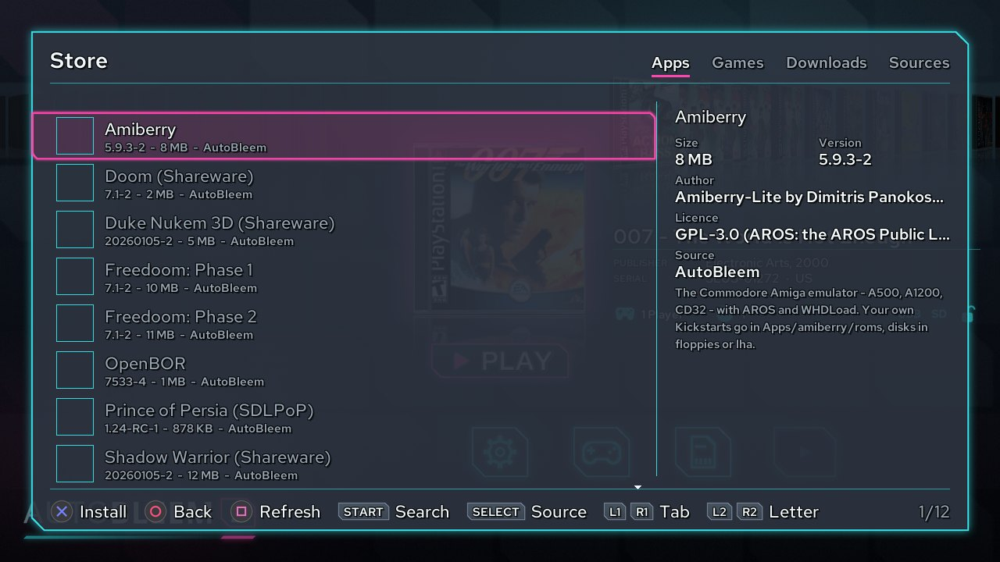

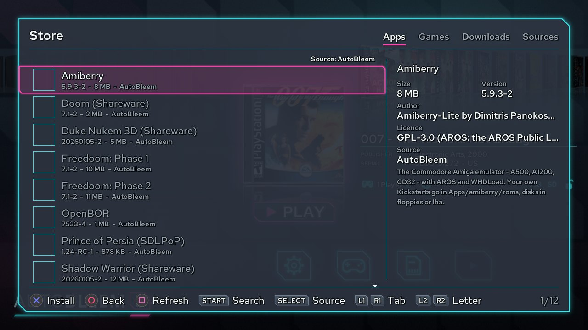

Quello che il catalogo di AutoBleem offre è anche elencato sul sito di download, `https://autobleem.retromenele.pl/store/`.
**Sei responsabile di quello che contengono le fonti che aggiungi.**

**I tuoi giochi sulla tua rete**: `abstored`, il server LAN del Negozio, serve una cartella di giochi PS1 al
Negozio sulla stessa rete. Gira su qualsiasi macchina Linux - un Raspberry Pi, un server domestico - e solo legge
la cartella. Avvialo con `abstored <cartella di giochi>`, apri `http://<quella macchina>:8124/` in un browser per
vedere cosa serve e eventuali problemi trovati, e aggiungi `http://<quella macchina>:8124/store.tsv` come fonte.
I programmi pronti per Linux e Windows sono sulla pagina del Negozio, nella sua scheda **Server LAN**; configurarlo
come servizio è `INSTALL-linux.md` (`ext_store/server/` nella fonte). **LAN Share** (sezione 5.2) mette giochi e
dischi da un PC su tale server.

### 3.13 Processori scanner

I **processori scanner** sono piccoli programmi che ogni scansione esegue prima di leggere i tuoi giochi. Uno può
trasformare un formato che AutoBleem non legge in uno che legge - un gioco zippato, per esempio - o modificare i
dati di un gioco, come una patch di traduzione. Vivono in `System/Processors/<nome>/` sull'unità (su un Raspberry Pi
la sua partizione di dati, su Windows la cartella di dati); per installarne uno, estrai la sua cartella lì. La
prossima scansione lo esegue.

- **Unzip viene con AutoBleem**: estrae i giochi PS1 zippati in `Games/` prima che la scansione li legga e le ROM
  zippate una alla volta (i giochi arcade rimangono zippati). L'aggiornamento di AutoBleem lo aggiorna anche e lo
  lascia disabilitato se l'hai disabilitato.
- Un processore che ha già gestito un gioco non viene rieseguito su di esso finché il gioco non cambia.
- Mentre un processore funziona, la bolla in alto a destra mostra cosa sta facendo; un avvertimento o errore appare
  sulla riga sotto. `processors.log` nella cartella di registro ha i dettagli.
- L'avvio di un gioco o RetroArch ferma un processore che modifica i file; la prossima scansione finisce il suo lavoro.

**L2 + R2 → Processori scanner** li mostra nell'ordine in cui si eseguono, una scheda per giochi PS1 e una per
ROM (L1 / R1). **Square** ne prende uno e Su / Giù lo muove - l'ordine conta: un processore che estrae deve venire
prima di uno che applica patch a quello che è stato estratto. **Cross** lo alterna o lo attiva, **Triangle** lo
riesamina ad ogni prossima scansione, **Circle** torna indietro e avvia una scansione se hai cambiato qualcosa. Un
processore costruito per un'altra macchina rimane nell'elenco, disattivato.

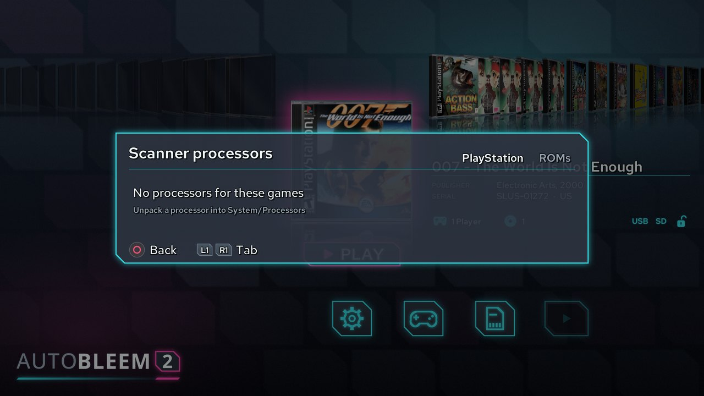

Scrivi il tuo: la pagina di Unzip, `https://github.com/autobleem2/proc_unzip`, spiega tutto quello che un processore
deve fare, e `tools/proc_check.py` nel sorgente di AutoBleem ne verifica uno prima di condividerlo.

<!-- pagebreak -->

## 4. Schermi

### 4.1 Gestore di giochi

I giochi PS1 come un elenco dei soli titoli (la cartella del gioco selezionato è nei suoi dettagli) e la copertina del gioco selezionato. Cross
apre l'editor di giochi, **Square elimina il gioco** (la sua cartella e, dopo una seconda domanda, i suoi punti di
salvataggio), Triangle elimina ogni PNG di copertina accanto ai giochi (la scansione li riprende dai database),
L2 / R2 pagina. Lo spazio libero dell'unità è in alto a destra. Il gestore di giochi aspetta mentre viene eseguita
una scansione.

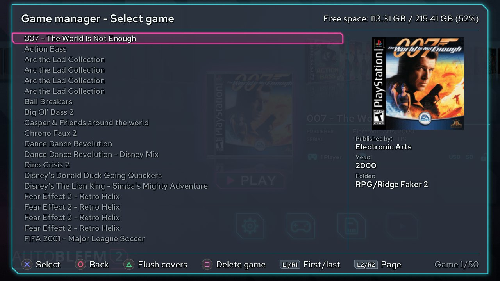

### 4.2 Informazioni sull'hardware

I fatti della macchina - sistema, hardware, archiviazione con il suo spazio libero, indirizzi di rete, i driver di
display e audio, i controller collegati - rileggi ogni secondo. È la stessa pagina su ogni piattaforma, console
compresa; le schermate di configurazione di rete e controller sono **Rete e controller** (PSC-Bios, capitolo 6).

I primi due controller sono mostrati come Giocatore 1 e Giocatore 2 – le porte che l'emulatore PS1 assegna loro.
Qualsiasi controller aggiuntivo è mostrato come non utilizzato dall'emulatore PS1. RetroArch assegna i controller
secondo le proprie impostazioni e potrebbe ordinarli diversamente. Quando un controller è collegato o scollegato,
il launcher mostra brevemente quale pad è Giocatore 1 e Giocatore 2.

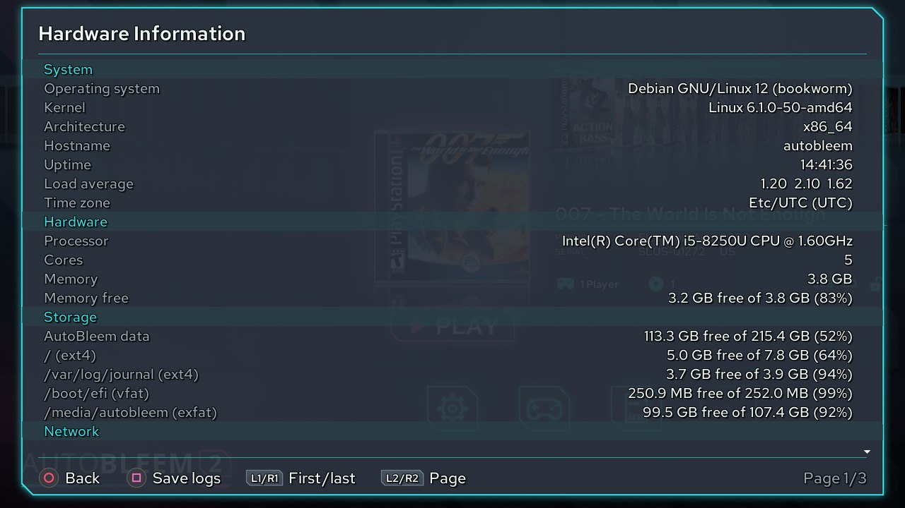

### 4.3 La guida dei pulsanti

Triangle sullo scaffale: ogni pulsante di ogni schermo su una pagina. Quando un teclato USB è collegato o è stato
usato, una colonna Tastiera mostra i tasti accanto ai pulsanti del controller.

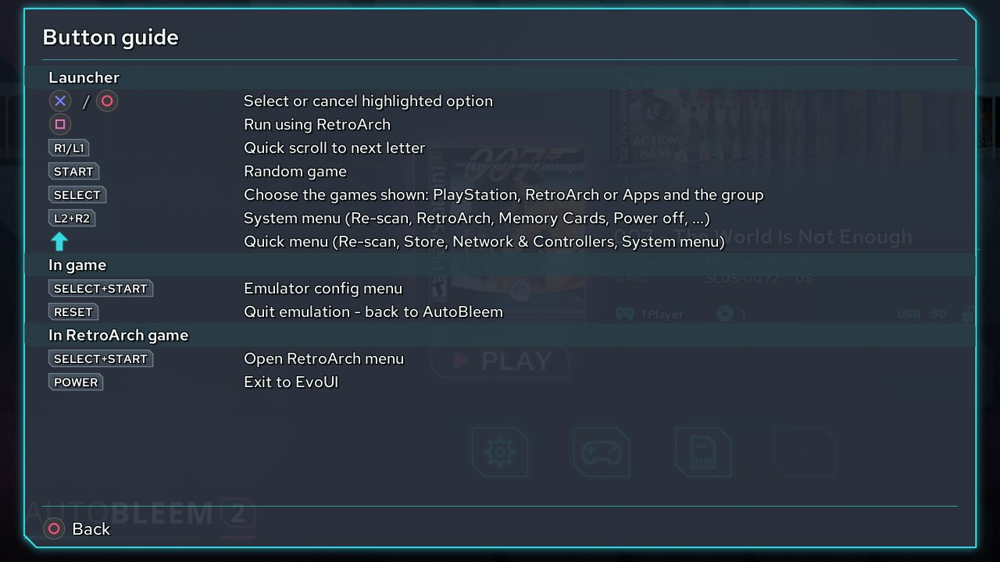

### 4.4 La tastiera su schermo

Dovunque viene scritto il testo - un set di memory card, un titolo di gioco, una password WiFi, l'indirizzo di una
fonte - la stessa tastiera, disposta come quella di un telefono: lettere, una pagina di simboli (`/ \ : ? & = % @ #`
e il resto che un indirizzo o una password ha bisogno) e due pagine di lettere accentate, con Maiusc, il tasto pagina,
Spazio, Backspace e Conferma nella riga inferiore. Le direzioni si muovono, Cross digita, Triangle elimina, Square è
uno spazio, **L1** è Maiusc (due volte per il blocco maiusc), **R1** la pagina successiva, **L2 / R2** muovono il
cursore, Start conferma, Circle annulla. Un teclato USB digita in qualsiasi momento: Invio conferma, Esc annulla.

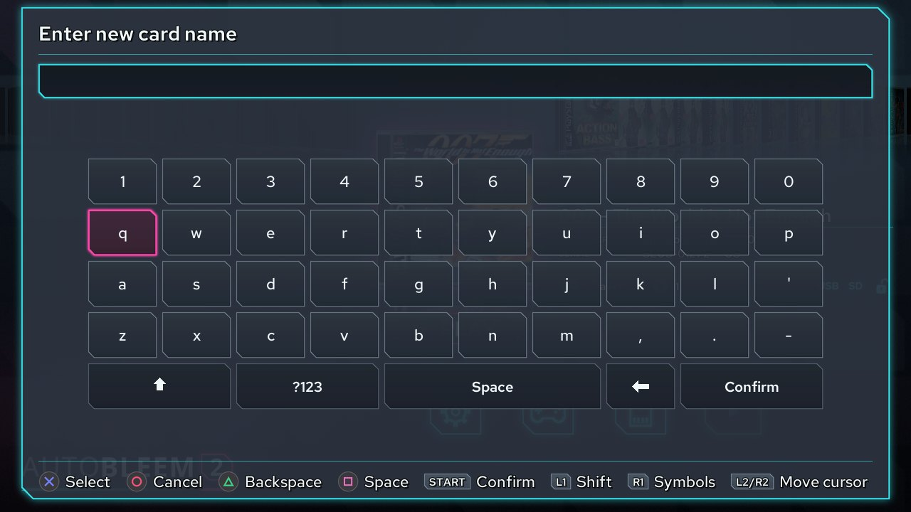

<!-- pagebreak -->

## 5. Su PC

### 5.1 UpdateRoms - aggiornare un'unità di console

La PlayStation Classic non ha rete, quindi gli elenchi di RetroArch e le copertine della sua unità vengono creati su
PC: **UpdateRoms** fa su PC quello che la scansione del launcher fa su un Pi, con la rete del PC e i percorsi della
console, quindi la console si avvia e trova tutto in posizione.

1. Copia i tuoi ROM sull'unità sotto `RetroArch/roms/<sistema>/` (sezione 3.9). I nomi delle cartelle devono essere
   i nomi dei database di RetroArch; l'installatore crea quelli comuni.
2. Avvia **`UpdateRoms\UpdateRoms.exe` dall'unità** (l'installatore l'ha messo lì). Trova l'unità da dove sta, mostra
   una riga di stadio, una barra di progresso e un registro, e:
   - scarica il bundle di database di RetroArch quando l'unità non ne ha uno, e identifica ogni ROM da esso - un gioco
     che il database conosce ottiene il suo nome corretto;
   - scrive un elenco di giochi per sistema in `RetroArch/bin/playlists/` con i percorsi della console, conservando
     tutto quello che RetroArch vi ha aggiunto;
   - recupera le copertine di ogni ROM che non ne ha uno dai server di miniature di libretro in
     `RetroArch/bin/thumbnails/`.
3. Estrai l'unità in modo sicuro e rimettila nella console. La scheda RetroArch del selettore di set elenca ogni
   sistema che ha giochi.

Riesegui dopo ogni modifica alle cartelle ROM; una cartella a cui nulla è cambiato viene saltata, quindi una
riesecuzione è veloce. Il registro è `System/Logs/updateroms.log`. Una scheda Raspberry Pi in un lettore di schede
può essere aggiornata allo stesso modo (`UpdateRoms.exe <unità> --target rpi`), sebbene un Pi lo faccia da solo se
ha una rete.

### 5.2 LAN Share - i tuoi giochi e dischi sul server sulla tua rete

**LAN Share** (`LanShare.exe`, sulla pagina del Negozio nella sua scheda **Server LAN**) mette i tuoi giochi PS1 sul
server del Negozio sulla tua rete domestica - un `abstored` su un Raspberry Pi, un NAS o un altro PC - e legge un
disco PS1 nell'unità CD/DVD del PC. Il Negozio sulla console, il Pi o il PC lo installa quindi da lì. Nulla da
installare; le impostazioni vengono mantenute in `%LOCALAPPDATA%\AutoBleem LAN Share\`.

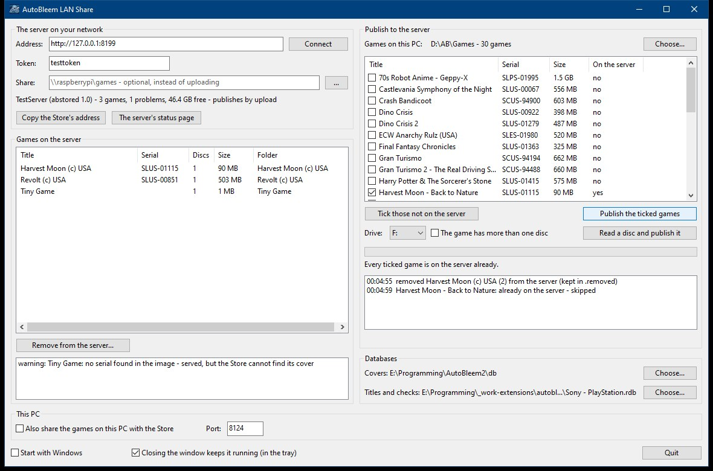

1. **Il server**: inserisci il suo indirizzo (`http://<suo indirizzo>:<porta>`, come lo ha il Negozio) e premi
   **Connetti**. I suoi giochi e gli eventuali problemi che la sua scansione ha trovato sono elencati a sinistra.
   Per mettere giochi su di esso, dai uno di questi:
   - **Condividi** - la cartella di giochi del server come viene condivisa sulla rete (Samba), ad esempio
     `\\raspberrypi\games`: LAN Share copia i giochi lì e chiede al server di scansionare. Il server stesso rimane
     di sola lettura.
   - **Token** - quando il server è stato avviato con `--allow-uploads`: il suo token (il server lo stampa all'avvio
     e lo mantiene in `<state>/upload-token`). LAN Share carica via HTTP, e un download interrotto continua da dove
     si è fermato.
2. **Giochi su questo PC**: scegli una cartella di giochi (una cartella per gioco), spunta i giochi e premi **Pubblica
   i giochi spuntati**. **Sul server** dice se il server ha già un gioco (per il suo numero di serie, altrimenti per
   il suo titolo); un gioco del genere non viene mai inviato due volte. **Spunta quelli non sul server** spunta il
   resto.
3. **Un disco**: metti un disco PS1 nell'unità e premi **Leggi un disco e pubblicalo**. Il disco viene letto per
   intero in un `.bin` + `.cue` (e un `.sbi` per un gioco LibCrypt, quando l'unità dà il subchannel), nominato dopo
   il suo titolo, verificato contro il buon dump noto (quando vengono scelti i database) e pubblicato. Per un gioco
   su più dischi, spunta **Il gioco ha più di un disco**: LAN Share chiede ogni disco successivo e li pubblica insieme
   come un gioco.
4. **Rimuovi dal server...** toglie i giochi selezionati dal server. Nulla viene eliminato: ognuno viene spostato in
   una cartella `.removed` accanto ai giochi del server, e spostarlo di nuovo lo recupera.

I **database** - la cartella di copertine di AutoBleem (`coversU/P/J.db`) e `Sony - PlayStation.rdb` di RetroArch -
danno i titoli e la verifica di un disco letto; entrambi sono opzionali. **Condividi anche i giochi su questo PC con
il Negozio** (disabilitato per impostazione predefinita) serve la cartella su questo PC al Negozio direttamente. La
prima volta, Windows chiede del suo firewall: consenti solo reti private.

<!-- pagebreak -->

## 6. Gli strumenti della console (PlayStation Classic)

Due strumenti per un'unità di PlayStation Classic. Entrambi disegnano nel tema e nella lingua del launcher e entrambi
sono gestiti dal controller - e, nella procedura guidata del controller, dai pulsanti anteriori della console.
**PSC-Bios** è un'estensione fornita con il pacchetto della console: la voce *Rete e controller* del menu rapido e del menu di sistema
la apre, ed è nell'elenco delle estensioni. **ABFlashKit** è un'app nel set di App.

### 6.1 PSC-Bios

Un'estensione fornita con il pacchetto della console, disponibile anche su un Raspberry Pi e l'unità PC. Viene aperta
dall'elemento *Rete e controller* del menu di sistema (o dall'elenco delle estensioni). Quando questa estensione è
installata ma disabilitata, l'elemento *Rete e controller* nel menu rapido e nel menu di sistema rimane disabilitato
con una nota "abilitalo nelle Estensioni" - Cross lì apre l'elenco Estensioni.

La schermata di apertura mostra i fatti della macchina: ora, fuso orario, adattatori di rete WiFi/Ethernet/Bluetooth
con i loro indirizzi, e ogni controller collegato con se ha una mappatura. Le parti di rete e Bluetooth hanno bisogno
del kernel AutoBleem sulla console (sezione 6.2) o strumenti di sistema su un Raspberry Pi / unità PC; la procedura
guidata del controller funziona su qualsiasi sistema.

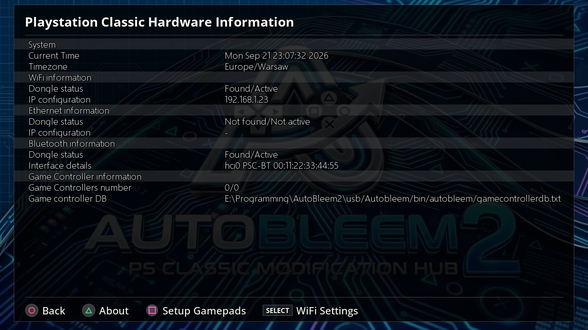

- **Select - Rete WiFi** (kernel o NetworkManager): il nome della rete (digitato o scelto da una scansione), la
  password, la modalità del driver, e *Applica / Riavvia rete*. Il fuso orario è impostato anche qui. L'indirizzo IP
  della console viene visualizzato una volta collegato.
- **Square - Controller Bluetooth**: una scansione di gamepad Bluetooth (DualShock 4, ecc.), per accoppiare o rimuovere.
- **L1 - Pairing DualShock 3**: connessione solo USB per il primo DualShock 3, tramite il plugin sixaxis del kernel.
- **R1 - Mappatura controller**: la procedura guidata di mappatura (sotto).
- **Triangle - Informazioni**, **Circle - torna indietro** al launcher.

**La procedura guidata del controller** mostra il controller collegato grezzo - ogni asse, pulsante e cappello come
numeri, e un'immagine DualShock che si illumina quando premi. Poiché il controller testato non può essere attendibile,
la procedura guidata è gestita dai **pulsanti anteriori della console**: **RESET** passa al controller successivo,
**OPEN** avvia la mappatura (quindi risponde ogni domanda - premi il pulsante illuminato sull'immagine, o OPEN se il
controller non ha quel pulsante), **POWER** annulla o esce. Tenere premuto Circle sul controller per 2 secondi esce
dalla procedura guidata (una barra si riempie e l'indizio del footer dice "Tieni premuto 2 s: Esci"). Mentre il
controller non ha una mappatura, tenere premuto qualsiasi pulsante 2 secondi lo fa ("Tieni premuto qualsiasi pulsante
2 s: Esci"). Una pressione breve viene mappata come al solito. Su una tastiera, Esc / Spazio / Invio rimpiazzano
POWER / RESET / OPEN. Alla fine, la nuova mappatura viene aggiunta per un test e OPEN la salva con un nome di tua
scelta; il launcher la carica da allora in poi.

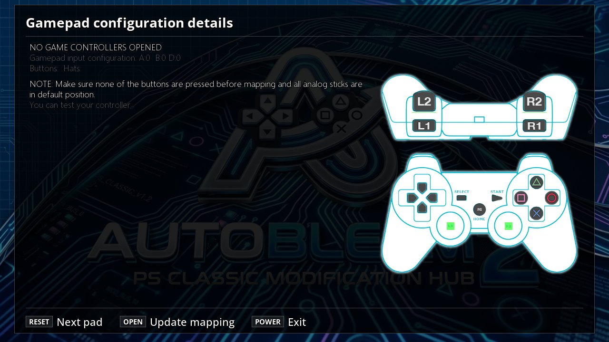

### 6.2 ABFlashKit - il kernel AutoBleem

Il kernel di AutoBleem è una sostituzione opzionale del kernel Linux della console: porta un orologio che funziona,
dongle USB WiFi e Bluetooth (per PSC-Bios e controller Bluetooth) e il supporto dei pulsanti anteriori che l'emulatore
usa per i punti di salvataggio. ABFlashKit lo installa, prima fa un backup della console, e può mettere la console
di nuovo al stock tramite il recupero proprio di Sony.

> **Questo strumento scrive nella memoria flash della console.** Un flash che viene interrotto - l'alimentazione viene
> tagliata, l'unità viene estratta - può lasciare la console incapace di avviarsi, e l'installazione di un kernel
> personalizzato annulla la sua garanzia. Mantieni la console accesa e l'unità dentro finché non si riavvia da sola.
> ABFlashKit si apre su questo avvertimento; *Capisco* continua, *Esci* esce.

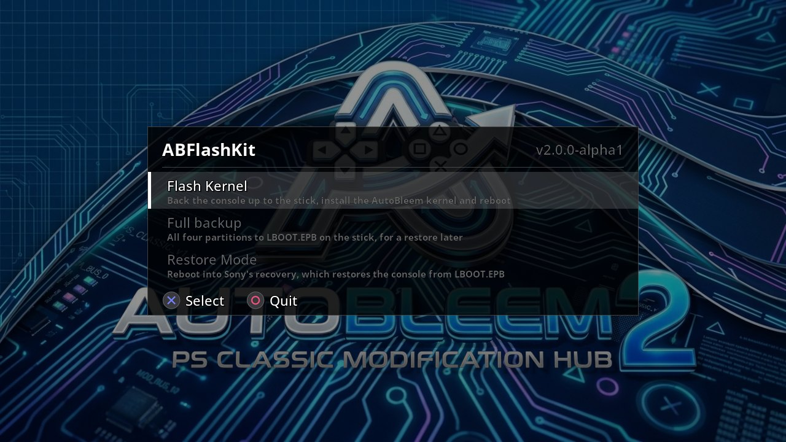

- **Flash Kernel**: fa un backup di recupero delle partizioni della console sull'unità (`LBOOT.EPB`) se non esiste
  ancora, la verifica e verifica l'immagine del kernel, scrive il kernel e i file di sistema di AutoBleem, e si riavvia.
  *Tutto fatto - quando lo schermo diventa nero sostituisci il cavo di alimentazione*: tira il cavo di alimentazione
  della console e rimettilo.
- **Backup completo**: tutte e quattro le partizioni a `LBOOT.EPB`, per un recupero successivo (il backup precedente
  viene sostituito dopo una domanda).
- **Modalità recupero**: verifica che il backup sia del stock, imposta il flag di recupero e si riavvia nel recupero
  di Sony, che recupera la console da `LBOOT.EPB` sull'unità - il modo di tornare al firmware originale.

Una barra di progresso sotto ogni passaggio mostra quanto sta avanzando l'azione. Lo strumento si rifiuta di flashare
una console che esegue un altro firmware personalizzato (BleemSync, Project Eris): recuperalo prima al stock.

<!-- pagebreak -->

## 7. Se qualcosa va male

- **Registri**: AutoBleem mantiene i suoi registri in memoria, quindi l'unità non viene scritta tutto il tempo - raggiungono
  `System/Logs/` sull'unità, la scheda o la cartella di dati solo quando qualcosa va male: un crash del launcher, di un
  gioco PS1 o di RetroArch li salva in `System/Logs/crash-<n>/` (vengono mantenuti gli ultimi tre), e il launcher lo
  dice una volta quando torna. Per mantenere ogni registro, abilita *Opzioni -> Diagnostica -> Mantieni i registri
  sull'unità* (dal prossimo avvio), o crea un file vuoto `System/Logs/keep` su un PC. Su un Pi o un PC, *Informazioni
  sull'hardware* mostra dove sono i registri e Square li salva in `System/Logs/saved-<n>/`. I file: `autobleem.log`
  (il launcher), `launch.log` e `pcsx.log` (l'avvio di un gioco PS1 e l'output dell'emulatore), `retroarch.log`, e -
  sempre sull'unità - `update.log` (un aggiornamento online) e `updateroms.log` (UpdateRoms).
- **Un gioco non è sullo scaffale**: controlla il layout della cartella (una cartella per gioco, i formati di immagine
  della sezione 3.9). Il *Gestore di giochi* elenca le cartelle che la scansione ha rifiutato dopo i giochi, marcate
  *Non aggiunto*, con il motivo; Square elimina tale cartella. *Riscansiona i giochi* nel menu di sistema riesegue la
  scansione.
- **Nessuna copertina**: i database di copertine non sono stati installati (riesegui l'installatore con essi spuntati), o,
  per i giochi di RetroArch su una console, UpdateRoms non è stato eseguito su PC.
- **Un controller non fa nulla o ha i pulsanti mescolati**: la procedura guidata del controller di PSC-Bios (una console)
  lo mappa; su un Pi o un PC la pagina Informazioni sull'hardware elenca quello che SDL vede.
- **La console mostra una schermata nera dopo un gioco**: AutoBleem ricostruisce la sua finestra da solo (fino a tre volte);
  se rimane nera, mantieni premuto il pulsante Power e riaccendi la console.
- **Raspberry Pi**: `Alt+F2` fornisce un prompt sulla seconda console; SSH è abilitato dal primo avvio. `sudo journalctl -u
  autobleem` mostra il servizio del launcher; `sudo systemctl restart autobleem` lo riavvia. Un primo avvio che non poteva
  finire (senza rete) riprova al prossimo avvio.
- **Windows**: `Esc` esce dal launcher; la cartella di dati è quella scelta nell'installazione
  (`Documents\AutoBleem` per impostazione predefinita), i registri sono nel suo `System\Logs`.

AutoBleem è software libero (GNU GPL v3 o versioni successive), senza garanzia. Supporto e notizie: il server Discord
collegato nella schermata Informazioni, e https://autobleem.retromenele.pl/.
