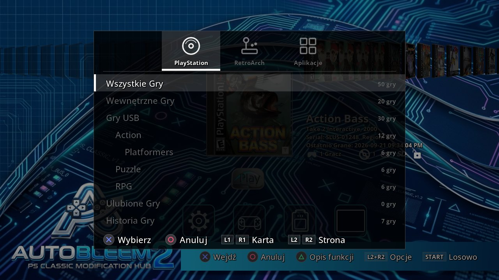
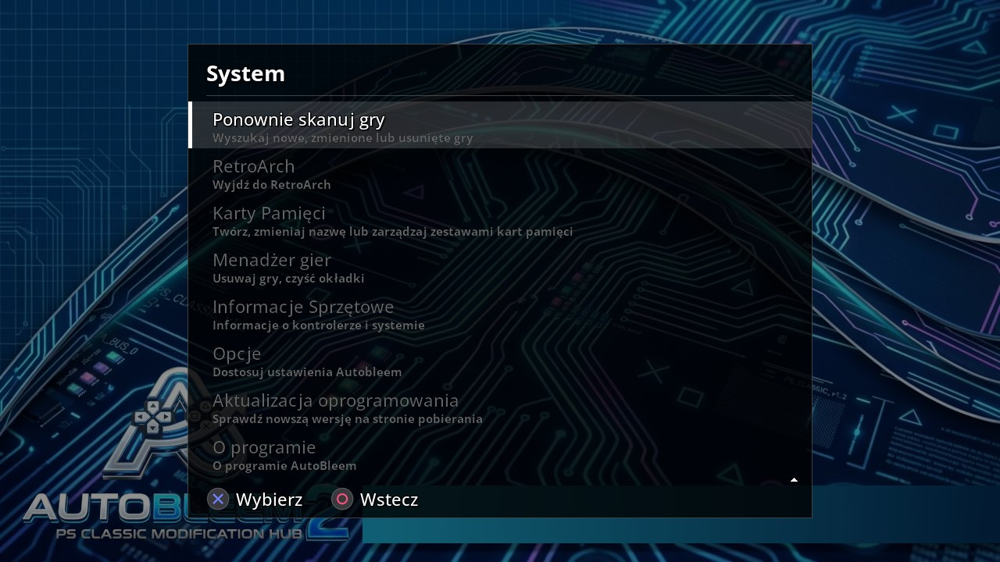
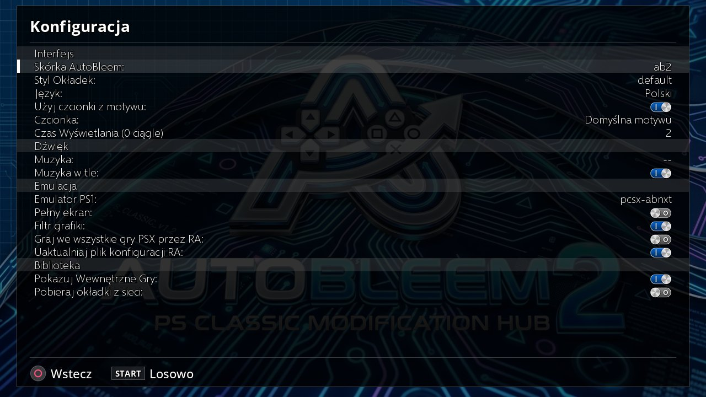
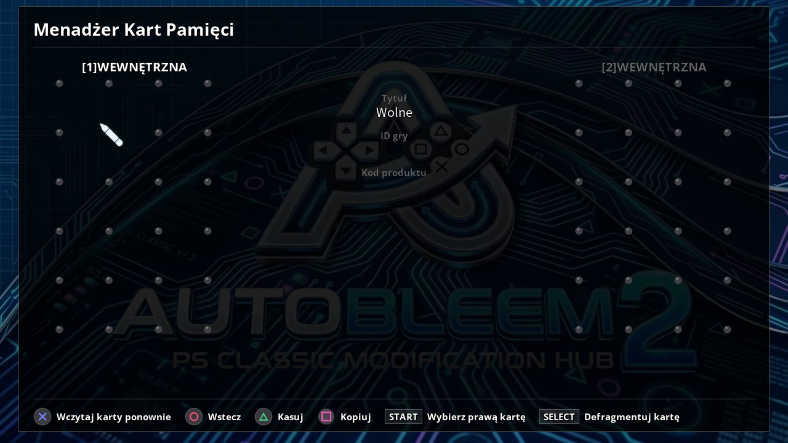
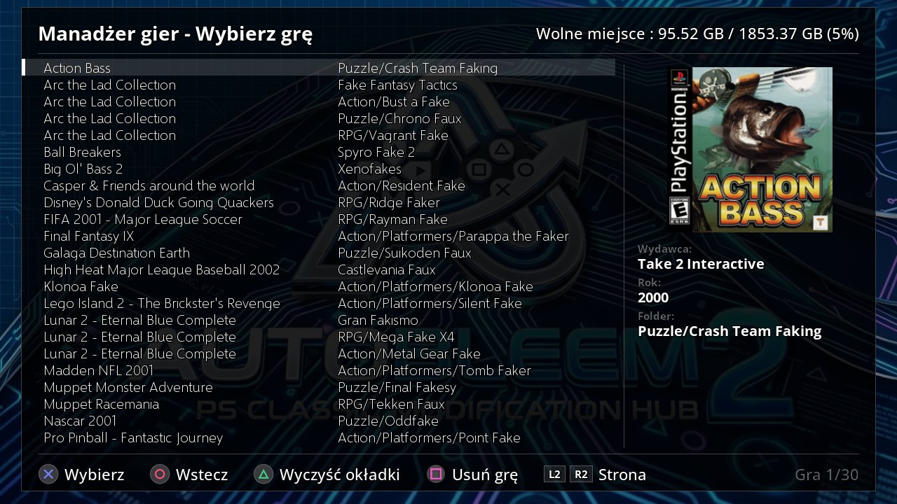
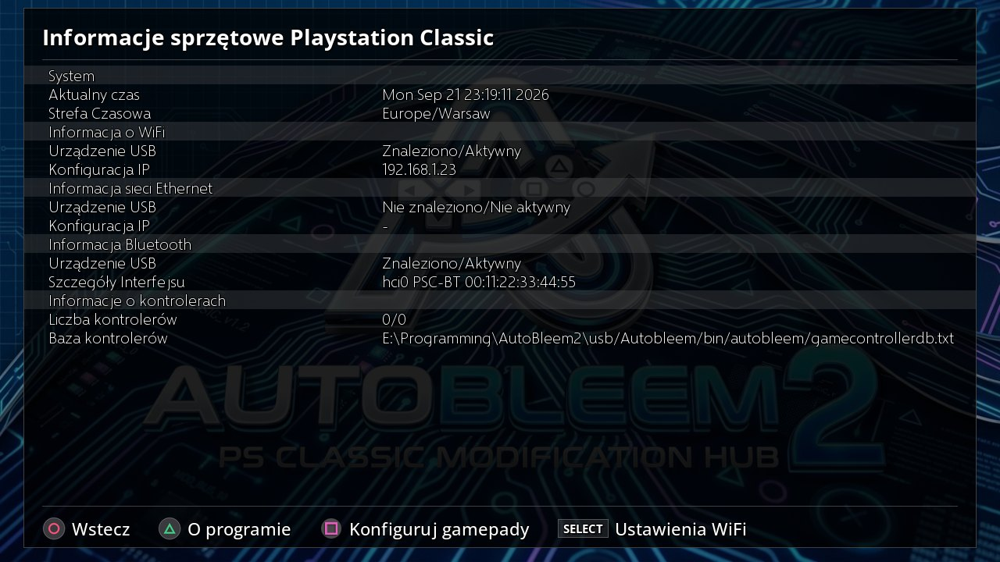

# AutoBleem 2 - Podręcznik użytkownika

AutoBleem 2 to launcher gier dla **PlayStation Classic** - a od wersji 2 także dla **Raspberry Pi**,
**komputera PC uruchamianego z pendrive'a** i **Windows**. Pokazuje gry PS1 jako półkę z okładkami, ich
grafiką i opisami, uruchamia je we wbudowanym emulatorze PCSX, a z zainstalowanym obok RetroArch gra też
w gry z innych systemów. Ten podręcznik opisuje instalację na każdej platformie, codzienne używanie oraz
dołączone narzędzia.

> Pliki do pobrania dla każdej platformy są na **https://autobleem.retromenele.pl/**. Strona jest podzielona
> na platformy: panel *Install* każdej z nich to to, co pobierasz; *Build inputs* pod nim to to, co
> instalatory pobierają same.

## 1. Co dostajesz

- **Launcher** - karuzela okładek, zestawy (PlayStation, RetroArch, Aplikacje), opis gry, menu systemowe,
  opcje, narzędzia do kart pamięci i stanów gry. Ten sam program na każdej platformie.
- **Dwa emulatory PS1** - `pcsx-abnxt`, aktualny (domyślny), oraz `pcsx-ab`, klasyczny, dostarczany z
  AutoBleem od zawsze. Wybierasz go w opcjach; oba używają tych samych ustawień i kart pamięci.
- **RetroArch** (opcjonalny na każdej platformie) dla innych systemów: NES, SNES, Mega Drive, Game Boy,
  automaty i wiele innych. AutoBleem buduje listy RetroArch z ROM-ów, które wgrasz, i uruchamia każdą grę
  właściwym rdzeniem.
- **Narzędzia konsolowe** (tylko PlayStation Classic): *PSC-Bios* do WiFi, zegara i mapowania padów oraz
  *ABFlashKit* do instalacji kernela AutoBleem.
- **UpdateRoms** dla Windows: odświeża listy RetroArch i okładki pendrive'a konsoli na PC, bo sama konsola
  nie ma sieci.


<!-- pagebreak -->

## 2. Instalacja

### 2.1 PlayStation Classic

Potrzebujesz komputera z Windows, pendrive'a (USB 2.0, 8 GB lub więcej; instalator go sformatuje, jeśli
poprosisz) i konsoli. AutoBleem działa z pendrive'a bez żadnej zmiany w konsoli. Pendrive musi być
**FAT32** dla fabrycznej konsoli - jej kernel nie czyta exFAT. Tylko konsola z zainstalowanym kernelem
AutoBleem (ABFlashKit, rozdział 6) uruchamia się także z pendrive'a exFAT, co znosi limit 4 GB na plik w FAT32.

1. Pobierz **AutoBleemInstaller-<wersja>.zip** z panelu PlayStation Classic na stronie i rozpakuj gdziekolwiek.
   W środku jest `AutoBleemInstaller.exe` i pakiet AutoBleem, który instaluje.
2. Włóż pendrive i uruchom `AutoBleemInstaller.exe`. Wybierz dysk u góry. Zaznacz, co chcesz:
   - **Formatowanie pendrive'a** - tylko dla nowego pendrive'a (wszystko na nim zostanie skasowane). Wybierz
     FAT32, chyba że konsola ma kernel AutoBleem.
   - **Bazy okładek** - grafika i opisy biblioteki PS1 (zaznaczone domyślnie; ok. 300 MB).
   - **RetroArch** - RetroArch z rdzeniami, dodatkowe aplikacje (Doom, Quake, Amiga, ...) i zasoby libretro,
     dla gier z innych systemów. Domyślnie wyłączone; można dodać później, uruchamiając instalator ponownie.
   - **Pliki BIOS** - BIOS-y, których potrzebują rdzenie RetroArch (wymaga RetroArch).
   - **Gry przykładowe** - kilka darmowych gier homebrew, żeby półka nie była pusta.
3. Naciśnij **Install** i poczekaj. Paski postępu i log pokazują każdy krok; na koniec pendrive dostaje
   nazwę `SONY`, a trafia na niego `UpdateRoms` (patrz rozdział 5).
4. Bezpiecznie odłącz pendrive, włóż go do **drugiego portu USB** konsoli (prawego, gracz 2) i włącz konsolę.
   Zamiast fabrycznego menu uruchamia się AutoBleem.

Żeby **zaktualizować** pendrive, uruchom na nim nowszy instalator: gry, zapisy, ustawienia i zawartość
RetroArch zostają; wymieniane są tylko pliki samego AutoBleem. Pendrive zrobiony AutoBleem 1.0 albo
AutoBleem-NG jest automatycznie przenoszony do nowego układu folderów.

> Fabryczna konsola nie ma zegara ani sieci: daty pokazują się dopiero po instalacji kernela AutoBleem
> (rozdział 6), a okładki gier RetroArch robi UpdateRoms na PC (rozdział 5).

Gry trafiają do folderu `Games` na pendrivie, po jednym folderze na grę - układ opisuje punkt 3.9.

### 2.2 Raspberry Pi

AutoBleem zamienia Pi w małą konsolę: uruchamia się prosto w launcherze, bez pulpitu. Na stronie są dwa
gotowe obrazy - 32-bitowy i 64-bitowy - oraz archiwum dla istniejącego Raspberry Pi OS Lite.

| Model | Obraz 32-bit | Obraz 64-bit | Uwagi |
|---|---|---|---|
| Raspberry Pi 5 | tak | tak | |
| Raspberry Pi 4 Model B, Pi 400 | tak | tak | |
| Raspberry Pi 3 Model B / B+ / A+ | tak | tak | wystarcza na launcher i PS1 |
| Raspberry Pi Zero 2 W | tak | tak | 512 MB RAM: PS1 działa, cięższe rdzenie RetroArch nie |
| Raspberry Pi 2 Model B | tak | tylko v1.2 | wolne dla czegokolwiek 3D |
| Raspberry Pi 1, Zero, Zero W | nie | nie | ARMv6 - żaden obraz nie działa |

**Obraz 32-bitowy jest zalecany** do gier PS1: szybki rekompilator ARM w `pcsx-ab` jest tylko 32-bitowy,
więc na 64 bitach gry PS1 chodzą wolniej. Obraz 64-bitowy ma za to większy zestaw rdzeni RetroArch.

**Przez Raspberry Pi Imager:**

1. Zainstaluj Raspberry Pi Imager (raspberrypi.com/software). W *Choose OS* wybierz *Use custom* i pobrany
   `autobleem-<wersja>-rpi-armhf.img.xz` (32-bit) albo `-arm64.img.xz` (64-bit) - albo dodaj w ustawieniach
   programu adres repozytorium `https://autobleem.retromenele.pl/rpi-imager/os_list.json` i wybierz
   AutoBleem z listy.
2. W ekranie dostosowania Imagera (koło zębate albo pytanie po *Next*) ustaw **nazwę użytkownika i hasło,
   sieć WiFi z krajem oraz włącz SSH**. AutoBleem potrzebuje sieci przy pierwszym uruchomieniu.
3. Zapisz kartę, włóż ją do Pi z podłączonym ekranem oraz klawiaturą lub padem i włącz zasilanie.

**Pierwsze uruchomienie** trwa od 5 do 25 minut i pokazuje na ekranie, co robi. Bez sieci pyta o nią
(lista WiFi, hasło), potem pyta, czy zainstalować RetroArch (minuta bez odpowiedzi oznacza tak), powiększa
partycję systemową, tworzy z reszty karty partycję danych `AUTOBLEEM`, instaluje RetroArch z rdzeniami,
paczki BIOS-ów i gry przykładowe, po czym restartuje się do launchera.

Odpowiedzi można podać z góry w pliku **`autobleem.txt`** na partycji rozruchowej karty (do edycji na
dowolnym PC przed pierwszym uruchomieniem):

| Klucz | Domyślnie | Znaczenie |
|---|---|---|
| `root_gib` | 8 | Rozmiar partycji systemowej w GiB; reszta staje się partycją gier. |
| `hdmi_mode` | 1920x1080@60 | Tryb ekranu dla całego rozruchu (`1280x720@60` dla starszego telewizora). |
| `retroarch` | (pytanie) | `yes` / `no` - RetroArch i inne systemy, albo samo PS1. |
| `thumbnails` | none | `boxarts` kopiuje cały zestaw okładek do pracy bez sieci (~9000 plików). |
| `bios`, `downloads`, `samples` | yes | Ustaw `no`, żeby pominąć paczki BIOS, wszystkie pobierania albo gry przykładowe. |

**Na istniejącym Raspberry Pi OS Lite** (Bookworm lub Trixie): skopiuj `autobleem-rpi.tar.gz` (albo wersję
arm64) na Pi, rozpakuj i uruchom `sudo bash install.sh`. Zadaje te same pytania, tworzy partycję danych
zmniejszając root przy następnym uruchomieniu (`--shrink-root <GiB>`) i uruchamia launcher na pierwszej
konsoli.

Po instalacji **partycja `AUTOBLEEM`** karty (exFAT) jest tym, co wypełniasz: wyjmij kartę i otwórz ją na
dowolnym PC albo kopiuj przez sieć (SSH jest włączone). `Games/` na gry PS1, `RetroArch/roms/<system>/` na
inne systemy, `System/Bios/` na BIOS PS1 (punkt 3.10), `Themes/` na motywy.

### 2.3 Pendrive dla PC

Ta sama "konsola" dla dowolnego komputera uruchamianego z USB - system 32-bitowy, więc działają też stare
maszyny:

1. Pobierz `autobleem-<wersja>-pcusb-i386.img.xz` z panelu PC i zapisz na pendrive 8 GB lub większym
   przez Raspberry Pi Imager (*Use custom*), balenaEtcher albo Rufus (tryb DD).
2. Uruchom PC z pendrive'a (klawisz menu rozruchowego twojego PC - F12, F8, Esc...). Działa rozruch BIOS
   i UEFI; **Secure Boot musi być wyłączony**.
3. Pierwsze uruchomienie jest takie jak na Pi: pytanie o sieć, jeśli nie ma kabla, pytanie o RetroArch,
   potem instalacja - około ośmiu minut z siecią kablową - i restart do launchera.

Pendrive ma potem partycję `AUTOBLEEM` na twoje gry, widoczną w Windows 10 (1903 i nowszych) jako drugi
dysk po włożeniu do działającego komputera. `autobleem.txt` jest na pierwszej partycji, z tymi samymi
kluczami co na Pi (bez `hdmi_mode` - PC używa natywnego trybu ekranu).

### 2.4 Windows

AutoBleem jako program dla Windows: pełny ekran, emulatory i RetroArch uruchamiane jako programy.

1. Pobierz **AutoBleemSetup-<wersja>.exe** i uruchom. Instaluje się dla użytkownika, bez uprawnień
   administratora: program w `%LOCALAPPDATA%\Programs\AutoBleem`, dane (gry, ustawienia, motywy, RetroArch)
   w wybranym folderze - domyślnie `Dokumenty\AutoBleem`.
2. Zaznacz składniki - bazy okładek, RetroArch (oficjalna wersja dla Windows z rdzeniami), pliki BIOS, gry
   przykładowe - i pozwól pomocnikowi instalacji je pobrać.
3. Uruchom AutoBleem z menu Start albo z pulpitu. Na PC klawiatura zastępuje pad (punkt 3.2).

Nowszy instalator uruchomiony na tym samym komputerze aktualizuje program, a folder danych zostaje.
Launcher raz dziennie sprawdza też stronę i proponuje aktualizację, gdy jest nowsza (punkt 3.11).

<!-- pagebreak -->

## 3. Używanie AutoBleem

### 3.1 Launcher

Launcher otwiera się na półce: okładki bieżącego zestawu, wybrana pośrodku, obok jej opis - wydawca, rok,
numer seryjny, region, liczba graczy, kiedy ostatnio grano - i przycisk odtwarzania. Pasek u dołu mówi, co
robią przyciski. Przy każdym starcie w tle działa skanowanie folderu gier; póki trwa, dymek w prawym górnym
rogu pokazuje postęp, a nowe gry pojawiają się na półce w miarę znajdowania.



### 3.2 Sterowanie

| Przycisk | Na półce |
|---|---|
| Lewo / Prawo | Poprzednia / następna gra. Przytrzymanie przewija dalej. |
| L1 / R1 | Skok do poprzedniej / następnej pierwszej litery tytułów. |
| Krzyżyk | Uruchom wybraną grę (grę PS1 w emulatorze PS1; grę RetroArch jej rdzeniem; aplikację po jej opisie). |
| Kwadrat | Uruchom wybraną grę PS1 w RetroArch. |
| Trójkąt | Przewodnik po przyciskach. |
| Start | Losowa gra z bieżącego zestawu. |
| Select | Wybór zestawu: zakładki PlayStation / RetroArch / Aplikacje (L1 / R1), grupy zakładki (Góra / Dół, L2 / R2 strona), Krzyżyk wybiera. |
| Dół | Otwiera rząd ikon pod grą (Ustawienia, Gra, Karta pamięci, Wznów). Góra go zamyka. |
| L2 + R2 | Menu systemowe (punkt 3.4). |

Na PC bez pada zastępuje go klawiatura: **X O S T** to Krzyżyk, Kółko, Kwadrat, Trójkąt; **I J K L**
kierunki; **Spacja** Start, **B** Select; **Q E 1 2** to L1, R1, L2, R2; **Esc** kończy program.

Na każdej liście i w każdym menu: Góra / Dół przesuwają, **L2 / R2 zmieniają stronę**, L1 / R1 skaczą do
pierwszego / ostatniego wiersza, **Krzyżyk wybiera, Kółko wraca**. Ekran z ustawieniami zapisuje je, gdy
wychodzisz Kółkiem.


### 3.3 Zestawy

**Select** otwiera wybór zestawu. Zakładka PlayStation zawiera *Wszystkie gry*, *Gry wewnętrzne* (dwadzieścia
wbudowanych gier konsoli, na PlayStation Classic), każdy folder, który założysz w `Games/` (gra w
podfolderze należy do tej grupy), *Ulubione*, *Historię* oraz - gdy jakaś gra jest tak oznaczona - *Gry na
pistolet świetlny*. Zakładka RetroArch ma po jednej grupie na system z grami, a także własne Ulubione i
Historię RetroArch. Zakładka Aplikacje to jedna grupa aplikacji. Każdy wiersz pokazuje liczbę gier; grupa
bez gier otwiera pustą półkę z rzędem ikon pokazującym same Ustawienia.

### 3.4 Menu systemowe

**L2 + R2** (razem, w dowolnej kolejności) otwiera menu systemowe nad półką:

| Pozycja | Co robi |
|---|---|
| Skanuj gry ponownie | Szuka teraz nowych, zmienionych lub usuniętych gier (skan sam też obserwuje folder). |
| RetroArch | Wychodzi z launchera do własnego menu RetroArch. Zamknięcie RetroArch wraca. |
| Karty pamięci | Twoje zestawy kart pamięci (punkt 3.7). |
| Menedżer gier | Gry PS1 jako lista z folderami: usuwanie gry, czyszczenie okładek. |
| Informacje o sprzęcie | Maszyna: system, CPU, dyski, sieć, ekran, pady. Na konsoli z kernelem AutoBleem otwiera PSC-Bios (rozdział 6). |
| Opcje | Ustawienia AutoBleem (punkt 3.5). |
| Aktualizacja | (Raspberry Pi i PC) Sprawdź teraz, czy na stronie jest nowszy AutoBleem lub RetroArch. |
| O programie | Autorzy i licencja. |
| Wyłącz | Wyłącza maszynę, po potwierdzeniu. |



### 3.5 Opcje

Ustawienia są w grupach; Góra / Dół przechodzą między nimi, Lewo / Prawo zmieniają wartość, Kółko wychodzi
i zapisuje. Każda zmiana działa od razu.

| Grupa / ustawienie | Co robi |
|---|---|
| **Interfejs**: Motyw AutoBleem | Wygląd. Motywy leżą w `Themes/`; zip z motywem wrzucony tam jest rozpakowywany przy następnym wejściu. |
| Styl okładki | Ramka pudełka rysowana wokół okładek PS1. |
| Język | Język launchera, od razu (17 języków). |
| Czcionka z motywu / Czcionka | Czcionka klasycznych ekranów: z motywu albo dowolny `.ttf`/`.otf` z `resources/fonts`, `RetroArch/fonts` lub folderu motywu. |
| Czas wyświetlania | Jak długo zostaje powiadomienie "Wyświetla: ..." w sekundach (0 = zawsze). |
| **Dźwięk**: Muzyka, Muzyka w tle | Który utwór gra pod launcherem (z motywu albo plik z `resources/music`) i czy w ogóle gra. |
| **Emulacja**: Emulator PS1 | `pcsx-abnxt` (domyślny: aktualny PCSX-ReARMed z dodatkami AutoBleem) albo `pcsx-ab` (klasyczny). Stan gry zapisany jednym nie wczyta się w drugim. |
| Szeroki ekran, Filtr GFX | Ustawienia obrazu emulatora PS1 dla każdej gry. |
| Graj we wszystkie gry PSX w RA | Każda gra PS1 startuje w rdzeniu PS1 RetroArch. |
| Aktualizuj konfigurację RA | AutoBleem wpisuje swoje ustawienia do konfiguracji RetroArch, gdy uruchamia tam grę. |
| **Biblioteka**: Pokaż gry wewnętrzne | Wbudowane gry konsoli na listach PlayStation (tylko PlayStation Classic). |
| Pobieraj okładki z sieci | Skan pobiera brakujące okładki z serwerów libretro (Raspberry Pi, PC, Windows). |
| **Aktualizacje** | (Raspberry Pi, PC, Windows) `stable`, `latest` (także wydania wstępne) albo `off`. |



### 3.6 Ustawienia gry

Przy wybranej grze **Dół** otwiera jej rząd ikon: **Ustawienia** (opcje powyżej), **Gra** (ustawienia samej
gry), **Karta pamięci** (jej karta) i **Wznów** (jej stany gry). Krzyżyk otwiera tę pod kursorem.

**Edytor gry** pokazuje po prawej opis gry, a po lewej jej ustawienia w trzech grupach:

- **Gra**: *Ulubiona* (w grupie Ulubione), *Gra na pistolet świetlny* (trafia do grupy pistoletu i zawsze
  chodzi w RetroArch, którego rdzeń PS1 ma GunCon), *Graj w RA* (ta gra chodzi w RetroArch), *Zablokuj dane*
  (skaner zostawia tytuł, numer seryjny i listę płyt tak, jak je ustawisz).
- **Obraz**: wysoka rozdzielczość, scanlines i ich poziom, pomijanie klatek, wtyczka GPU.
- **Emulator**: SpeedHack, zegar CPU, interpolacja SPU, logo startowe (wyłączone pomija powłokę BIOS - dla
  płyty homebrew, której własne logo psuje start), a z `pcsx-abnxt` filtr *Wygładzanie* i przełącznik
  *Hacki Sony*.

Trójkąt zmienia nazwę gry, Kwadrat zmienia jej kartę pamięci, Start udostępnia nową kartę. Kółko zapisuje i
wychodzi.


### 3.7 Karty pamięci i stany gry

Każda gra PS1 ma domyślnie własną kartę pamięci (trzymaną razem z jej stanami w `Games/!SaveStates/<folder
gry>/`). **Karty pamięci** w menu systemowym zarządzają **zestawami wspólnymi** - kartą używaną przez kilka
gier, trzymaną w `Games/!MemCards/`: utwórz (Kwadrat, przez klawiaturę ekranową), zmień nazwę (Krzyżyk),
usuń (Trójkąt). Grę przypisujesz do zestawu przez *Zmień kartę pamięci* w jej edytorze albo z jej ikony
Karta pamięci.

**Edytor kart pamięci** (ikona Karta pamięci) pokazuje obok siebie kartę gry i drugą kartę, z ikoną i
tytułem każdego zapisu: kopiowanie zapisu między nimi (Kwadrat), usuwanie (Trójkąt), defragmentacja karty
(Select). Start zamienia prawą kartę na inny zestaw.



**Punkty wznowienia**: gdy wychodzisz z gry PS1 przyciskiem Reset konsoli (albo menu emulatora na Pi lub
PC), AutoBleem zachowuje stan gry z tego miejsca i proponuje go pod ikoną **Wznów** - cztery sloty, każdy z
obrazkiem chwili. Krzyżyk kontynuuje ze slotu, Trójkąt go usuwa. Gra z punktem wznowienia pokazuje mały
obrazek na ikonie Wznów.

### 3.8 Uruchamianie gier, RetroArch i aplikacje

**Krzyżyk** uruchamia wybraną grę. Gra PS1 chodzi w wybranym emulatorze PS1 (punkt 3.5), na pełnym
ekranie, aż z niej wyjdziesz - na konsoli przednim przyciskiem **Reset** (powrót do launchera z punktem
wznowienia) albo **Power** (konsola się wyłącza); na Pi lub PC przez menu emulatora (Select + Start na
padzie albo Esc na klawiaturze). **Kwadrat** uruchamia grę PS1 w RetroArch.

Gra **RetroArch** startuje w RetroArch z rdzeniem, który launcher wybrał dla jej systemu; *Close Content*
albo *Quit RetroArch* w jego menu wraca do launchera. Pozycja RetroArch w menu systemowym otwiera własne
menu RetroArch (XMB) bez wczytanej gry, do jego ustawień i własnych list.

**Aplikacja** (zestaw Aplikacje: narzędzia konsolowe, a na konsoli dodatkowe programy z paczki RetroArch -
Doom, Quake, Amiga, ...) pokazuje najpierw swój opis; Krzyżyk ją uruchamia, Kółko wraca.


### 3.9 Dodawanie gier

**Gry PS1** trafiają do folderu `Games`, **po jednym folderze na grę**, nazwanym jak gra:

```
Games/
  Crash Bandicoot/            Crash Bandicoot.cue + Crash Bandicoot.bin
  Final Fantasy VII/          Final Fantasy VII (Disc 1).chd, (Disc 2).chd, (Disc 3).chd
  Platformowki/               folder gier: własna grupa w wyborze zestawu
    Klonoa/                   Klonoa.pbp
```

- Formaty: `.cue` + `.bin` (albo `.img`), `.pbp`, `.chd` (także zstd), `.ecm` (dekodowany przez skan), `.iso`.
- Gra wielopłytowa to jeden folder ze wszystkimi płytami; foldery `Gra (Disc 1)`, `Gra (Disc 2)` ... skan
  scala w jeden folder `Gra`.
- Gry wrzucone luzem prosto do `Games/` skan porządkuje do folderów.
- **Okładka** to PNG obok obrazu gry, nazwany tak jak on. Bez niego grafika pochodzi z baz okładek albo -
  z zainstalowanym RetroArch - z zestawu miniatur libretro; na Pi, PC i Windows brakująca jest pobierana z
  sieci (Opcje → *Pobieraj okładki z sieci*).
- Skan odczytuje numer seryjny każdej płyty i bierze tytuł, wydawcę, rok, liczbę graczy i region z bazy
  PlayStation RetroArch albo z baz okładek. Zmień cokolwiek w edytorze gry i zaznacz *Zablokuj dane*, żeby
  to zachować.

**Inne systemy** trafiają do `RetroArch/roms/`, **po jednym folderze na system, nazwanym jak bazy
RetroArch** (foldery są zakładane za ciebie): `Nintendo - Nintendo Entertainment System`, `Nintendo - Super
Nintendo Entertainment System`, `Sega - Mega Drive - Genesis`, `Nintendo - Game Boy Advance`, `FBNeo -
Arcade Games` (albo `Arcade`), ... ROM-y mogą zostać spakowane. Na Pi, PC i Windows skan czyta je sam i
zapisuje listy RetroArch; na pendrivie konsoli uruchom **UpdateRoms** na PC (rozdział 5).

**Aplikacje** trafiają do `Apps/<nazwa>/` z `app.ini` (nazwa, ikona, co uruchomić) i `run.sh`.

**Motywy** trafiają do `Themes/<nazwa>/` (`theme.json` i obrazy) - albo wrzuć zip motywu do `Themes/`.

### 3.10 BIOS PS1

Na **PlayStation Classic** emulator używa BIOS-u konsoli. Na **Raspberry Pi, PC i Windows** wgraj własny
BIOS PS1 do `System/Bios/`: `romw.bin` (amerykański/europejski SCPH-5501/5502) i `romJP.bin` (japoński
SCPH-5500). Instalatory wypełniają je z paczek BIOS RetroArch, chyba że twoje pliki już tam są. Bez nich
emulator działa na wbudowanym BIOS-ie HLE, który wiele gier toleruje, a niektóre nie.

### 3.11 Aktualizacje

- **Raspberry Pi, pendrive PC, Windows**: launcher sprawdza stronę przy starcie i raz dziennie (Opcje →
  *Aktualizacje* to kanał; *Aktualizacja* w menu systemowym sprawdza od razu). Gdy jest nowszy AutoBleem
  lub RetroArch, pyta: *Aktualizuj teraz* pobiera wszystko i uruchamia ponownie instalator z ekranem
  postępu z pierwszego uruchomienia; *Przypomnij jutro* i *Pomiń tę wersję* to pozostałe odpowiedzi. Gry i
  ustawienia zostają; po aktualizacji launcher raz skanuje ponownie.
- **PlayStation Classic**: uruchom nowszy `AutoBleemInstaller.exe` na pendrivie (punkt 2.1).

<!-- pagebreak -->

## 4. Ekrany

### 4.1 Menedżer gier

Gry PS1 jako lista z folderami oraz okładka i opis wybranej. Krzyżyk otwiera edytor gry, **Kwadrat usuwa
grę** (jej folder, a po drugim pytaniu także stany gry), Trójkąt usuwa wszystkie PNG okładek obok gier (skan
weźmie je znów z baz), L2 / R2 zmieniają stronę. Wolne miejsce na dysku jest w prawym górnym rogu. Menedżer
gier czeka, gdy trwa skan.



### 4.2 Informacje o sprzęcie

Fakty o maszynie - system, sprzęt, dyski z wolnym miejscem, adresy sieciowe, sterowniki ekranu i dźwięku,
podłączone pady - odczytywane co sekundę. Na PlayStation Classic z kernelem AutoBleem ta pozycja otwiera
zamiast tego **PSC-Bios** (rozdział 6).


### 4.3 Przewodnik po przyciskach

Trójkąt na półce: wszystkie przyciski każdego ekranu na jednej stronie.


### 4.4 Klawiatura ekranowa

Wszędzie, gdzie wpisuje się nazwę - nowy zestaw kart pamięci, tytuł gry, hasło WiFi - ta sama klawiatura:
kierunki przesuwają, Krzyżyk wpisuje, Trójkąt kasuje, Kwadrat to spacja, L1 zmienia wielkość liter, L2
przesuwa kursor, Start zatwierdza, Kółko anuluje. Klawiatura USB pisze bezpośrednio.


<!-- pagebreak -->

## 5. UpdateRoms - odświeżanie pendrive'a konsoli na PC

PlayStation Classic nie ma sieci, więc listy RetroArch i okładki jego pendrive'a powstają na PC:
**UpdateRoms** robi na PC to, co na Pi robi skan launchera - z siecią komputera i ze ścieżkami konsoli, tak
że konsola po włączeniu zastaje wszystko gotowe.

1. Skopiuj ROM-y na pendrive do `RetroArch/roms/<system>/` (punkt 3.9). Nazwy folderów muszą być nazwami
   baz RetroArch; instalator zakłada najpopularniejsze.
2. Uruchom **`UpdateRoms\UpdateRoms.exe` z pendrive'a** (instalator go tam położył). Program znajduje
   pendrive po tym, gdzie leży, pokazuje wiersz etapu, pasek postępu i log oraz:
   - pobiera paczkę baz RetroArch, gdy pendrive jej nie ma, i rozpoznaje po niej każdy ROM - gra znana
     bazie dostaje właściwą nazwę;
   - zapisuje po jednej liście na system do `RetroArch/bin/playlists/` ze ścieżkami konsoli, zachowując
     to, co dodał tam sam RetroArch;
   - pobiera okładki wszystkich ROM-ów bez okładki z serwerów miniatur libretro do
     `RetroArch/bin/thumbnails/`.
3. Bezpiecznie odłącz pendrive i włóż go z powrotem do konsoli. Zakładka RetroArch w wyborze zestawu
   pokazuje każdy system z grami.

Uruchamiaj go po każdej zmianie w folderach ROM-ów; folder, w którym nic się nie zmieniło, jest pomijany,
więc kolejne uruchomienie jest szybkie. Log to `System/Logs/updateroms.log`. Kartę Raspberry Pi w czytniku
można odświeżyć tak samo (`UpdateRoms.exe <dysk> --target rpi`), choć Pi robi to sam, gdy ma sieć.

<!-- pagebreak -->

## 6. Narzędzia konsolowe (PlayStation Classic)

Dwie aplikacje w zestawie Aplikacje na pendrivie PlayStation Classic. Obie rysują w motywie i języku
launchera i obie obsługuje się padem - a w kreatorze mapowania przednimi przyciskami konsoli.

### 6.1 PSC-Bios

Strona sprzętu: czas i strefa czasowa, adaptery WiFi, Ethernet i Bluetooth z adresami oraz każdy podłączony
kontroler z informacją, czy ma mapowanie przycisków. Część sieciowa wymaga kernela AutoBleem (punkt 6.2);
część o kontrolerach działa też na fabrycznej konsoli.



- **Select - Ustawienia WiFi** (tylko z kernelem): nazwa sieci (wpisana albo wybrana ze skanu Trójkątem),
  hasło, tryb sterownika, *Zapisz konfigurację/Restartuj sieć*, żeby zastosować, oraz strefa czasowa. Adres
  IP konsoli pokazuje się po połączeniu.
- **Kwadrat - Konfiguruj gamepady**: kreator mapowania oraz dwie strony o parowaniu DualShock 3 albo
  innego pada Bluetooth.
- **Trójkąt - O programie**, **Kółko - powrót** do launchera.

**Kreator mapowania** pokazuje podłączony pad "na surowo" - każdą oś, przycisk i krzyżak jako liczby - oraz
rysunek DualShocka, który podświetla się przy naciskaniu. Ponieważ testowanemu padowi nie można ufać,
kreator obsługują **przednie przyciski** konsoli: **RESET** przełącza na następny pad, **OPEN** zaczyna
mapowanie (potem odpowiada na każde pytanie - naciśnij przycisk podświetlony na rysunku albo OPEN, gdy
pad takiego nie ma), **POWER** anuluje lub wychodzi. Na koniec nowe mapowanie jest dodane do testu, a OPEN
zapisuje je pod wybraną nazwą; od tej pory launcher je wczytuje.


### 6.2 ABFlashKit - kernel AutoBleem

Kernel AutoBleem to opcjonalny zamiennik linuksowego kernela konsoli: daje działający zegar, adaptery USB
WiFi i Bluetooth (do PSC-Bios i padów Bluetooth) oraz obsługę przednich przycisków, z której emulator
korzysta przy punktach wznowienia. ABFlashKit go instaluje, najpierw robiąc kopię konsoli, i potrafi
przywrócić konsolę do stanu fabrycznego przez własne narzędzie odzyskiwania Sony.

> **To narzędzie zapisuje pamięć flash konsoli.** Przerwane wgrywanie - odcięte zasilanie, wyjęty pendrive
> - może uniemożliwić uruchomienie konsoli, a własny kernel unieważnia gwarancję. Nie odłączaj zasilania
> ani pendrive'a, dopóki konsola sama się nie uruchomi ponownie. ABFlashKit otwiera się na tym
> ostrzeżeniu; *Rozumiem* idzie dalej, *Koniec* wychodzi.


- **Wypal kernel**: robi na pendrivie kopię zapasową partycji konsoli (`LBOOT.EPB`), jeśli jeszcze jej nie
  ma, sprawdza ją i obraz kernela, wgrywa kernel i pliki systemowe AutoBleem, po czym restartuje konsolę.
  *Gotowe - gdy ekran zgaśnie, wepnij ponownie kabel zasilający*: odłącz zasilanie konsoli i podłącz je
  z powrotem.
- **Wykonaj kopię**: wszystkie cztery partycje do `LBOOT.EPB`, do późniejszego przywrócenia (poprzednia
  kopia jest nadpisywana po pytaniu).
- **Przywróć z kopii**: sprawdza, że kopia jest fabryczna, ustawia flagę odzyskiwania i restartuje konsolę
  do narzędzia odzyskiwania Sony, które przywraca konsolę z `LBOOT.EPB` na pendrivie - droga powrotu do
  fabrycznego oprogramowania.

Pasek postępu pod każdym krokiem pokazuje, jak daleko jest operacja. Narzędzie odmawia wgrania kernela na
konsolę z innym własnym oprogramowaniem (BleemSync, Project Eris): najpierw przywróć ją do stanu
fabrycznego.

<!-- pagebreak -->

## 7. Gdy coś nie działa

- **Logi**: `System/Logs/` na pendrivie, karcie albo w folderze danych - `autobleem.log` (launcher),
  `launch.log` i `pcsx.log` (start gry PS1 i wyjście emulatora), `retroarch_crash.log` (RetroArch zakończył
  się błędem), `update.log` (aktualizacja z sieci), `updateroms.log` (UpdateRoms).
- **Gry nie ma na półce**: sprawdź układ folderów (jeden folder na grę, formaty obrazów z punktu 3.9);
  `System/Logs/gamesThatFailedVerifyCheck.txt` wymienia, co skan odrzucił i dlaczego. *Skanuj gry ponownie*
  w menu systemowym uruchamia skan jeszcze raz.
- **Brak okładek**: nie zainstalowano baz okładek (uruchom instalator ponownie z zaznaczonymi bazami)
  albo - dla gier RetroArch na konsoli - nie uruchomiono UpdateRoms na PC.
- **Pad nie działa albo ma pomieszane przyciski**: kreator mapowania w PSC-Bios (konsola) go mapuje; na
  Pi lub PC strona Informacje o sprzęcie pokazuje, co widzi SDL.
- **Konsola pokazuje czarny ekran po grze**: AutoBleem sam odbudowuje swoje okno (do trzech razy); jeśli
  zostaje czarny, przytrzymaj przycisk zasilania i włącz konsolę ponownie.
- **Raspberry Pi**: `Alt+F2` daje ekran logowania na drugiej konsoli; SSH jest włączone od pierwszego
  uruchomienia. `sudo journalctl -u autobleem` pokazuje usługę launchera; `sudo systemctl restart
  autobleem` uruchamia ją ponownie. Pierwsze uruchomienie, które nie mogło się zakończyć (brak sieci),
  ponawia się przy następnym starcie.
- **Windows**: `Esc` kończy launcher; folder danych to ten wybrany w instalatorze (domyślnie
  `Dokumenty\AutoBleem`), logi są w jego `System\Logs`.

AutoBleem to wolne oprogramowanie (GNU GPL v3 lub nowsza), bez gwarancji. Wsparcie i nowości: serwer
Discord podlinkowany na ekranie O programie oraz https://autobleem.retromenele.pl/.
